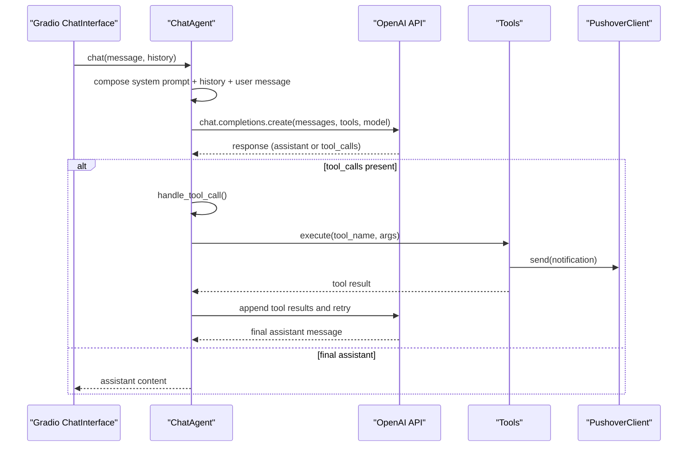
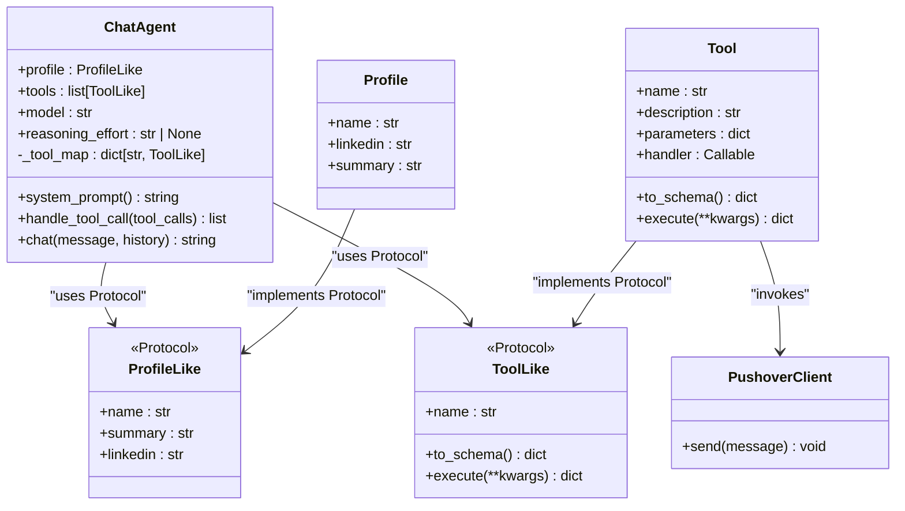
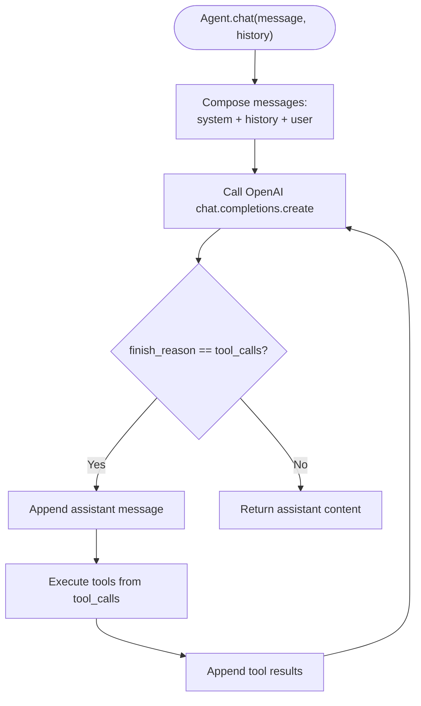
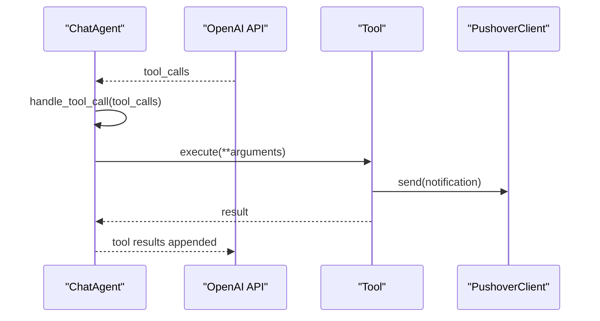
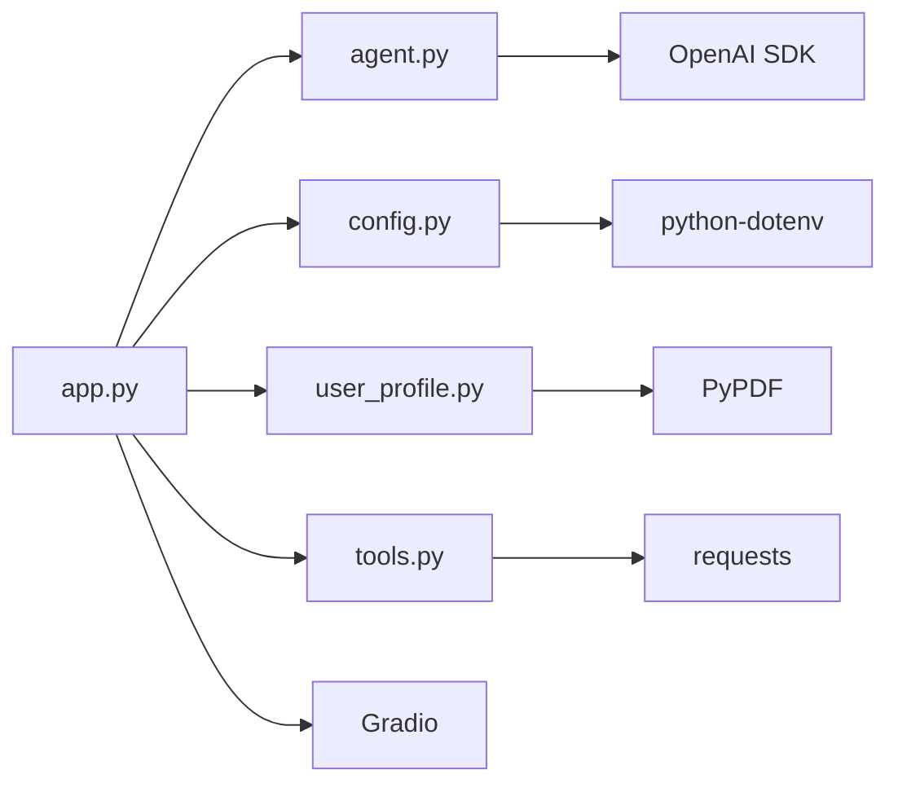

# Chat Agent Engine

<cite>
**Referenced Files in This Document**
- [agent.py](file://agent.py)
- [app.py](file://app.py)
- [config.py](file://config.py)
- [tools.py](file://tools.py)
- [user_profile.py](file://user_profile.py)
- [pushover.py](file://pushover.py)
- [README.md](file://README.md)
- [pyproject.toml](file://pyproject.toml)
- [me/summary.txt](file://me/summary.txt)
</cite>

## Update Summary
**Changes Made**
- Enhanced type safety with Protocol-based typing (ProfileLike, ToolLike)
- Improved ChatAgent constructor with typed parameters
- Added comprehensive documentation for Protocol-based contracts
- Updated architecture diagrams to reflect new typing patterns
- Expanded type safety documentation with practical examples

## Table of Contents
1. [Introduction](#introduction)
2. [Project Structure](#project-structure)
3. [Core Components](#core-components)
4. [Architecture Overview](#architecture-overview)
5. [Detailed Component Analysis](#detailed-component-analysis)
6. [Type Safety and Protocol-Based Design](#type-safety-and-protocol-based-design)
7. [Dependency Analysis](#dependency-analysis)
8. [Performance Considerations](#performance-considerations)
9. [Troubleshooting Guide](#troubleshooting-guide)
10. [Conclusion](#conclusion)
11. [Appendices](#appendices)

## Introduction
This document explains the Chat Agent Engine implementation that emulates a professional persona in a chat interface. The system has been enhanced with Protocol-based typing to provide better static type checking and improved developer experience. It focuses on the ChatAgent class architecture, OpenAI integration patterns, conversation management, system prompts, context injection, and tool calling with enhanced type safety guarantees.

## Project Structure
The project is organized around a small set of focused modules with enhanced type safety:
- agent.py: Implements the ChatAgent class with Protocol-based typing, system prompts, tool handling, and conversation loop.
- app.py: Builds tools, loads the profile, initializes the agent, and launches the Gradio chat UI with type-safe contracts.
- config.py: Loads environment variables for credentials and configuration.
- tools.py: Defines the Tool wrapper for OpenAI function calling schemas and execution with proper typing.
- user_profile.py: Loads and parses a PDF LinkedIn profile and a text summary with type-safe interfaces.
- pushover.py: Sends notifications via Pushover for tool executions with type-safe notification contracts.
- pyproject.toml: Declares dependencies including OpenAI, Gradio, PyPDF, and python-dotenv.
- me/summary.txt: A text summary of the professional persona.

```mermaid
graph TB
subgraph "Application"
APP["app.py"]
CFG["config.py"]
NOTIF["Notifiable Protocol"]
end
subgraph "Agent Core"
AG["agent.py"]
T["tools.py"]
UP["user_profile.py"]
PROTOCOLS["ProfileLike & ToolLike Protocols"]
END
subgraph "External Services"
OA["OpenAI API"]
PO["Pushover API"]
END
APP --> CFG
APP --> AG
APP --> UP
APP --> T
AG --> PROTOCOLS
AG --> OA
T --> PO
NOTIF --> PO
```

**Diagram sources**
- [app.py:11-14](file://app.py#L11-L14)
- [agent.py:7-19](file://agent.py#L7-L19)
- [agent.py:23](file://agent.py#L23)
- [tools.py:5-26](file://tools.py#L5-L26)
- [user_profile.py:4-22](file://user_profile.py#L4-L22)
- [pushover.py:4-17](file://pushover.py#L4-L17)

**Section sources**
- [app.py:72-82](file://app.py#L72-L82)
- [pyproject.toml:1-20](file://pyproject.toml#L1-L20)

## Core Components
- **ChatAgent**: Orchestrates system prompts, manages conversation history, invokes OpenAI chat completions, and handles tool calls until a final assistant response is produced. Now uses Protocol-based typing for enhanced type safety.
- **Tool**: Wraps a function schema and handler for OpenAI's function calling API with proper typing contracts.
- **Profile**: Loads a PDF LinkedIn profile and a text summary to inject context into the system prompt with type-safe interfaces.
- **PushoverClient**: Sends notifications when tools execute with type-safe notification contracts.
- **Gradio ChatInterface**: Provides the chat UI entry point with enhanced type checking.
- **Protocol Contracts**: ProfileLike and ToolLike define structured contracts for profiles and tools respectively.

Key responsibilities:
- Build a persona-aware system prompt from profile data using Protocol contracts.
- Inject conversation history and user messages into each request with type safety.
- Translate OpenAI tool_calls into tool execution results using Protocol-based typing.
- Return final assistant content after tool invocation cycles with enhanced static checking.

**Section sources**
- [agent.py:7-19](file://agent.py#L7-L19)
- [agent.py:21-95](file://agent.py#L21-L95)
- [tools.py:5-26](file://tools.py#L5-L26)
- [user_profile.py:4-22](file://user_profile.py#L4-L22)
- [pushover.py:4-17](file://pushover.py#L4-L17)
- [app.py:72-82](file://app.py#L72-L82)

## Architecture Overview
The system follows a clean separation of concerns with enhanced type safety:
- Application bootstrap constructs the profile, tools, and agent using Protocol contracts, then launches the UI.
- The agent composes a system prompt with injected context and maintains a conversation history using typed parameters.
- OpenAI's chat completion endpoint is called with function definitions; when tool_calls are returned, the agent executes tools and appends results to the conversation until a final assistant message is produced.
- Protocol-based typing ensures compile-time type checking and better IDE support.



**Diagram sources**
- [agent.py:72-95](file://agent.py#L72-L95)
- [agent.py:57-71](file://agent.py#L57-L71)
- [tools.py:23-26](file://tools.py#L23-L26)
- [pushover.py:12-17](file://pushover.py#L12-L17)
- [app.py:77](file://app.py#L77)

## Detailed Component Analysis

### ChatAgent Class
The ChatAgent encapsulates:
- OpenAI client initialization with Protocol-based typing.
- Persona profile and tools using ProfileLike and ToolLike contracts.
- Model selection and optional reasoning effort with proper type hints.
- A tool map for dispatching tool calls with enhanced type safety.
- System prompt composition with injected profile data using Protocol contracts.
- Conversation loop that retries on tool_calls and returns final content.



**Diagram sources**
- [agent.py:21-95](file://agent.py#L21-L95)
- [agent.py:7-19](file://agent.py#L7-L19)
- [tools.py:5-26](file://tools.py#L5-L26)
- [user_profile.py:4-22](file://user_profile.py#L4-L22)
- [pushover.py:4-17](file://pushover.py#L4-L17)

Implementation highlights:
- **Enhanced Constructor**: The ChatAgent.__init__ method now accepts ProfileLike and ToolLike parameters with proper type hints for better static analysis.
- **Protocol Contracts**: Uses ProfileLike and ToolLike protocols to define structured contracts for profiles and tools, enabling better IDE support and compile-time type checking.
- System prompt construction pulls persona name, summary, and LinkedIn content to keep the agent in character using Protocol-defined attributes.
- The conversation loop appends tool results and retries until a final assistant message is produced.
- Optional reasoning effort is passed through to the OpenAI API when configured.

**Section sources**
- [agent.py:23](file://agent.py#L23)
- [agent.py:31-55](file://agent.py#L31-L55)
- [agent.py:57-71](file://agent.py#L57-L71)
- [agent.py:72-95](file://agent.py#L72-L95)

### Tool Schema and Execution
The Tool class defines a function schema compatible with OpenAI's function calling API and wraps a handler that performs side effects (e.g., sending notifications). The agent converts tools to schemas and executes them during the conversation loop using Protocol-based typing.

Key behaviors:
- to_schema produces a function definition with name, description, and JSON Schema parameters.
- execute invokes the handler and ensures a dictionary result for tool responses.
- Implements ToolLike protocol for enhanced type safety and IDE support.

**Section sources**
- [tools.py:5-26](file://tools.py#L5-L26)
- [agent.py:80-87](file://agent.py#L80-L87)
- [agent.py:57-71](file://agent.py#L57-L71)

### Profile Loading and Context Injection
The Profile class reads a PDF LinkedIn profile and a text summary, assembling context for the system prompt. This enables the agent to answer questions aligned with the persona's background and expertise. The Profile class implements the ProfileLike protocol for type-safe usage.

- LinkedIn parsing uses a PDF reader to extract text across pages.
- Summary is loaded from a text file.
- Implements ProfileLike protocol for structured attribute access.

**Section sources**
- [user_profile.py:4-22](file://user_profile.py#L4-L22)
- [agent.py:31-55](file://agent.py#L31-L55)

### Application Bootstrap and UI Integration
The application builds tools, loads the profile, initializes the agent, and launches a Gradio ChatInterface that delegates chat interactions to the agent's chat method. The app now uses Protocol-based typing for better type safety.

- Tools include capturing user details and recording unknown questions.
- Environment variables configure credentials, model, and persona data.
- Uses Notifiable protocol for type-safe notification handling.

**Section sources**
- [app.py:16-70](file://app.py#L16-L70)
- [app.py:72-82](file://app.py#L72-L82)
- [config.py:6-17](file://config.py#L6-L17)

### OpenAI Integration Patterns
The agent integrates with OpenAI's chat completions API:
- Sends a system prompt plus conversation history plus the latest user message.
- Supplies function definitions via tools.to_schema().
- Handles tool_calls by executing tools and appending tool results to continue the conversation.
- Returns the final assistant content when finish_reason indicates no further tool calls.



**Diagram sources**
- [agent.py:72-95](file://agent.py#L72-L95)
- [agent.py:80-87](file://agent.py#L80-L87)
- [agent.py:57-71](file://agent.py#L57-L71)

**Section sources**
- [agent.py:72-95](file://agent.py#L72-L95)

### Tool Calling Workflow
The agent translates OpenAI tool_calls into tool executions:
- Parses tool name and arguments from the tool call.
- Resolves the tool by name using the Protocol-based tool map and executes it with validated parameters.
- Returns a structured tool result with tool_call_id for OpenAI to consume.



**Diagram sources**
- [agent.py:57-71](file://agent.py#L57-L71)
- [tools.py:23-26](file://tools.py#L23-L26)
- [pushover.py:12-17](file://pushover.py#L12-L17)

**Section sources**
- [agent.py:57-71](file://agent.py#L57-L71)
- [tools.py:23-26](file://tools.py#L23-L26)

### System Prompts and Context Injection
The system prompt is built dynamically from:
- Persona name using ProfileLike.name attribute.
- Summary content using ProfileLike.summary attribute.
- LinkedIn profile text extracted from the PDF using ProfileLike.linkedin attribute.

This ensures the agent remains in character and grounded in the persona's background using Protocol-defined attributes.

**Section sources**
- [agent.py:31-55](file://agent.py#L31-L55)
- [user_profile.py:11-21](file://user_profile.py#L11-L21)

### Conversation Management
The agent maintains conversation continuity by:
- Prepending a system message with persona context using Protocol-defined attributes.
- Appending previous user and assistant messages.
- Appending the new user message.
- Extending with tool results when tool_calls occur.
- Returning only the final assistant content.

**Section sources**
- [agent.py:72-95](file://agent.py#L72-L95)

### Parameter Validation and Error Handling
- Tool parameters are defined via JSON Schema with required fields and strict property lists.
- Tool.execute ensures a dictionary result is returned for tool responses.
- The agent does not explicitly catch OpenAI exceptions; errors propagate from the OpenAI client.
- Tool handlers can raise exceptions if invalid arguments are provided; callers should handle these appropriately.
- Protocol-based typing provides compile-time checking for attribute access and method signatures.

**Section sources**
- [tools.py:23-26](file://tools.py#L23-L26)
- [agent.py:57-71](file://agent.py#L57-L71)

### Customization Options for Professional Personas
- Profile: Change name, LinkedIn PDF path, and summary text to reflect different personas. The Profile class implements ProfileLike protocol for type-safe usage.
- Tools: Add new tools with distinct schemas and handlers to capture additional signals (e.g., scheduling, quoting). Tools implement ToolLike protocol for enhanced type safety.
- Model and Reasoning Effort: Configure via environment variables to adjust quality and cost.
- Protocol Contracts: Extend the system by creating classes that implement ProfileLike and ToolLike protocols for custom implementations.

**Section sources**
- [config.py:6-17](file://config.py#L6-L17)
- [app.py:72-78](file://app.py#L72-L78)

## Type Safety and Protocol-Based Design

### Protocol Contracts Overview
The system now uses Protocol-based typing to provide enhanced type safety and better developer experience:

#### ProfileLike Protocol
Defines the contract for profile objects:
- `name: str` - The persona's name
- `summary: str` - Text summary of the persona's background
- `linkedin: str` - Extracted LinkedIn profile text

#### ToolLike Protocol  
Defines the contract for tool objects:
- `name: str` - Tool identifier
- `to_schema() -> dict` - Method to generate OpenAI function schema
- `execute(**kwargs) -> dict` - Method to execute tool with validated parameters

#### Notifiable Protocol
Used for notification services:
- `send(message: str) -> None` - Method to send notifications

### Benefits of Protocol-Based Design
- **Compile-time Type Checking**: IDEs can provide better autocomplete and error detection
- **Better IDE Support**: Enhanced IntelliSense and refactoring capabilities
- **Contract Enforcement**: Clear interfaces for custom implementations
- **Runtime Flexibility**: Still allows for duck typing while providing static analysis benefits
- **Extensibility**: Easy to create custom implementations that satisfy the protocols

### Implementation Examples
The system demonstrates Protocol-based typing through:
- ChatAgent constructor accepting ProfileLike and ToolLike parameters
- Tool class implementing ToolLike protocol
- Profile class implementing ProfileLike protocol
- PushoverClient used with Notifiable protocol for notifications

**Section sources**
- [agent.py:7-19](file://agent.py#L7-L19)
- [agent.py:23](file://agent.py#L23)
- [tools.py:5-26](file://tools.py#L5-L26)
- [user_profile.py:4-22](file://user_profile.py#L4-L22)
- [app.py:11-14](file://app.py#L11-L14)

## Dependency Analysis
The project relies on:
- OpenAI SDK for chat completions and function calling.
- Gradio for the chat UI.
- PyPDF for extracting text from the LinkedIn PDF.
- python-dotenv for environment configuration.
- requests for Pushover notifications.



**Diagram sources**
- [pyproject.toml:7-14](file://pyproject.toml#L7-L14)
- [app.py:1-8](file://app.py#L1-L8)
- [agent.py:4](file://agent.py#L4)
- [tools.py:1](file://tools.py#L1)
- [user_profile.py:1](file://user_profile.py#L1)
- [config.py:3](file://config.py#L3)

**Section sources**
- [pyproject.toml:1-20](file://pyproject.toml#L1-L20)

## Performance Considerations
- Token usage: Including a large LinkedIn PDF and summary increases context length; consider summarizing long inputs or chunking content.
- Tool call loops: Each tool execution adds round-trips; batch related actions when possible.
- Model selection: Choose a smaller model for cost-sensitive scenarios; increase reasoning effort only when needed.
- Streaming: The current implementation waits for full responses; streaming could improve perceived latency.
- Caching: Cache repeated tool results or frequently accessed profile segments to reduce overhead.
- **Protocol Overhead**: The Protocol-based typing adds no runtime overhead but provides compile-time benefits.

## Troubleshooting Guide
Common issues and resolutions:
- Missing environment variables: Ensure PUSHOVER_TOKEN, PUSHOVER_USER, OPENAI_MODEL, PROFILE_NAME, LINKEDIN_PATH, SUMMARY_PATH are set.
- OpenAI API errors: Verify credentials and model availability; the agent does not catch exceptions internally.
- Tool execution failures: Validate tool parameter schemas and handler logic; ensure required fields are provided.
- PDF loading errors: Confirm the LinkedIn PDF path exists and is readable.
- **Type Errors**: If encountering Protocol-related type errors, ensure your custom implementations satisfy the protocol contracts exactly.
- **IDE Issues**: Protocol-based typing requires Python 3.12+ for optimal support.

**Section sources**
- [config.py:6-17](file://config.py#L6-L17)
- [agent.py:72-95](file://agent.py#L72-L95)
- [tools.py:23-26](file://tools.py#L23-L26)
- [user_profile.py:11-21](file://user_profile.py#L11-L21)

## Conclusion
The Chat Agent Engine cleanly separates persona context, conversation management, and tool execution while providing enhanced type safety through Protocol-based design. The system integrates with OpenAI's function calling API to extend the agent's capabilities while maintaining a simple loop that continues until a final response is produced. With configurable profiles, tools, and model settings, it supports customization for diverse professional personas and use cases. The Protocol-based typing provides better developer experience with compile-time type checking and enhanced IDE support.

## Appendices

### Example Workflows

- **Agent initialization and chat flow with Protocol typing**:
  - Build tools and profile with proper typing contracts.
  - Initialize ChatAgent with ProfileLike and ToolLike parameters.
  - Launch Gradio ChatInterface to delegate chat interactions to agent.chat.

- **Tool calling example with enhanced type safety**:
  - OpenAI responds with tool_calls.
  - Agent resolves tool by name using Protocol-based tool map and executes handler.
  - Agent appends tool results and retries until a final assistant message is produced.

- **Custom Protocol Implementation**:
  - Create custom profile class that implements ProfileLike protocol.
  - Create custom tool class that implements ToolLike protocol.
  - Use custom implementations with ChatAgent for enhanced type safety.

**Section sources**
- [app.py:72-82](file://app.py#L72-L82)
- [agent.py:72-95](file://agent.py#L72-L95)
- [agent.py:57-71](file://agent.py#L57-L71)