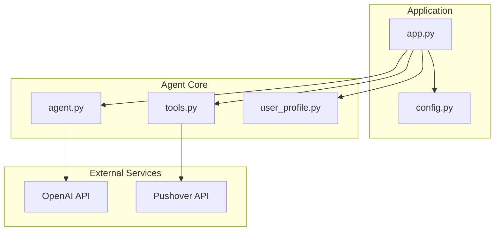
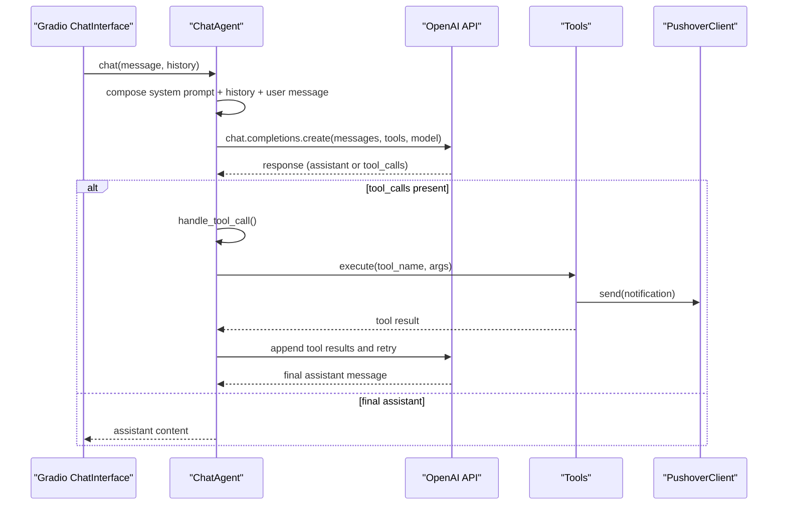
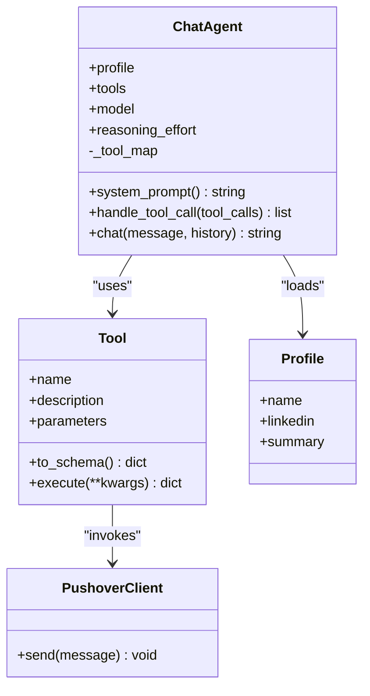
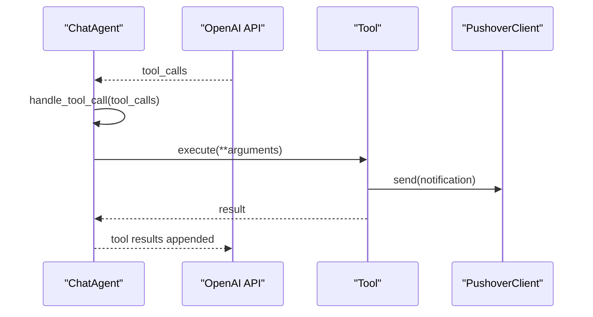
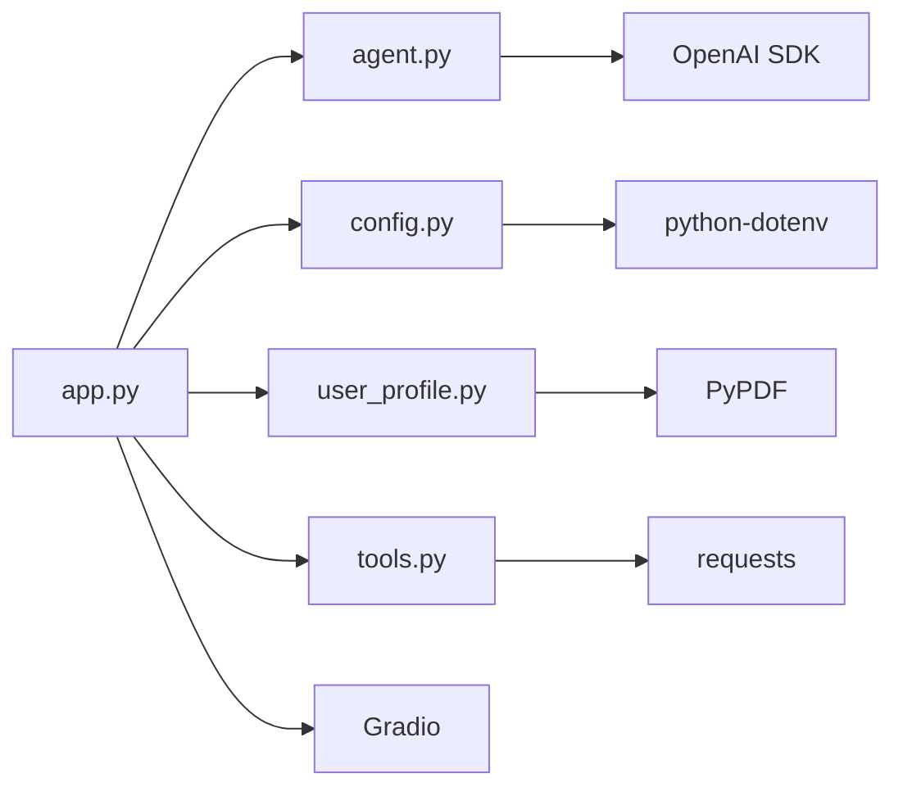

# Chat Agent Engine

<cite>
**Referenced Files in This Document**
- [agent.py](file://agent.py)
- [app.py](file://app.py)
- [config.py](file://config.py)
- [tools.py](file://tools.py)
- [user_profile.py](file://user_profile.py)
- [pushover.py](file://pushover.py)
- [README.md](file://README.md)
- [pyproject.toml](file://pyproject.toml)
- [me/summary.txt](file://me/summary.txt)
</cite>

## Table of Contents
1. [Introduction](#introduction)
2. [Project Structure](#project-structure)
3. [Core Components](#core-components)
4. [Architecture Overview](#architecture-overview)
5. [Detailed Component Analysis](#detailed-component-analysis)
6. [Dependency Analysis](#dependency-analysis)
7. [Performance Considerations](#performance-considerations)
8. [Troubleshooting Guide](#troubleshooting-guide)
9. [Conclusion](#conclusion)
10. [Appendices](#appendices)

## Introduction
This document explains the Chat Agent Engine implementation that emulates a professional persona in a chat interface. It focuses on the ChatAgent class architecture, OpenAI integration patterns, conversation management, system prompts, context injection, and tool calling. It also documents how the engine integrates with Gradio for UI, uses a PDF-based LinkedIn profile and a text summary to inject context, and how tools are defined and executed to capture user details or unknown questions.

## Project Structure
The project is organized around a small set of focused modules:
- agent.py: Implements the ChatAgent class with system prompts, tool handling, and conversation loop.
- app.py: Builds tools, loads the profile, initializes the agent, and launches the Gradio chat UI.
- config.py: Loads environment variables for credentials and configuration.
- tools.py: Defines the Tool wrapper for OpenAI function calling schemas and execution.
- user_profile.py: Loads and parses a PDF LinkedIn profile and a text summary.
- pushover.py: Sends notifications via Pushover for tool executions.
- pyproject.toml: Declares dependencies including OpenAI, Gradio, PyPDF, and python-dotenv.
- me/summary.txt: A text summary of the professional persona.

**Diagram sources**
- [app.py:66-76](file://app.py#L66-L76)
- [agent.py:57-80](file://agent.py#L57-L80)
- [tools.py:4-25](file://tools.py#L4-L25)
- [user_profile.py:4-22](file://user_profile.py#L4-L22)
- [pushover.py:4-17](file://pushover.py#L4-L17)

**Section sources**
- [app.py:66-76](file://app.py#L66-L76)
- [pyproject.toml:1-20](file://pyproject.toml#L1-L20)

## Core Components
- ChatAgent: Orchestrates system prompts, manages conversation history, invokes OpenAI chat completions, and handles tool calls until a final assistant response is produced.
- Tool: Wraps a function schema and handler for OpenAI’s function calling API.
- Profile: Loads a PDF LinkedIn profile and a text summary to inject context into the system prompt.
- PushoverClient: Sends notifications when tools execute.
- Gradio ChatInterface: Provides the chat UI entry point.

Key responsibilities:
- Build a persona-aware system prompt from profile data.
- Inject conversation history and user messages into each request.
- Translate OpenAI tool_calls into tool execution results.
- Return final assistant content after tool invocation cycles.

**Section sources**
- [agent.py:6-80](file://agent.py#L6-L80)
- [tools.py:4-25](file://tools.py#L4-L25)
- [user_profile.py:4-22](file://user_profile.py#L4-L22)
- [pushover.py:4-17](file://pushover.py#L4-L17)
- [app.py:66-76](file://app.py#L66-L76)

## Architecture Overview
The system follows a clean separation of concerns:
- Application bootstrap constructs the profile, tools, and agent, then launches the UI.
- The agent composes a system prompt with injected context and maintains a conversation history.
- OpenAI’s chat completion endpoint is called with function definitions; when tool_calls are returned, the agent executes tools and appends results to the conversation until a final assistant message is produced.

**Diagram sources**
- [agent.py:57-80](file://agent.py#L57-L80)
- [agent.py:42-55](file://agent.py#L42-L55)
- [tools.py:22-25](file://tools.py#L22-L25)
- [pushover.py:12-17](file://pushover.py#L12-L17)
- [app.py:70-71](file://app.py#L70-L71)

## Detailed Component Analysis

### ChatAgent Class
The ChatAgent encapsulates:
- OpenAI client initialization.
- Persona profile and tools.
- Model selection and optional reasoning effort.
- A tool map for dispatching tool calls.
- System prompt composition with injected profile data.
- Conversation loop that retries on tool_calls and returns final content.

**Diagram sources**
- [agent.py:6-80](file://agent.py#L6-L80)
- [tools.py:4-25](file://tools.py#L4-L25)
- [user_profile.py:4-22](file://user_profile.py#L4-L22)
- [pushover.py:4-17](file://pushover.py#L4-L17)

Implementation highlights:
- System prompt construction pulls persona name, summary, and LinkedIn content to keep the agent in character.
- The conversation loop appends tool results and retries until a final assistant message is produced.
- Optional reasoning effort is passed through to the OpenAI API when configured.

**Section sources**
- [agent.py:8-14](file://agent.py#L8-L14)
- [agent.py:16-40](file://agent.py#L16-L40)
- [agent.py:42-55](file://agent.py#L42-L55)
- [agent.py:57-80](file://agent.py#L57-L80)

### Tool Schema and Execution
The Tool class defines a function schema compatible with OpenAI’s function calling API and wraps a handler that performs side effects (e.g., sending notifications). The agent converts tools to schemas and executes them during the conversation loop.

Key behaviors:
- to_schema produces a function definition with name, description, and JSON Schema parameters.
- execute invokes the handler and ensures a dictionary result for tool responses.

**Section sources**
- [tools.py:4-25](file://tools.py#L4-L25)
- [agent.py:68-72](file://agent.py#L68-L72)
- [agent.py:42-55](file://agent.py#L42-L55)

### Profile Loading and Context Injection
The Profile class reads a PDF LinkedIn profile and a text summary, assembling context for the system prompt. This enables the agent to answer questions aligned with the persona’s background and expertise.

- LinkedIn parsing uses a PDF reader to extract text across pages.
- Summary is loaded from a text file.

**Section sources**
- [user_profile.py:4-22](file://user_profile.py#L4-L22)
- [agent.py:34-40](file://agent.py#L34-L40)

### Application Bootstrap and UI Integration
The application builds tools, loads the profile, initializes the agent, and launches a Gradio ChatInterface that delegates chat interactions to the agent’s chat method.

- Tools include capturing user details and recording unknown questions.
- Environment variables configure credentials, model, and persona data.

**Section sources**
- [app.py:10-63](file://app.py#L10-L63)
- [app.py:66-76](file://app.py#L66-L76)
- [config.py:7-14](file://config.py#L7-L14)

### OpenAI Integration Patterns
The agent integrates with OpenAI’s chat completions API:
- Sends a system prompt plus conversation history plus the latest user message.
- Supplies function definitions via tools.to_schema().
- Handles tool_calls by executing tools and appending tool results to continue the conversation.
- Returns the final assistant content when finish_reason indicates no further tool calls.

**Diagram sources**
- [agent.py:57-80](file://agent.py#L57-L80)
- [agent.py:68-72](file://agent.py#L68-L72)
- [agent.py:42-55](file://agent.py#L42-L55)

**Section sources**
- [agent.py:57-80](file://agent.py#L57-L80)

### Tool Calling Workflow
The agent translates OpenAI tool_calls into tool executions:
- Parses tool name and arguments from the tool call.
- Resolves the tool by name and executes it with validated parameters.
- Returns a structured tool result with tool_call_id for OpenAI to consume.

**Diagram sources**
- [agent.py:42-55](file://agent.py#L42-L55)
- [tools.py:22-25](file://tools.py#L22-L25)
- [pushover.py:12-17](file://pushover.py#L12-L17)

**Section sources**
- [agent.py:42-55](file://agent.py#L42-L55)
- [tools.py:22-25](file://tools.py#L22-L25)

### System Prompts and Context Injection
The system prompt is built dynamically from:
- Persona name.
- Summary content.
- LinkedIn profile text extracted from the PDF.

This ensures the agent remains in character and grounded in the persona’s background.

**Section sources**
- [agent.py:16-40](file://agent.py#L16-L40)
- [user_profile.py:11-21](file://user_profile.py#L11-L21)

### Conversation Management
The agent maintains conversation continuity by:
- Prepending a system message with persona context.
- Appending previous user and assistant messages.
- Appending the new user message.
- Extending with tool results when tool_calls occur.
- Returning only the final assistant content.

**Section sources**
- [agent.py:57-80](file://agent.py#L57-L80)

### Parameter Validation and Error Handling
- Tool parameters are defined via JSON Schema with required fields and strict property lists.
- Tool.execute ensures a dictionary result is returned for tool responses.
- The agent does not explicitly catch OpenAI exceptions; errors propagate from the OpenAI client.
- Tool handlers can raise exceptions if invalid arguments are provided; callers should handle these appropriately.

**Section sources**
- [tools.py:12-25](file://tools.py#L12-L25)
- [agent.py:42-55](file://agent.py#L42-L55)

### Customization Options for Professional Personas
- Profile: Change name, LinkedIn PDF path, and summary text to reflect different personas.
- Tools: Add new tools with distinct schemas and handlers to capture additional signals (e.g., scheduling, quoting).
- Model and Reasoning Effort: Configure via environment variables to adjust quality and cost.

**Section sources**
- [config.py:7-14](file://config.py#L7-L14)
- [app.py:66-71](file://app.py#L66-L71)

## Dependency Analysis
The project relies on:
- OpenAI SDK for chat completions and function calling.
- Gradio for the chat UI.
- PyPDF for extracting text from the LinkedIn PDF.
- python-dotenv for environment configuration.
- requests for Pushover notifications.

**Diagram sources**
- [pyproject.toml:7-14](file://pyproject.toml#L7-L14)
- [app.py:1-8](file://app.py#L1-L8)
- [agent.py:3](file://agent.py#L3)
- [tools.py:1](file://tools.py#L1)
- [user_profile.py:1](file://user_profile.py#L1)
- [config.py:3](file://config.py#L3)

**Section sources**
- [pyproject.toml:1-20](file://pyproject.toml#L1-L20)

## Performance Considerations
- Token usage: Including a large LinkedIn PDF and summary increases context length; consider summarizing long inputs or chunking content.
- Tool call loops: Each tool execution adds round-trips; batch related actions when possible.
- Model selection: Choose a smaller model for cost-sensitive scenarios; increase reasoning effort only when needed.
- Streaming: The current implementation waits for full responses; streaming could improve perceived latency.
- Caching: Cache repeated tool results or frequently accessed profile segments to reduce overhead.

[No sources needed since this section provides general guidance]

## Troubleshooting Guide
Common issues and resolutions:
- Missing environment variables: Ensure PUSHOVER_TOKEN, PUSHOVER_USER, OPENAI_MODEL, PROFILE_NAME, LINKEDIN_PATH, SUMMARY_PATH are set.
- OpenAI API errors: Verify credentials and model availability; the agent does not catch exceptions internally.
- Tool execution failures: Validate tool parameter schemas and handler logic; ensure required fields are provided.
- PDF loading errors: Confirm the LinkedIn PDF path exists and is readable.

**Section sources**
- [config.py:7-14](file://config.py#L7-L14)
- [agent.py:57-80](file://agent.py#L57-L80)
- [tools.py:22-25](file://tools.py#L22-L25)
- [user_profile.py:11-17](file://user_profile.py#L11-L17)

## Conclusion
The Chat Agent Engine cleanly separates persona context, conversation management, and tool execution. It integrates with OpenAI’s function calling API to extend the agent’s capabilities while maintaining a simple loop that continues until a final response is produced. With configurable profiles, tools, and model settings, it supports customization for diverse professional personas and use cases.

[No sources needed since this section summarizes without analyzing specific files]

## Appendices

### Example Workflows

- Agent initialization and chat flow:
  - Build tools and profile.
  - Initialize ChatAgent with model and optional reasoning effort.
  - Launch Gradio ChatInterface to delegate chat interactions to agent.chat.

- Tool calling example:
  - OpenAI responds with tool_calls.
  - Agent resolves tool by name and executes handler.
  - Agent appends tool results and retries until a final assistant message is produced.

**Section sources**
- [app.py:66-76](file://app.py#L66-L76)
- [agent.py:57-80](file://agent.py#L57-L80)
- [agent.py:42-55](file://agent.py#L42-L55)