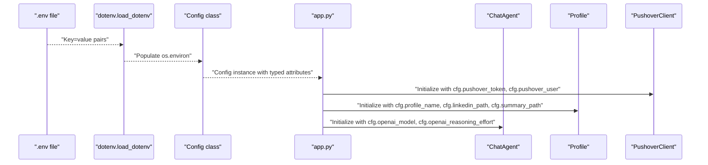
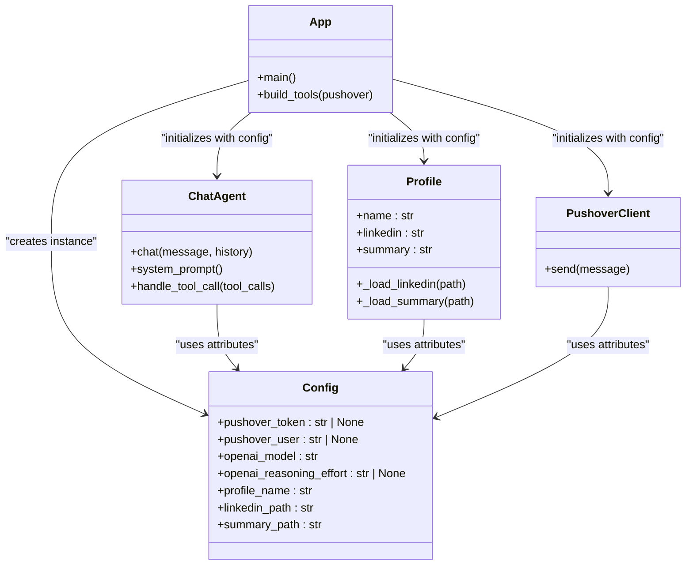
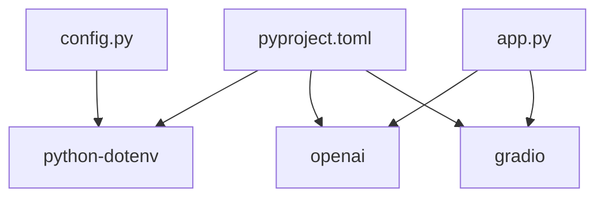

# Configuration Management

<cite>
**Referenced Files in This Document**
- [config.py](file://config.py)
- [app.py](file://app.py)
- [agent.py](file://agent.py)
- [pushover.py](file://pushover.py)
- [user_profile.py](file://user_profile.py)
- [tools.py](file://tools.py)
- [pyproject.toml](file://pyproject.toml)
- [README.md](file://README.md)
</cite>

## Update Summary
**Changes Made**
- Completely rewrote configuration system from module-level globals to object-oriented Config class
- Enhanced type safety with protocol-based typing throughout the application
- Improved encapsulation and maintainability of configuration management
- Added comprehensive documentation for the new configuration architecture
- Updated all integration points to use the new Config class pattern

## Table of Contents
1. [Introduction](#introduction)
2. [Project Structure](#project-structure)
3. [Core Components](#core-components)
4. [Architecture Overview](#architecture-overview)
5. [Detailed Component Analysis](#detailed-component-analysis)
6. [Dependency Analysis](#dependency-analysis)
7. [Performance Considerations](#performance-considerations)
8. [Troubleshooting Guide](#troubleshooting-guide)
9. [Conclusion](#conclusion)
10. [Appendices](#appendices)

## Introduction
This document explains the enhanced configuration management system in the Professional Alter Ego system. The configuration system has been redesigned with an object-oriented approach featuring a Config class that encapsulates environment variable loading and provides typed accessors. This redesign improves type safety, maintainability, and follows modern Python best practices.

## Project Structure
The configuration system now centers around a dedicated Config class that loads environment variables and exposes them through typed attributes. The application orchestrates components that rely on these configuration objects.


**Diagram sources**
- [config.py:6-17](file://config.py#L6-L17)
- [app.py:72-78](file://app.py#L72-L78)
- [agent.py:21-29](file://agent.py#L21-L29)
- [user_profile.py:4-9](file://user_profile.py#L4-L9)
- [pushover.py:4-10](file://pushover.py#L4-L10)
- [tools.py:5-11](file://tools.py#L5-L11)

**Section sources**
- [config.py:6-17](file://config.py#L6-L17)
- [app.py:72-78](file://app.py#L72-L78)

## Core Components
- **Config class**: Encapsulates environment variable loading and provides typed attribute access
- **Application entrypoint**: Creates a Config instance and passes it to components
- **Chat agent**: Uses model and reasoning effort settings for OpenAI completions
- **Profile**: Uses name and file paths to load LinkedIn PDF and summary text
- **Pushover client**: Uses API token and user key for notifications
- **Tools**: Accesses configuration indirectly via application wiring

Key configuration attributes and defaults:
- **pushover_token**: No default; required for Pushover notifications
- **pushover_user**: No default; required for Pushover notifications
- **openai_model**: Default "gpt-4o-mini"
- **openai_reasoning_effort**: No default; optional
- **profile_name**: Default "John Doe"
- **linkedin_path**: Default "me/linkedin.pdf"
- **summary_path**: Default "me/summary.txt"

**Section sources**
- [config.py:8-16](file://config.py#L8-L16)
- [app.py:72-78](file://app.py#L72-L78)
- [agent.py:23-28](file://agent.py#L23-L28)
- [user_profile.py:6-9](file://user_profile.py#L6-L9)
- [pushover.py:8-10](file://pushover.py#L8-L10)

## Architecture Overview
The configuration architecture follows an object-oriented pattern:
- Config class loads environment variables from .env at instantiation
- Typed attributes are exposed for configuration consumption
- Other modules receive a Config instance rather than importing module-level constants
- Optional values are handled gracefully through the Config class



**Diagram sources**
- [config.py:8-16](file://config.py#L8-L16)
- [app.py:72-78](file://app.py#L72-L78)
- [agent.py:23-28](file://agent.py#L23-L28)
- [user_profile.py:6-9](file://user_profile.py#L6-L9)
- [pushover.py:8-10](file://pushover.py#L8-L10)

## Detailed Component Analysis

### Object-Oriented Configuration Class
- **Encapsulation**: The Config class encapsulates all environment variable loading and provides a clean interface
- **Type Safety**: Attributes are typed with appropriate default values and optional types
- **Lazy Loading**: Environment variables are loaded when the Config instance is created
- **Override Mechanism**: The loader is configured to override existing environment variables, enabling local .env overrides

Security and safety considerations:
- API keys are read directly from environment variables without logging
- No sensitive data is printed or stored in logs by default
- Configuration is validated at object creation time

**Section sources**
- [config.py:6-17](file://config.py#L6-L17)

### Enhanced Type Safety with Protocols
The application now uses Protocol-based typing for better type safety:
- **Notifiable Protocol**: Defines the interface for notification services
- **ProfileLike Protocol**: Defines the interface for profile data access
- **ToolLike Protocol**: Defines the interface for tool operations

Best practices:
- Protocols enable structural subtyping without inheritance
- Type checking ensures components implement required interfaces
- Better IDE support and autocompletion

**Section sources**
- [app.py:11-13](file://app.py#L11-L13)
- [agent.py:7-11](file://agent.py#L7-L11)
- [agent.py:13-18](file://agent.py#L13-L18)

### API Key Management
- **Pushover credentials**:
  - pushover_token: Required for sending notifications
  - pushover_user: Required for targeting the notification recipient
- **OpenAI integration**:
  - openai_model: Required for chat completions
  - openai_reasoning_effort: Optional; when present, enables reasoning effort control

Best practices:
- Store API keys in .env during development
- Use platform-specific secret managers in production
- Restrict .env file permissions and exclude it from version control

**Section sources**
- [config.py:10-13](file://config.py#L10-L13)
- [pushover.py:8-10](file://pushover.py#L8-L10)
- [agent.py:85-86](file://agent.py#L85-L86)

### File Path Configurations
- **profile_name**: Used by the profile component to personalize the assistant
- **linkedin_path**: Path to the LinkedIn PDF; loaded via a PDF reader
- **summary_path**: Path to the summary text file; loaded via file I/O

Defaults:
- linkedin_path defaults to "me/linkedin.pdf"
- summary_path defaults to "me/summary.txt"
- profile_name defaults to "John Doe"

Validation and error handling:
- Missing file paths will cause runtime errors when attempting to read the files
- The application does not explicitly validate file existence at startup

**Section sources**
- [config.py:14-16](file://config.py#L14-L16)
- [user_profile.py:11-21](file://user_profile.py#L11-L21)

### Configuration Hierarchy and Defaults
Hierarchy:
1. Environment variables set by the OS or platform
2. .env file loaded at Config instantiation (override behavior enabled)
3. Class-level defaults defined in the Config class

Defaults:
- openai_model: "gpt-4o-mini"
- profile_name: "John Doe"
- linkedin_path: "me/linkedin.pdf"
- summary_path: "me/summary.txt"
- openai_reasoning_effort: None (optional)

Override mechanism:
- Values from .env override OS-level environment variables due to the loader's override setting
- The application consumes these values through typed attributes without additional transformation

**Section sources**
- [config.py:12-16](file://config.py#L12-L16)
- [config.py:9](file://config.py#L9)

### Integration Points
- Application entrypoint creates a Config instance and passes it to all components
- Chat agent conditionally passes reasoning effort when provided
- Profile component reads file paths to initialize content



**Diagram sources**
- [config.py:8-16](file://config.py#L8-L16)
- [app.py:72-78](file://app.py#L72-L78)
- [agent.py:23-28](file://agent.py#L23-L28)
- [user_profile.py:6-9](file://user_profile.py#L6-L9)
- [pushover.py:8-10](file://pushover.py#L8-L10)

**Section sources**
- [app.py:72-78](file://app.py#L72-L78)
- [agent.py:23-28](file://agent.py#L23-L28)
- [user_profile.py:6-9](file://user_profile.py#L6-L9)
- [pushover.py:8-10](file://pushover.py#L8-L10)

## Dependency Analysis
External dependencies relevant to configuration:
- python-dotenv: Enables loading .env files into environment variables
- openai: Consumes model and reasoning effort settings
- gradio: Launches the chat interface; configuration affects runtime behavior



**Diagram sources**
- [pyproject.toml:7-14](file://pyproject.toml#L7-L14)
- [config.py:3](file://config.py#L3)
- [app.py:1](file://app.py#L1)

**Section sources**
- [pyproject.toml:7-14](file://pyproject.toml#L7-L14)

## Performance Considerations
- Environment loading occurs at Config instantiation; keep .env minimal to reduce startup overhead
- Avoid excessive environment variables to prevent confusion and potential conflicts
- Centralized configuration reduces repeated lookups and improves maintainability
- Object creation overhead is minimal since environment variables are cached in os.environ

## Troubleshooting Guide
Common issues and resolutions:
- **Missing .env file**:
  - Symptoms: Missing API keys or file paths lead to runtime errors
  - Resolution: Create a .env file with required keys and restart the application
- **Incorrect file paths**:
  - Symptoms: Profile initialization fails when reading PDF or summary
  - Resolution: Verify linkedin_path and summary_path match actual files
- **Missing reasoning effort**:
  - Symptoms: Optional reasoning effort not applied
  - Resolution: Set OPENAI_REASONING_EFFORT if desired; otherwise leave unset
- **Pushover delivery failures**:
  - Symptoms: Notifications not sent
  - Resolution: Confirm pushover_token and pushover_user are valid and correctly formatted

Validation and error handling:
- The application does not explicitly validate configuration at startup
- Add explicit checks in the application entrypoint to raise clear errors for missing required values
- Consider adding runtime validation in the Config class constructor

**Section sources**
- [config.py:10-16](file://config.py#L10-L16)
- [user_profile.py:11-21](file://user_profile.py#L11-L21)
- [agent.py:85-86](file://agent.py#L85-L86)
- [pushover.py:12-16](file://pushover.py#L12-L16)

## Conclusion
The Professional Alter Ego system now uses a sophisticated, object-oriented configuration approach powered by the Config class. This redesign improves type safety, encapsulation, and maintainability while preserving the centralized configuration pattern. The new system provides better developer experience through typed attributes and cleaner integration patterns.

## Appendices

### .env File Setup Template
- Create a .env file at the project root with the following keys:
  - PUSHOVER_TOKEN=<your_pushover_token>
  - PUSHOVER_USER=<your_pushover_user_key>
  - OPENAI_MODEL=<your_model_id>
  - OPENAI_REASONING_EFFORT=<low|medium|high>
  - PROFILE_NAME=<your_name>
  - LINKEDIN_PATH=<path_to_linkedin_pdf>
  - SUMMARY_PATH=<path_to_summary_txt>

Notes:
- Ensure the .env file is excluded from version control
- Use platform-specific secret management in production environments

### Security Best Practices for API Keys
- Never commit secrets to version control
- Use separate tokens for development and production
- Rotate tokens periodically and revoke compromised ones
- Limit token scopes to the minimum required permissions

### Environment-Specific Configuration Examples
- **Development**:
  - Use .env for local secrets
  - Keep defaults for non-sensitive values
- **Staging**:
  - Use environment variables injected by the platform
  - Mirror production structure with staging tokens
- **Production**:
  - Use platform-managed secrets
  - Disable local .env usage and enforce strict permissions

### Configuration Validation and Error Handling Pattern
Add a validation step in the application entrypoint to check required values and raise descriptive errors. For example:
- Validate that pushover_token and pushover_user are set
- Validate that linkedin_path and summary_path are readable
- Validate that openai_model is set and recognized by the OpenAI client

### Deployment Scenarios
- **Local development**:
  - Place .env in the project root
  - Run the application normally; Config class will load .env automatically
- **Containerized deployment**:
  - Provide environment variables via container orchestration
  - Mount volumes for file paths if needed
- **Platform deployment**:
  - Configure environment variables in the platform's secret manager
  - Ensure file paths align with mounted storage

### Configuration Class Usage Examples
The Config class can be instantiated and used throughout the application:

```python
# Basic usage
cfg = Config()

# Access configuration attributes
print(cfg.openai_model)
print(cfg.pushover_token)

# Pass to components
agent = ChatAgent(cfg.openai_model, cfg.openai_reasoning_effort)
profile = Profile(cfg.profile_name, cfg.linkedin_path, cfg.summary_path)
```

### Type Safety Enhancements
The new protocol-based typing system provides better type checking:

```python
# Protocol definitions enable structural subtyping
class Notifiable(Protocol):
    def send(self, message: str) -> None: ...

# Components can accept any object implementing the protocol
def build_tools(pushover: Notifiable):  # Works with PushoverClient or any other Notifiable
    pass
```