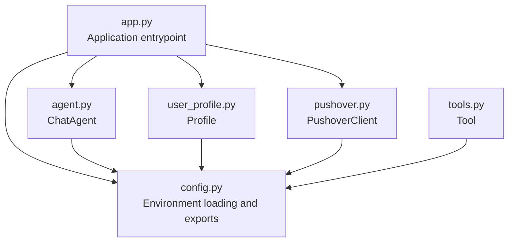
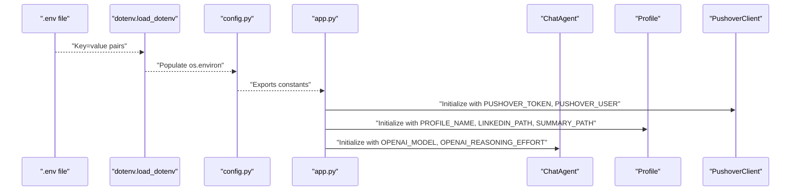
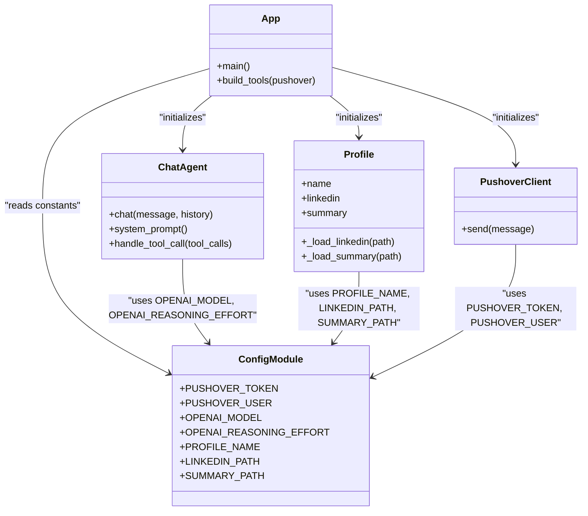
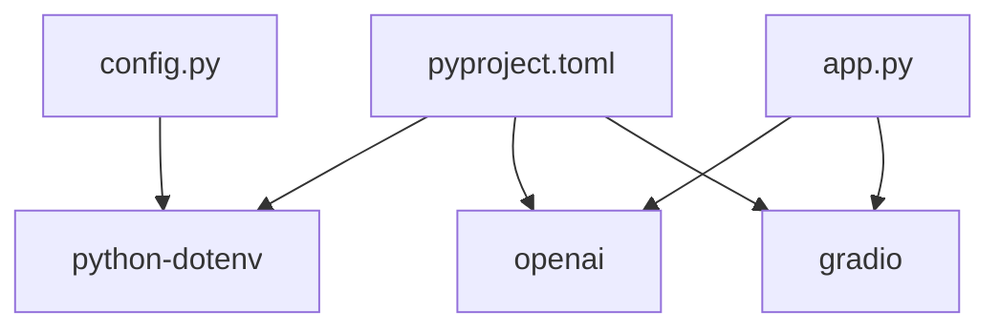

# Configuration Management

<cite>
**Referenced Files in This Document**
- [config.py](file://config.py)
- [app.py](file://app.py)
- [agent.py](file://agent.py)
- [pushover.py](file://pushover.py)
- [user_profile.py](file://user_profile.py)
- [tools.py](file://tools.py)
- [pyproject.toml](file://pyproject.toml)
</cite>

## Table of Contents
1. [Introduction](#introduction)
2. [Project Structure](#project-structure)
3. [Core Components](#core-components)
4. [Architecture Overview](#architecture-overview)
5. [Detailed Component Analysis](#detailed-component-analysis)
6. [Dependency Analysis](#dependency-analysis)
7. [Performance Considerations](#performance-considerations)
8. [Troubleshooting Guide](#troubleshooting-guide)
9. [Conclusion](#conclusion)
10. [Appendices](#appendices)

## Introduction
This document explains configuration management in the Professional Alter Ego system. It covers the environment variable system, API key management, file path configurations, configuration hierarchy, defaults, and override mechanisms. It also provides examples for .env file setup, security best practices for API key storage, environment-specific configurations, validation strategies, error handling for missing settings, troubleshooting, and deployment templates.

## Project Structure
The configuration system centers around a dedicated configuration module that loads environment variables and exposes them to the rest of the application. The application orchestrates components that rely on these settings.

**Diagram sources**
- [config.py:1-14](file://config.py#L1-L14)
- [app.py:1-76](file://app.py#L1-L76)
- [agent.py:1-80](file://agent.py#L1-L80)
- [user_profile.py:1-22](file://user_profile.py#L1-L22)
- [pushover.py:1-17](file://pushover.py#L1-L17)
- [tools.py:1-25](file://tools.py#L1-L25)

**Section sources**
- [config.py:1-14](file://config.py#L1-L14)
- [app.py:1-76](file://app.py#L1-L76)

## Core Components
- Environment loader and exporter: Loads environment variables from .env and exposes them as module constants.
- Application entrypoint: Reads configuration constants and initializes components.
- Chat agent: Uses model and reasoning effort settings for OpenAI completions.
- Profile: Uses name and file paths to load LinkedIn PDF and summary text.
- Pushover client: Uses API token and user key for notifications.
- Tools: Accesses configuration indirectly via application wiring.

Key configuration keys and defaults:
- PUSHOVER_TOKEN: No default; required for Pushover notifications.
- PUSHOVER_USER: No default; required for Pushover notifications.
- OPENAI_MODEL: Default "gpt-4o-mini".
- OPENAI_REASONING_EFFORT: No default; optional.
- PROFILE_NAME: Default "John Doe".
- LINKEDIN_PATH: Default "me/linkedin.pdf".
- SUMMARY_PATH: Default "me/summary.txt".

**Section sources**
- [config.py:6-13](file://config.py#L6-L13)
- [app.py:66-71](file://app.py#L66-L71)
- [agent.py:8-14](file://agent.py#L8-L14)
- [user_profile.py:6-9](file://user_profile.py#L6-L9)
- [pushover.py:8-16](file://pushover.py#L8-L16)

## Architecture Overview
The configuration architecture follows a centralized loader pattern:
- Environment variables are loaded from .env at import time.
- Constants are exported from the configuration module.
- Other modules import and consume these constants.
- Optional values are passed to components that support them.

**Diagram sources**
- [config.py:3-5](file://config.py#L3-L5)
- [config.py:6-13](file://config.py#L6-L13)
- [app.py:66-71](file://app.py#L66-L71)
- [agent.py:8-14](file://agent.py#L8-L14)
- [user_profile.py:6-9](file://user_profile.py#L6-L9)
- [pushover.py:8-16](file://pushover.py#L8-L16)

## Detailed Component Analysis

### Environment Variable System
- Loader: The configuration module imports the environment loader and invokes it during import with override semantics.
- Exporter: After loading, the module reads environment variables and exposes them as module-level constants.
- Override mechanism: The loader is configured to override existing environment variables, enabling local .env overrides in development.

Security and safety considerations:
- API keys are read directly from environment variables without logging.
- No sensitive data is printed or stored in logs by default.

**Section sources**
- [config.py:3-5](file://config.py#L3-L5)
- [config.py:6-13](file://config.py#L6-L13)

### API Key Management
- Pushover credentials:
  - PUSHOVER_TOKEN: Required for sending notifications.
  - PUSHOVER_USER: Required for targeting the notification recipient.
- OpenAI integration:
  - OPENAI_MODEL: Required for chat completions.
  - OPENAI_REASONING_EFFORT: Optional; when present, enables reasoning effort control.

Best practices:
- Store API keys in .env during development.
- Use platform-specific secret managers in production (e.g., environment variables set by the hosting platform).
- Restrict .env file permissions and exclude it from version control.

**Section sources**
- [config.py:6-13](file://config.py#L6-L13)
- [pushover.py:8-16](file://pushover.py#L8-L16)
- [agent.py:66-72](file://agent.py#L66-L72)

### File Path Configurations
- PROFILE_NAME: Used by the profile component to personalize the assistant.
- LINKEDIN_PATH: Path to the LinkedIn PDF; loaded via a PDF reader.
- SUMMARY_PATH: Path to the summary text file; loaded via file I/O.

Defaults:
- LINKEDIN_PATH defaults to "me/linkedin.pdf".
- SUMMARY_PATH defaults to "me/summary.txt".
- PROFILE_NAME defaults to "John Doe".

Validation and error handling:
- Missing file paths will cause runtime errors when attempting to read the files.
- The application does not explicitly validate file existence at startup.

**Section sources**
- [config.py:10-13](file://config.py#L10-L13)
- [user_profile.py:11-21](file://user_profile.py#L11-L21)

### Configuration Hierarchy and Defaults
Hierarchy:
1. Environment variables set by the OS or platform.
2. .env file loaded at import time (override behavior enabled).
3. Module-level defaults defined in the configuration module.

Defaults:
- OPENAI_MODEL: "gpt-4o-mini"
- PROFILE_NAME: "John Doe"
- LINKEDIN_PATH: "me/linkedin.pdf"
- SUMMARY_PATH: "me/summary.txt"
- OPENAI_REASONING_EFFORT: Not set (optional)

Override mechanism:
- Values from .env override OS-level environment variables due to the loader’s override setting.
- The application consumes these values directly without additional transformation.

**Section sources**
- [config.py:8-13](file://config.py#L8-L13)
- [config.py:5](file://config.py#L5)

### Integration Points
- Application entrypoint composes components using configuration constants.
- Chat agent conditionally passes reasoning effort when provided.
- Profile component reads file paths to initialize content.

**Diagram sources**
- [config.py:6-13](file://config.py#L6-L13)
- [app.py:66-71](file://app.py#L66-L71)
- [agent.py:8-14](file://agent.py#L8-L14)
- [user_profile.py:6-9](file://user_profile.py#L6-L9)
- [pushover.py:8-16](file://pushover.py#L8-L16)

**Section sources**
- [app.py:66-71](file://app.py#L66-L71)
- [agent.py:8-14](file://agent.py#L8-L14)
- [user_profile.py:6-9](file://user_profile.py#L6-L9)
- [pushover.py:8-16](file://pushover.py#L8-L16)

## Dependency Analysis
External dependencies relevant to configuration:
- python-dotenv: Enables loading .env files into environment variables.
- openai: Consumes model and reasoning effort settings.
- gradio: Launches the chat interface; configuration affects runtime behavior.

**Diagram sources**
- [pyproject.toml:7-14](file://pyproject.toml#L7-L14)
- [config.py:3](file://config.py#L3)
- [app.py:1](file://app.py#L1)

**Section sources**
- [pyproject.toml:7-14](file://pyproject.toml#L7-L14)

## Performance Considerations
- Environment loading occurs at import time; keep .env minimal to reduce startup overhead.
- Avoid excessive environment variables to prevent confusion and potential conflicts.
- Centralized configuration reduces repeated lookups and improves maintainability.

## Troubleshooting Guide
Common issues and resolutions:
- Missing .env file:
  - Symptoms: Missing API keys or file paths lead to runtime errors.
  - Resolution: Create a .env file with required keys and restart the application.
- Incorrect file paths:
  - Symptoms: Profile initialization fails when reading PDF or summary.
  - Resolution: Verify LINKEDIN_PATH and SUMMARY_PATH match actual files.
- Missing reasoning effort:
  - Symptoms: Optional reasoning effort not applied.
  - Resolution: Set OPENAI_REASONING_EFFORT if desired; otherwise leave unset.
- Pushover delivery failures:
  - Symptoms: Notifications not sent.
  - Resolution: Confirm PUSHOVER_TOKEN and PUSHOVER_USER are valid and correctly formatted.

Validation and error handling:
- The application does not explicitly validate configuration at startup.
- Add explicit checks in the application entrypoint to raise clear errors for missing required values.

**Section sources**
- [config.py:6-13](file://config.py#L6-L13)
- [user_profile.py:11-21](file://user_profile.py#L11-L21)
- [agent.py:66-72](file://agent.py#L66-L72)
- [pushover.py:12-16](file://pushover.py#L12-L16)

## Conclusion
The Professional Alter Ego system uses a straightforward, centralized configuration approach powered by environment variables and .env loading. It defines sensible defaults, supports overrides, and integrates cleanly with the application components. Strengthening configuration validation and adding explicit error reporting would improve robustness and developer experience.

## Appendices

### .env File Setup Template
- Create a .env file at the project root with the following keys:
  - PUSHOVER_TOKEN=<your_pushover_token>
  - PUSHOVER_USER=<your_pushover_user_key>
  - OPENAI_MODEL=<your_model_id>
  - OPENAI_REASONING_EFFORT=<low|medium|high>
  - PROFILE_NAME=<your_name>
  - LINKEDIN_PATH=<path_to_linkedin_pdf>
  - SUMMARY_PATH=<path_to_summary_txt>

Notes:
- Ensure the .env file is excluded from version control.
- Use platform-specific secret management in production environments.

### Security Best Practices for API Keys
- Never commit secrets to version control.
- Use separate tokens for development and production.
- Rotate tokens periodically and revoke compromised ones.
- Limit token scopes to the minimum required permissions.

### Environment-Specific Configuration Examples
- Development:
  - Use .env for local secrets.
  - Keep defaults for non-sensitive values.
- Staging:
  - Use environment variables injected by the platform.
  - Mirror production structure with staging tokens.
- Production:
  - Use platform-managed secrets.
  - Disable local .env usage and enforce strict permissions.

### Configuration Validation and Error Handling Pattern
Add a validation step in the application entrypoint to check required values and raise descriptive errors. For example:
- Validate that PUSHOVER_TOKEN and PUSHOVER_USER are set.
- Validate that LINKEDIN_PATH and SUMMARY_PATH are readable.
- Validate that OPENAI_MODEL is set and recognized by the OpenAI client.

### Deployment Scenarios
- Local development:
  - Place .env in the project root.
  - Run the application normally; environment loader will load .env.
- Containerized deployment:
  - Provide environment variables via container orchestration.
  - Mount volumes for file paths if needed.
- Platform deployment:
  - Configure environment variables in the platform’s secret manager.
  - Ensure file paths align with mounted storage.