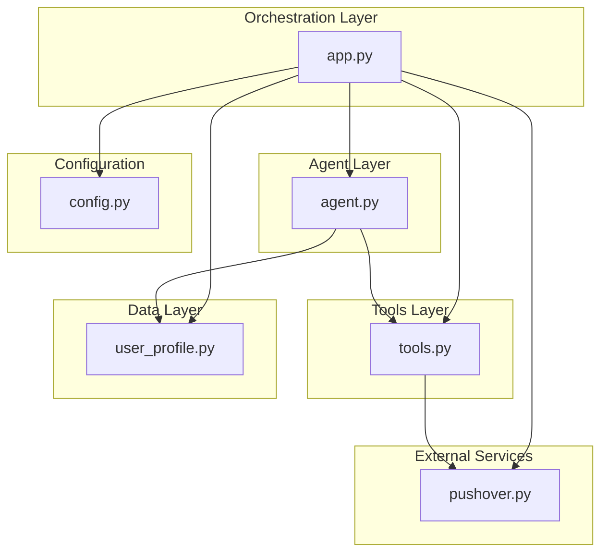
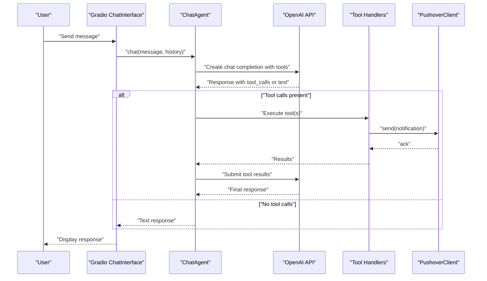
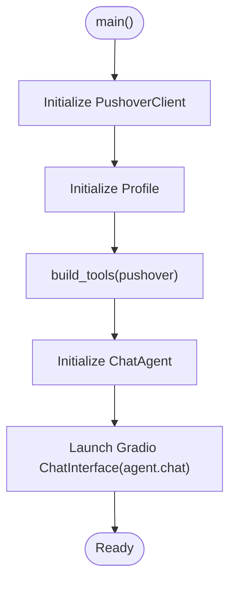
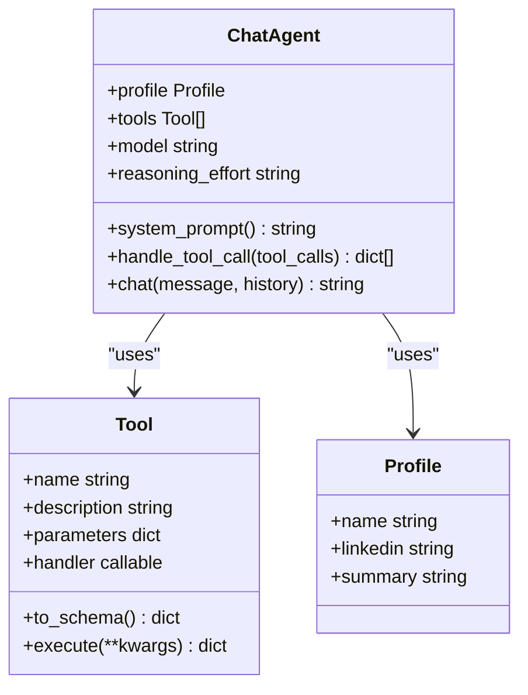
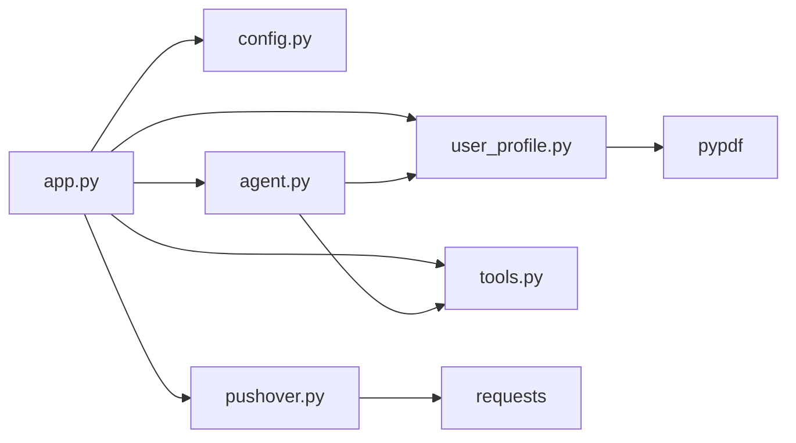
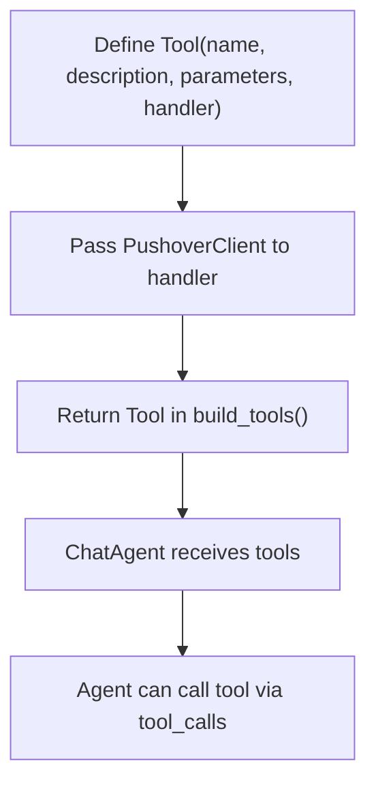

# Application Orchestration

<cite>
**Referenced Files in This Document**
- [app.py](file://app.py)
- [agent.py](file://agent.py)
- [tools.py](file://tools.py)
- [pushover.py](file://pushover.py)
- [user_profile.py](file://user_profile.py)
- [config.py](file://config.py)
- [pyproject.toml](file://pyproject.toml)
- [README.md](file://README.md)
</cite>

## Table of Contents
1. [Introduction](#introduction)
2. [Project Structure](#project-structure)
3. [Core Components](#core-components)
4. [Architecture Overview](#architecture-overview)
5. [Detailed Component Analysis](#detailed-component-analysis)
6. [Dependency Analysis](#dependency-analysis)
7. [Performance Considerations](#performance-considerations)
8. [Troubleshooting Guide](#troubleshooting-guide)
9. [Conclusion](#conclusion)
10. [Appendices](#appendices)

## Introduction
This document explains the application orchestration layer of the Professional Alter Ego chatbot. It focuses on how app.py acts as the main entry point and coordinator for all system components, how tools are constructed with parameter schemas and handlers, and how the main() function initializes PushoverClient, Profile, tools, and ChatAgent instances. It also documents the Gradio ChatInterface integration and how it delegates conversation handling to the ChatAgent, the dependency injection pattern used for tool construction, and the overall application startup sequence. Finally, it provides practical guidance on adding new tools and how the factory pattern enables dynamic tool creation.

## Project Structure
The project follows a clean separation of concerns:
- app.py: Orchestrator and entry point
- agent.py: LLM-driven conversational agent with tool invocation
- tools.py: Generic tool abstraction and schema conversion
- pushover.py: Notification delivery service
- user_profile.py: Profile data loader
- config.py: Environment-driven configuration
- pyproject.toml: Dependencies and project metadata

**Diagram sources**
- [app.py:1-76](file://app.py#L1-L76)
- [agent.py:1-80](file://agent.py#L1-L80)
- [tools.py:1-25](file://tools.py#L1-L25)
- [pushover.py:1-17](file://pushover.py#L1-L17)
- [user_profile.py:1-22](file://user_profile.py#L1-L22)
- [config.py:1-14](file://config.py#L1-L14)

**Section sources**
- [app.py:1-76](file://app.py#L1-L76)
- [pyproject.toml:1-20](file://pyproject.toml#L1-L20)

## Core Components
- app.py orchestrates initialization and launches the chat interface.
- agent.py encapsulates the conversational loop, tool selection, and LLM integration.
- tools.py defines a generic Tool abstraction with schema export and execution.
- pushover.py provides a simple notification client.
- user_profile.py loads and exposes profile data from PDF and text files.
- config.py centralizes environment variables for credentials and paths.

**Section sources**
- [app.py:1-76](file://app.py#L1-L76)
- [agent.py:1-80](file://agent.py#L1-L80)
- [tools.py:1-25](file://tools.py#L1-L25)
- [pushover.py:1-17](file://pushover.py#L1-L17)
- [user_profile.py:1-22](file://user_profile.py#L1-L22)
- [config.py:1-14](file://config.py#L1-L14)

## Architecture Overview
The application follows a layered architecture:
- Orchestration Layer: app.py initializes dependencies and starts the UI.
- Agent Layer: ChatAgent manages conversation state, system prompts, and tool invocation.
- Tools Layer: Tool provides a uniform interface for actions with JSON Schema parameters.
- External Services: PushoverClient integrates with a third-party notification API.
- Data Layer: Profile loads contextual data from files.
- Configuration: Environment variables drive runtime behavior.

**Diagram sources**
- [app.py:66-76](file://app.py#L66-L76)
- [agent.py:57-80](file://agent.py#L57-L80)
- [tools.py:22-25](file://tools.py#L22-L25)
- [pushover.py:12-17](file://pushover.py#L12-L17)

## Detailed Component Analysis

### app.py: Entry Point and Coordinator
- build_tools(): Factory function that constructs Tool instances with:
  - Name and description
  - JSON Schema parameters defining required fields and descriptions
  - Handler lambdas bound to a PushoverClient instance (dependency injection)
  - Returns a list of Tool instances
- main(): Initializes:
  - PushoverClient using tokens from config
  - Profile with name and file paths from config
  - Tools via build_tools(pushover)
  - ChatAgent(profile, tools, model, reasoning_effort)
  - Launches Gradio ChatInterface with agent.chat as the callback

**Diagram sources**
- [app.py:66-76](file://app.py#L66-L76)
- [app.py:10-64](file://app.py#L10-L64)

**Section sources**
- [app.py:10-64](file://app.py#L10-L64)
- [app.py:66-76](file://app.py#L66-L76)

### agent.py: ChatAgent
- ChatAgent encapsulates:
  - OpenAI client initialization
  - Profile and tools
  - Model and optional reasoning effort
  - A tool map for fast lookup
- system_prompt(): Builds a contextual prompt using profile data and instructions.
- handle_tool_call(): Executes tool calls by name, deserializing arguments and returning standardized tool results.
- chat(): Implements the conversation loop:
  - Composes messages (system + history + user)
  - Calls OpenAI with tools enabled
  - If tool_calls are returned, executes them and continues until a final text response is produced

**Diagram sources**
- [agent.py:6-80](file://agent.py#L6-L80)
- [tools.py:4-25](file://tools.py#L4-L25)
- [user_profile.py:4-22](file://user_profile.py#L4-L22)

**Section sources**
- [agent.py:6-80](file://agent.py#L6-L80)

### tools.py: Tool Abstraction
- Tool provides:
  - Constructor storing name, description, parameters (JSON Schema), and handler
  - to_schema(): Converts the tool into a function tool schema compatible with OpenAI
  - execute(**kwargs): Invokes handler with validated parameters and ensures a dict result

**Section sources**
- [tools.py:4-25](file://tools.py#L4-L25)

### pushover.py: PushoverClient
- PushoverClient:
  - Stores token and user
  - send(message): Posts notifications to the Pushover API

**Section sources**
- [pushover.py:4-17](file://pushover.py#L4-L17)

### user_profile.py: Profile
- Profile:
  - Loads LinkedIn text from a PDF
  - Loads a summary text file
  - Exposes name, linkedin, and summary for agent context

**Section sources**
- [user_profile.py:4-22](file://user_profile.py#L4-L22)

### config.py: Environment Configuration
- Loads environment variables for:
  - Pushover credentials
  - OpenAI model and optional reasoning effort
  - Profile name and file paths

**Section sources**
- [config.py:1-14](file://config.py#L1-L14)

## Dependency Analysis
- app.py depends on:
  - config for environment variables
  - agent.ChatAgent for conversation logic
  - user_profile.Profile for context
  - pushover.PushoverClient for notifications
  - tools.Tool for tool definitions
- agent.py depends on:
  - openai.OpenAI for completions
  - tools.Tool for tool execution
  - user_profile.Profile for system prompt
- tools.py depends on:
  - python stdlib (no external dependencies)
- pushover.py depends on:
  - requests for HTTP posting
- user_profile.py depends on:
  - pypdf for PDF parsing

**Diagram sources**
- [app.py:1-7](file://app.py#L1-L7)
- [agent.py:1-4](file://agent.py#L1-L4)
- [pushover.py:1](file://pushover.py#L1)
- [user_profile.py:1](file://user_profile.py#L1)
- [pyproject.toml:7-14](file://pyproject.toml#L7-L14)

**Section sources**
- [pyproject.toml:1-20](file://pyproject.toml#L1-L20)

## Performance Considerations
- Tool execution is synchronous; consider batching or async execution if handlers become expensive.
- PDF loading occurs during initialization; caching or lazy loading could reduce startup latency.
- Network calls to Pushover and OpenAI introduce latency; consider connection pooling and retry policies.
- Tool schemas are static; precomputing and caching schemas avoids repeated conversions.

## Troubleshooting Guide
- Missing environment variables:
  - Ensure PUSHOVER_TOKEN, PUSHOVER_USER, OPENAI_MODEL, PROFILE_NAME, LINKEDIN_PATH, SUMMARY_PATH are set.
- OpenAI errors:
  - Verify model availability and API key configuration.
- Tool execution failures:
  - Confirm handler signatures match the declared parameters.
- Gradio launch issues:
  - Check port availability and firewall settings.

**Section sources**
- [config.py:7-14](file://config.py#L7-L14)
- [app.py:66-76](file://app.py#L66-L76)

## Conclusion
The application orchestration layer cleanly separates concerns: app.py coordinates initialization and UI, agent.py manages conversation and tool invocation, tools.py provides a uniform tool abstraction, pushover.py handles notifications, user_profile.py supplies context, and config.py centralizes environment configuration. The dependency injection pattern in build_tools enables flexible tool construction, while the factory pattern in build_tools allows dynamic tool creation. The Gradio ChatInterface delegates all conversation handling to ChatAgent, which interacts with OpenAI and executes tools as needed.

## Appendices

### Adding a New Tool
To add a new tool:
1. Define a Tool instance in build_tools() with:
   - A unique name
   - A clear description
   - A JSON Schema parameters object specifying required fields and descriptions
   - A handler function bound to the injected PushoverClient instance
2. Return the new Tool alongside existing tools so it becomes available to ChatAgent.
3. Optionally, update the ChatAgent’s system prompt to guide the model to use the new tool when appropriate.

**Diagram sources**
- [app.py:10-64](file://app.py#L10-L64)
- [tools.py:12-25](file://tools.py#L12-L25)

### Example: Dynamic Tool Creation Pattern
- The factory pattern in build_tools() enables dynamic tool creation by constructing Tool instances with varying names, descriptions, and handlers while sharing a single PushoverClient instance.
- This pattern supports easy extension without changing ChatAgent initialization logic.

**Section sources**
- [app.py:10-64](file://app.py#L10-L64)