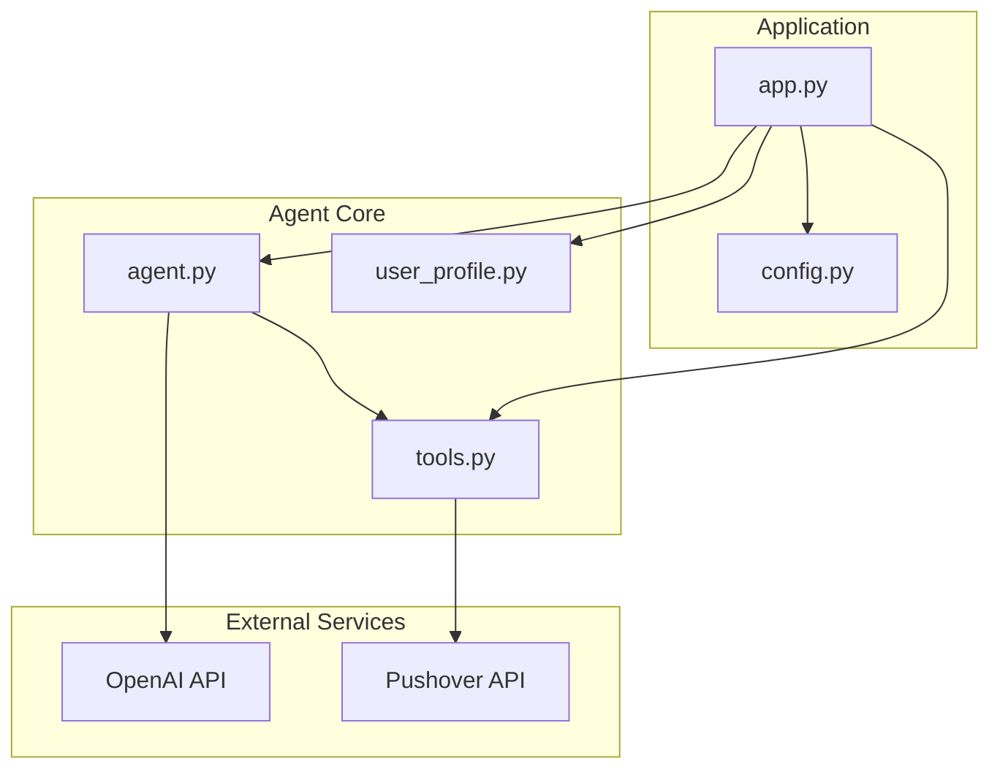
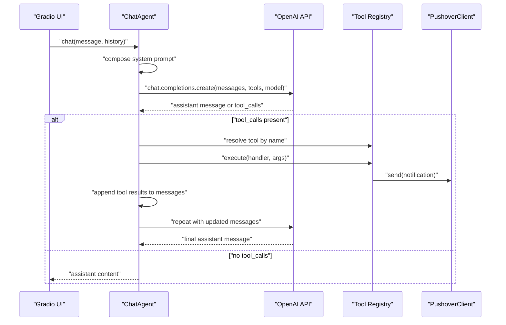
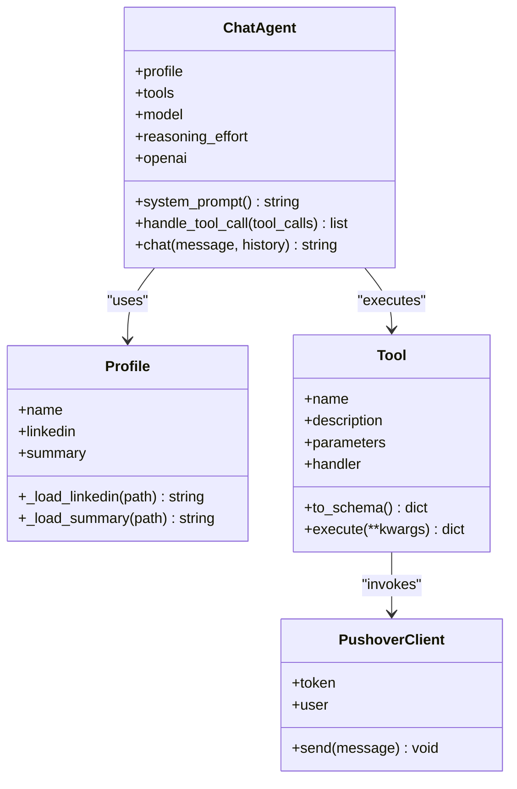
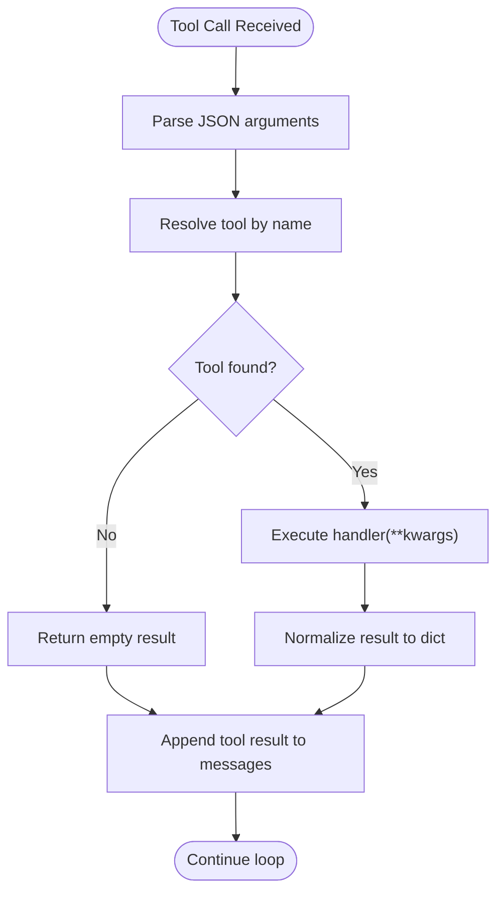
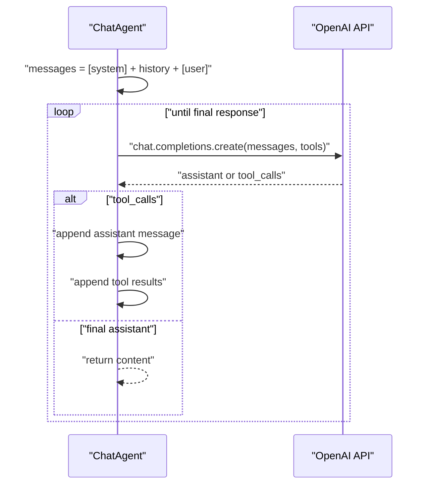
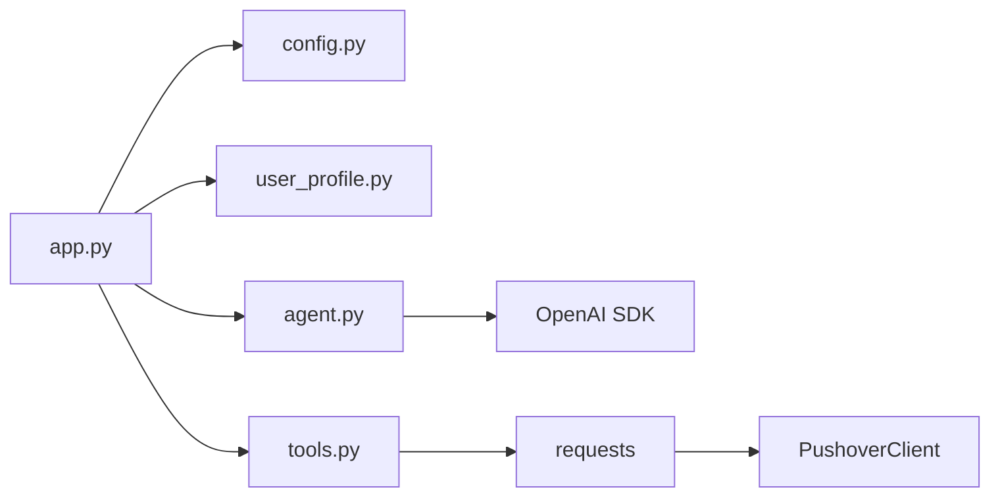

# Chat Agent Engine

<cite>
**Referenced Files in This Document**
- [agent.py](file://agent.py)
- [app.py](file://app.py)
- [config.py](file://config.py)
- [tools.py](file://tools.py)
- [user_profile.py](file://user_profile.py)
- [pushover.py](file://pushover.py)
- [README.md](file://README.md)
- [pyproject.toml](file://pyproject.toml)
</cite>

## Table of Contents
1. [Introduction](#introduction)
2. [Project Structure](#project-structure)
3. [Core Components](#core-components)
4. [Architecture Overview](#architecture-overview)
5. [Detailed Component Analysis](#detailed-component-analysis)
6. [Dependency Analysis](#dependency-analysis)
7. [Performance Considerations](#performance-considerations)
8. [Troubleshooting Guide](#troubleshooting-guide)
9. [Conclusion](#conclusion)

## Introduction
This document explains the Chat Agent Engine, a conversational AI system that coordinates user input, OpenAI API responses, and tool execution to simulate a professional persona. The agent maintains a coherent conversation, applies a persona-driven system prompt, and integrates external tools to record user details or unknown questions. It runs as a Gradio chat interface and is configured via environment variables.

## Project Structure
The project is organized around a small set of focused modules:
- agent.py: Implements the ChatAgent class responsible for orchestration, system prompting, tool calling, and conversation loop.
- app.py: Builds tools, loads profile data, initializes the ChatAgent, and launches the Gradio UI.
- config.py: Loads environment variables for credentials and configuration.
- tools.py: Defines the Tool wrapper and execution interface for external actions.
- user_profile.py: Loads and exposes a persona’s LinkedIn and summary content.
- pushover.py: Provides a simple notification client for tool-side effects.
- pyproject.toml: Declares dependencies including OpenAI, Gradio, PyPDF, and python-dotenv.

**Diagram sources**
- [app.py:66-76](file://app.py#L66-L76)
- [agent.py:6-15](file://agent.py#L6-L15)
- [tools.py:4-25](file://tools.py#L4-L25)
- [user_profile.py:4-22](file://user_profile.py#L4-L22)
- [pushover.py:4-17](file://pushover.py#L4-L17)

**Section sources**
- [README.md:1-3](file://README.md#L1-L3)
- [pyproject.toml:1-20](file://pyproject.toml#L1-L20)

## Core Components
- ChatAgent: Central orchestrator that composes a persona-driven system prompt, manages conversation history, invokes the OpenAI chat completion API, and executes tool calls returned by the model.
- Tool: A wrapper that defines a function schema and an executable handler for side effects.
- Profile: Loads persona content from a PDF and a text summary.
- PushoverClient: Sends notifications to a Pushover endpoint.
- Gradio integration: Exposes the agent as a chat interface.

Key responsibilities:
- Build a system prompt from profile context.
- Maintain conversation history and append user messages.
- Streamline tool-call loops until a final assistant response is produced.
- Validate tool names against a registry and execute handlers.
- Return final assistant content to the UI.

**Section sources**
- [agent.py:6-80](file://agent.py#L6-L80)
- [tools.py:4-25](file://tools.py#L4-L25)
- [user_profile.py:4-22](file://user_profile.py#L4-L22)
- [pushover.py:4-17](file://pushover.py#L4-L17)
- [app.py:66-76](file://app.py#L66-L76)

## Architecture Overview
The ChatAgent sits between the user interface and the OpenAI API. It constructs a system prompt from the persona profile and appends prior conversation turns. When the model responds with tool calls, the agent executes the corresponding handlers and appends tool results back into the conversation until a final assistant message is produced.

**Diagram sources**
- [agent.py:57-80](file://agent.py#L57-L80)
- [agent.py:42-55](file://agent.py#L42-L55)
- [tools.py:22-25](file://tools.py#L22-L25)
- [pushover.py:12-16](file://pushover.py#L12-L16)

## Detailed Component Analysis

### ChatAgent
The ChatAgent encapsulates:
- Initialization parameters:
  - profile: A Profile object containing name, LinkedIn content, and summary.
  - tools: A list of Tool instances.
  - model: The OpenAI model identifier.
  - reasoning_effort: Optional reasoning effort setting passed to the API.
- System prompt construction: Uses profile name, summary, and LinkedIn content to define persona behavior and responsibilities.
- Conversation flow:
  - Compose messages: system prompt + history + user message.
  - Loop while finish_reason indicates tool_calls: append assistant message, execute tool calls, append tool results.
  - Return final assistant content.

**Diagram sources**
- [agent.py:6-80](file://agent.py#L6-L80)
- [user_profile.py:4-22](file://user_profile.py#L4-L22)
- [tools.py:4-25](file://tools.py#L4-L25)
- [pushover.py:4-17](file://pushover.py#L4-L17)

**Section sources**
- [agent.py:8-15](file://agent.py#L8-L15)
- [agent.py:16-40](file://agent.py#L16-L40)
- [agent.py:42-55](file://agent.py#L42-L55)
- [agent.py:57-80](file://agent.py#L57-L80)

### Tool Registry and Execution
- Tool schema: Each Tool exposes a function schema compatible with the OpenAI function calling protocol.
- Execution: The agent resolves a tool by name and executes its handler with parsed JSON arguments. Results are normalized to a dictionary.
- Handlers: The app supplies two tools:
  - record_user_details: Records email, optional name, and notes via Pushover.
  - record_unknown_question: Records questions that could not be answered.

**Diagram sources**
- [agent.py:42-55](file://agent.py#L42-L55)
- [tools.py:12-25](file://tools.py#L12-L25)
- [app.py:10-63](file://app.py#L10-L63)

**Section sources**
- [tools.py:4-25](file://tools.py#L4-L25)
- [app.py:10-63](file://app.py#L10-L63)

### Conversation Management and Memory
- Messages composition: The agent builds a list of messages starting with the system prompt, followed by prior conversation history, and ending with the current user message.
- Loop behavior: After each API call, if the model requests tool execution, the agent appends the assistant message and tool results to the conversation and repeats the API call until a final assistant message is produced.
- Memory retention: The conversation history is maintained in-memory during a session and is passed through each call to preserve context.

**Diagram sources**
- [agent.py:57-80](file://agent.py#L57-L80)

**Section sources**
- [agent.py:57-80](file://agent.py#L57-L80)

### System Prompt Construction
- The system prompt is built dynamically from:
  - Persona name.
  - Summary and LinkedIn content from the Profile.
  - Instructions to stay in character, answer questions, record unknown questions, and capture user contact details when steering toward email.

**Section sources**
- [agent.py:16-40](file://agent.py#L16-L40)
- [user_profile.py:6-22](file://user_profile.py#L6-L22)

### Application Bootstrap and Integration
- Environment configuration: Credentials and model settings are loaded from environment variables.
- Tool construction: Two tools are registered with the agent:
  - record_user_details: Sends a Pushover notification with email, name, and notes.
  - record_unknown_question: Sends a Pushover notification with the recorded question.
- UI integration: The agent’s chat method is wired to a Gradio ChatInterface, enabling a chat UI.

**Section sources**
- [config.py:7-14](file://config.py#L7-L14)
- [app.py:10-63](file://app.py#L10-L63)
- [app.py:66-76](file://app.py#L66-L76)

## Dependency Analysis
- OpenAI SDK: Used to call chat.completions.create with messages, tools, and optional reasoning effort.
- Gradio: Provides the chat UI surface for the agent.
- PyPDF: Reads LinkedIn PDF content for the persona context.
- python-dotenv: Loads environment variables from a .env file.
- requests: Used by PushoverClient to send notifications.

**Diagram sources**
- [pyproject.toml:7-14](file://pyproject.toml#L7-L14)
- [agent.py:9](file://agent.py#L9)
- [tools.py:1](file://tools.py#L1)
- [pushover.py:1](file://pushover.py#L1)

**Section sources**
- [pyproject.toml:1-20](file://pyproject.toml#L1-L20)

## Performance Considerations
- Streaming vs. batching: The agent currently waits for each API call to complete before proceeding. For long conversations, consider batching or streaming updates to improve responsiveness.
- Tool execution latency: External tool calls (e.g., Pushover) introduce network latency. Consider asynchronous execution and caching where appropriate.
- Message size: Large histories increase payload sizes and cost. Consider trimming older messages or summarizing context periodically.
- Model selection: Choose a model that balances cost, speed, and capability for your workload.

## Troubleshooting Guide
Common issues and resolutions:
- Missing environment variables:
  - Ensure PUSHOVER_TOKEN, PUSHOVER_USER, OPENAI_MODEL, PROFILE_NAME, LINKEDIN_PATH, SUMMARY_PATH are set.
  - Reference: [config.py:7-14](file://config.py#L7-L14)
- Tool not found:
  - Verify tool name matches exactly; the agent resolves tools by name.
  - Reference: [agent.py:48](file://agent.py#L48)
- Tool argument validation:
  - The agent expects JSON-parsable arguments; ensure tool schemas match handler signatures.
  - Reference: [agent.py:46](file://agent.py#L46), [tools.py:22-25](file://tools.py#L22-L25)
- OpenAI API errors:
  - Inspect finish_reason and handle unexpected outcomes gracefully.
  - Reference: [agent.py:72-78](file://agent.py#L72-L78)
- Tool execution failures:
  - Confirm handler logic and external service availability (e.g., Pushover).
  - Reference: [tools.py:22-25](file://tools.py#L22-L25), [pushover.py:12-16](file://pushover.py#L12-L16)

**Section sources**
- [config.py:7-14](file://config.py#L7-L14)
- [agent.py:42-55](file://agent.py#L42-L55)
- [agent.py:57-80](file://agent.py#L57-L80)
- [tools.py:22-25](file://tools.py#L22-L25)
- [pushover.py:12-16](file://pushover.py#L12-L16)

## Conclusion
The Chat Agent Engine provides a clean, extensible framework for persona-driven conversations with integrated tool execution. By composing a strong system prompt from profile data, maintaining conversation context, and looping on tool calls, it enables a responsive and capable chat experience. The modular design allows easy addition of new tools and configuration adjustments via environment variables.