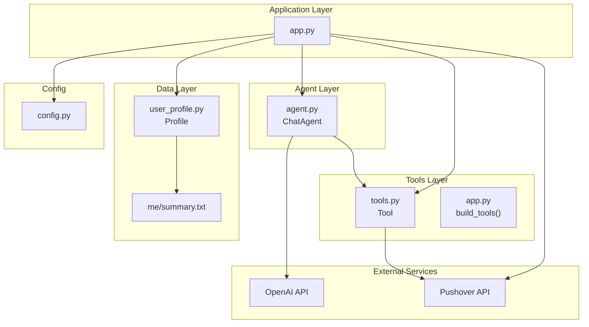
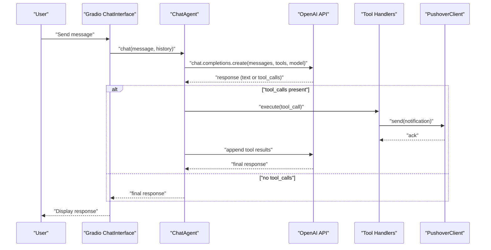
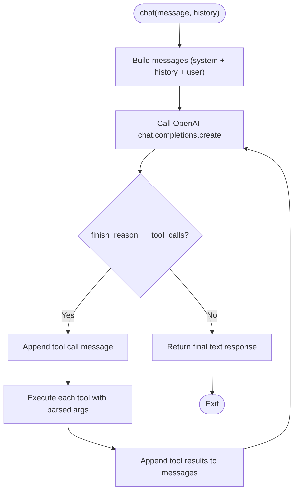
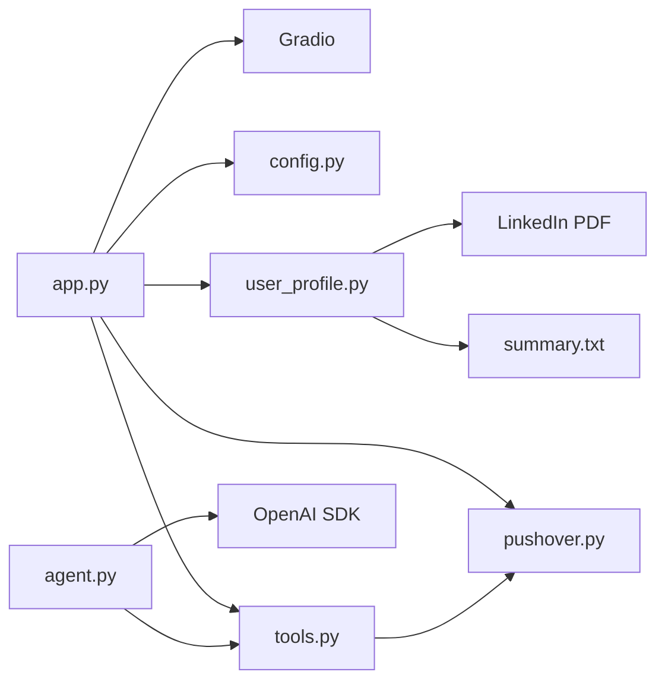

# Core Architecture

<cite>
**Referenced Files in This Document**
- [app.py](file://app.py)
- [agent.py](file://agent.py)
- [tools.py](file://tools.py)
- [config.py](file://config.py)
- [pushover.py](file://pushover.py)
- [user_profile.py](file://user_profile.py)
- [pyproject.toml](file://pyproject.toml)
- [README.md](file://README.md)
- [me/summary.txt](file://me/summary.txt)
</cite>

## Table of Contents
1. [Introduction](#introduction)
2. [Project Structure](#project-structure)
3. [Core Components](#core-components)
4. [Architecture Overview](#architecture-overview)
5. [Detailed Component Analysis](#detailed-component-analysis)
6. [Dependency Analysis](#dependency-analysis)
7. [Performance Considerations](#performance-considerations)
8. [Troubleshooting Guide](#troubleshooting-guide)
9. [Conclusion](#conclusion)

## Introduction
This document describes the core architecture of the Professional Alter Ego system, an agent-based chat application that emulates a professional persona. The system orchestrates a Gradio interface, an OpenAI-powered ChatAgent, a tool framework for actions, and a notification service. It emphasizes modularity, extensibility, and maintainability through design patterns such as Strategy for tools, Factory for dynamic tool creation, and a simple observer-like pattern for notifications.

## Project Structure
The project follows a small, focused layout with clear separation of concerns:
- Application entrypoint and orchestration
- Agent that manages conversation and tool invocation
- Tool abstraction and concrete tool definitions
- Configuration and environment management
- User profile loading from PDF and text
- Notification client for external alerts
- Project metadata and dependencies

**Diagram sources**
- [app.py:66-76](file://app.py#L66-L76)
- [agent.py:6-80](file://agent.py#L6-L80)
- [tools.py:4-25](file://tools.py#L4-L25)
- [user_profile.py:4-22](file://user_profile.py#L4-L22)
- [config.py:1-14](file://config.py#L1-L14)
- [pushover.py:4-17](file://pushover.py#L4-L17)

**Section sources**
- [app.py:1-76](file://app.py#L1-L76)
- [agent.py:1-80](file://agent.py#L1-L80)
- [tools.py:1-25](file://tools.py#L1-L25)
- [config.py:1-14](file://config.py#L1-L14)
- [pushover.py:1-17](file://pushover.py#L1-L17)
- [user_profile.py:1-22](file://user_profile.py#L1-L22)
- [pyproject.toml:1-20](file://pyproject.toml#L1-L20)
- [README.md:1-3](file://README.md#L1-L3)
- [me/summary.txt:1-117](file://me/summary.txt#L1-L117)

## Core Components
- Application Orchestration (app.py): Initializes configuration, constructs the user profile, builds tools, instantiates the ChatAgent, and launches the Gradio interface.
- ChatAgent (agent.py): Manages system prompts, maintains tool registry, invokes OpenAI chat completions, and handles tool calls.
- Tool Framework (tools.py): Defines a minimal Tool abstraction with a schema and execution contract.
- Configuration (config.py): Loads environment variables for credentials and paths.
- User Profile (user_profile.py): Loads LinkedIn content from a PDF and a personal summary from a text file.
- Notification Client (pushover.py): Sends push notifications via the Pushover API.
- Project Metadata (pyproject.toml): Declares dependencies including Gradio, OpenAI SDK, PyPDF, and requests.

Key architectural patterns:
- Strategy pattern for tools: Each tool encapsulates a handler function and parameters, enabling interchangeable behaviors.
- Factory pattern for dynamic tool creation: The build_tools function constructs tool instances with handlers bound to the Pushover client.
- Observer-like pattern for notifications: The ChatAgent triggers tool executions that notify external systems without tightly coupling to them.

**Section sources**
- [app.py:10-63](file://app.py#L10-L63)
- [agent.py:6-80](file://agent.py#L6-L80)
- [tools.py:4-25](file://tools.py#L4-L25)
- [config.py:1-14](file://config.py#L1-L14)
- [user_profile.py:4-22](file://user_profile.py#L4-L22)
- [pushover.py:4-17](file://pushover.py#L4-L17)

## Architecture Overview
The system is orchestrated by app.py, which composes the runtime:
- Reads environment variables from config.py.
- Loads user profile data from PDF and text files.
- Builds tools with handlers bound to a PushoverClient instance.
- Instantiates ChatAgent with the profile, tools, and model settings.
- Launches a Gradio ChatInterface that routes user messages to agent.chat.

**Diagram sources**
- [app.py:66-76](file://app.py#L66-L76)
- [agent.py:57-80](file://agent.py#L57-L80)
- [tools.py:22-25](file://tools.py#L22-L25)
- [pushover.py:12-16](file://pushover.py#L12-L16)

## Detailed Component Analysis

### Application Orchestration (app.py)
Responsibilities:
- Central composition of the runtime: constructs PushoverClient, Profile, Tool instances, and ChatAgent.
- Provides a factory method build_tools that defines tool schemas and binds handlers to the PushoverClient.
- Exposes a main entrypoint that launches the Gradio interface.

Design Decisions:
- Encapsulation of tool creation in a dedicated function enables easy extension with new tools.
- Passing the PushoverClient to tool handlers decouples tool logic from notification specifics.

Integration Points:
- Gradio ChatInterface delegates user interactions to agent.chat.
- Environment variables from config.py drive model selection and file paths.

**Section sources**
- [app.py:10-63](file://app.py#L10-L63)
- [app.py:66-76](file://app.py#L66-L76)

### ChatAgent (agent.py)
Responsibilities:
- Composes a system prompt from the user profile and context.
- Maintains a tool registry mapping tool names to Tool instances.
- Orchestrates OpenAI chat completions and handles tool-call responses iteratively until a final response is produced.

Processing Logic:
- Iterative loop: if the model responds with tool_calls, the agent executes tools and appends results to messages; otherwise it returns the final text response.

**Diagram sources**
- [agent.py:57-80](file://agent.py#L57-L80)
- [agent.py:42-55](file://agent.py#L42-L55)

**Section sources**
- [agent.py:6-80](file://agent.py#L6-L80)

### Tool Framework (tools.py)
Responsibilities:
- Defines a Tool abstraction with name, description, JSON Schema parameters, and a handler function.
- Provides a to_schema method to expose function declarations to OpenAI.
- Executes handlers and normalizes results to dictionaries.

Design Patterns:
- Strategy pattern: Each Tool encapsulates a distinct behavior via handler.
- Factory pattern: Tools are constructed in app.py’s build_tools function with specific handlers.

Extensibility:
- Adding a new tool requires defining a handler and a JSON Schema, then registering it in build_tools.

**Section sources**
- [tools.py:4-25](file://tools.py#L4-L25)
- [app.py:10-63](file://app.py#L10-L63)

### Configuration (config.py)
Responsibilities:
- Loads environment variables for:
  - Pushover credentials (token and user key)
  - OpenAI model and optional reasoning effort
  - Profile name and file paths for LinkedIn PDF and summary text

Environment Management:
- Uses python-dotenv to load .env variables with override semantics.

**Section sources**
- [config.py:1-14](file://config.py#L1-L14)

### User Profile (user_profile.py)
Responsibilities:
- Loads LinkedIn content from a PDF using PyPDF.
- Loads a personal summary from a text file.

Data Handling:
- Aggregates text across PDF pages and reads the summary file synchronously.

**Section sources**
- [user_profile.py:4-22](file://user_profile.py#L4-L22)
- [me/summary.txt:1-117](file://me/summary.txt#L1-L117)

### Notification Client (pushover.py)
Responsibilities:
- Sends push notifications to Pushover via a POST request to the Pushover API.

Integration:
- Bound to tools during construction so tool executions trigger notifications.

**Section sources**
- [pushover.py:4-17](file://pushover.py#L4-L17)

## Dependency Analysis
External dependencies and their roles:
- Gradio: Provides the web UI chat interface.
- OpenAI SDK: Powers the LLM chat completion and tool-call handling.
- PyPDF: Parses LinkedIn PDF content.
- requests: Sends HTTP requests to Pushover.
- python-dotenv: Loads environment variables from .env.

**Diagram sources**
- [pyproject.toml:7-14](file://pyproject.toml#L7-L14)
- [app.py:1-7](file://app.py#L1-L7)
- [agent.py:3](file://agent.py#L3)
- [user_profile.py:1](file://user_profile.py#L1)

**Section sources**
- [pyproject.toml:1-20](file://pyproject.toml#L1-L20)
- [app.py:1-7](file://app.py#L1-L7)
- [agent.py:3](file://agent.py#L3)
- [user_profile.py:1](file://user_profile.py#L1)

## Performance Considerations
- Tool execution latency: Each tool execution triggers an HTTP request to Pushover. Consider batching or async execution if tool volume increases.
- PDF parsing: Loading LinkedIn content from a PDF is synchronous and may block; consider lazy loading or caching if the PDF is large.
- Model selection: Using a smaller model or adjusting reasoning effort can reduce latency and cost.
- Iterative tool-calls: The agent loops until a final response; keep tool schemas precise to minimize unnecessary iterations.

## Troubleshooting Guide
Common issues and remedies:
- Missing environment variables: Ensure PUSHOVER_TOKEN, PUSHOVER_USER, OPENAI_MODEL, PROFILE_NAME, LINKEDIN_PATH, and SUMMARY_PATH are set in the environment.
- OpenAI API errors: Verify credentials and model availability; check network connectivity.
- Tool execution failures: Confirm Pushover credentials and endpoint accessibility; inspect tool handler logs.
- PDF parsing errors: Validate the LinkedIn PDF path and content; ensure PyPDF compatibility.
- Gradio launch issues: Confirm port availability and browser support.

**Section sources**
- [config.py:1-14](file://config.py#L1-L14)
- [pushover.py:12-16](file://pushover.py#L12-L16)
- [user_profile.py:11-21](file://user_profile.py#L11-L21)

## Conclusion
The Professional Alter Ego system demonstrates a clean, modular agent-based architecture. The ChatAgent centralizes conversation logic and tool invocation, while the tool framework and factory pattern enable easy extension. The Gradio interface provides a simple UX, and the Pushover integration offers lightweight notifications. The design balances simplicity with extensibility, making it straightforward to add new tools, adjust prompts, and integrate additional external services.