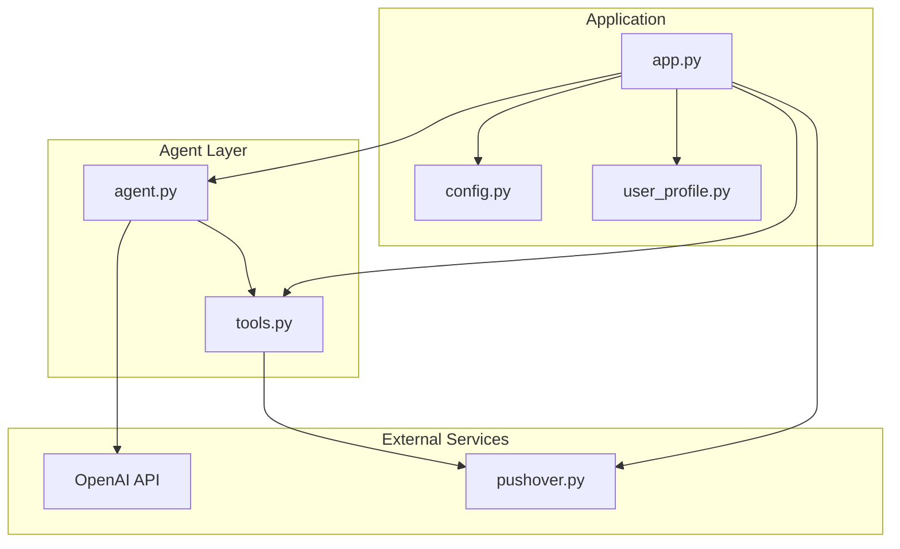
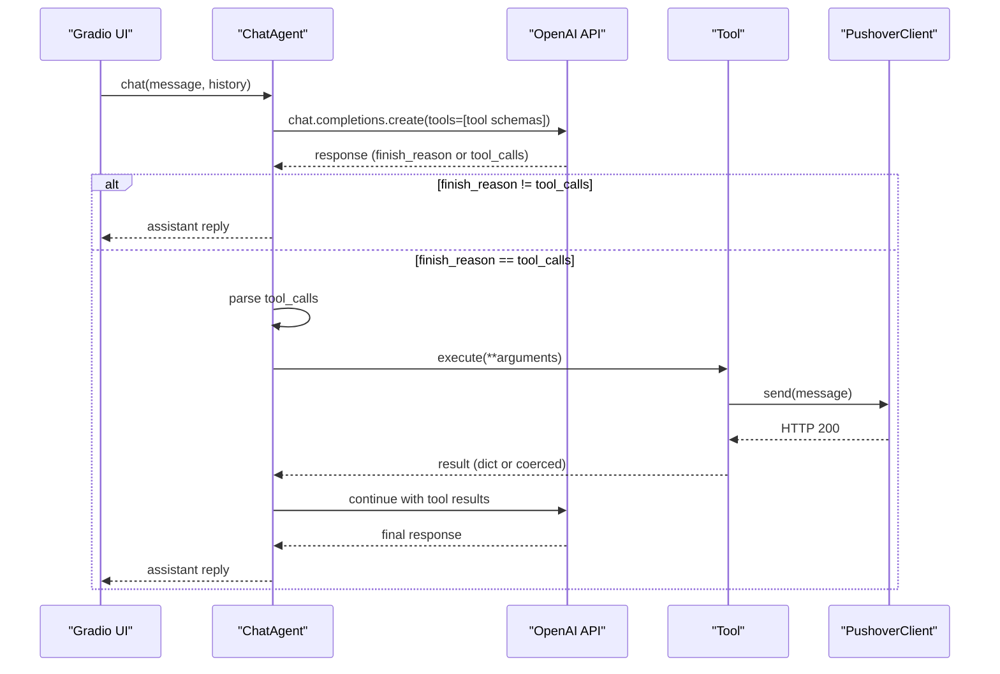
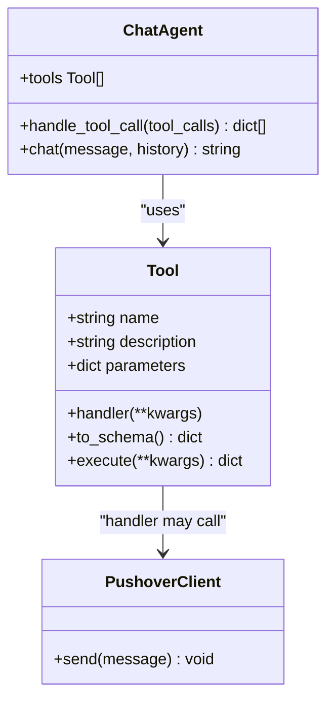
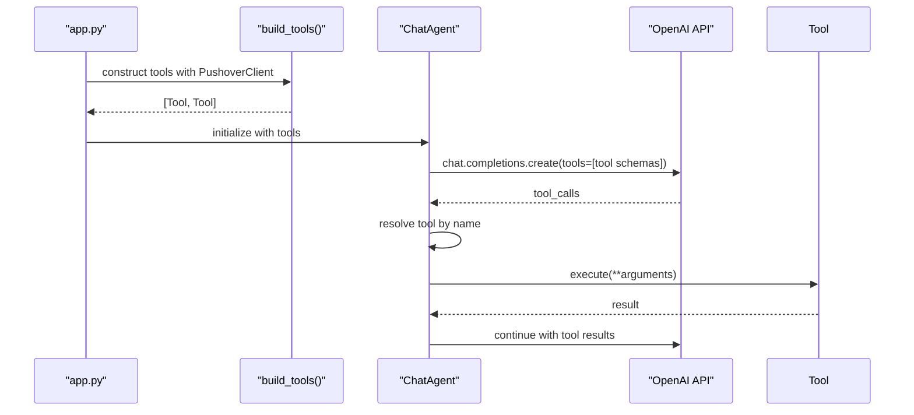
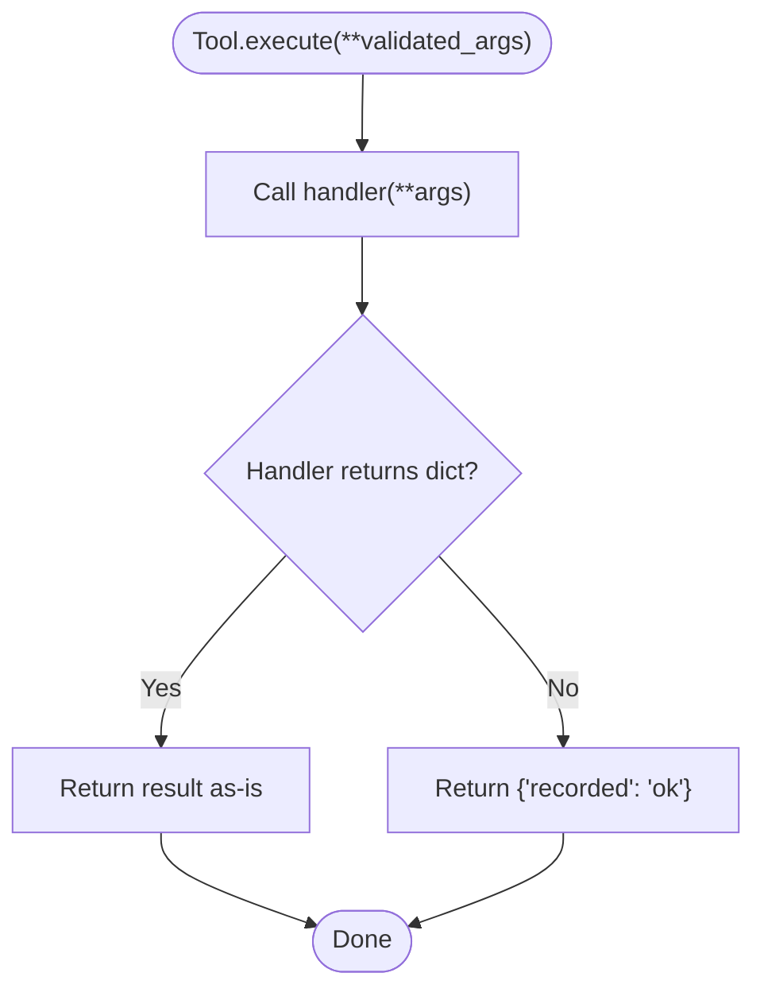
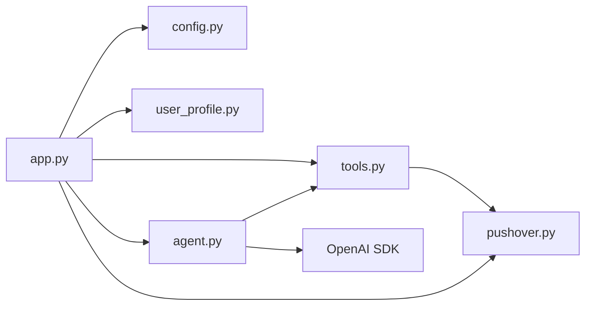

# Tool Framework System

<cite>
**Referenced Files in This Document**
- [tools.py](file://tools.py)
- [agent.py](file://agent.py)
- [app.py](file://app.py)
- [pushover.py](file://pushover.py)
- [config.py](file://config.py)
- [user_profile.py](file://user_profile.py)
- [pyproject.toml](file://pyproject.toml)
- [README.md](file://README.md)
</cite>

## Table of Contents
1. [Introduction](#introduction)
2. [Project Structure](#project-structure)
3. [Core Components](#core-components)
4. [Architecture Overview](#architecture-overview)
5. [Detailed Component Analysis](#detailed-component-analysis)
6. [Dependency Analysis](#dependency-analysis)
7. [Performance Considerations](#performance-considerations)
8. [Troubleshooting Guide](#troubleshooting-guide)
9. [Conclusion](#conclusion)

## Introduction
This document explains the tool framework architecture and implementation used to enable specialized business functions within a chat agent. It covers the Tool abstract base class design, JSON schema validation for tool parameters, the tool handler pattern, tool registration via the build_tools function, and integration with the ChatAgent. It also documents two concrete tools—record_user_details and record_unknown_question—along with best practices for creating custom tools, parameter validation, error handling, lifecycle management, and interactions with external services such as Pushover.

## Project Structure
The project is organized around a small set of focused modules:
- tools.py defines the Tool abstraction and its schema/handler execution model.
- agent.py implements the ChatAgent that integrates tools with OpenAI’s chat completions API.
- app.py constructs tools, initializes the agent, and launches a Gradio UI.
- pushover.py encapsulates Pushover notifications.
- config.py loads environment variables for credentials and model settings.
- user_profile.py loads profile data from PDF and text files.
- pyproject.toml lists dependencies.
- README.md provides a brief project description.

**Diagram sources**
- [app.py:1-76](file://app.py#L1-L76)
- [agent.py:1-80](file://agent.py#L1-L80)
- [tools.py:1-25](file://tools.py#L1-L25)
- [pushover.py:1-17](file://pushover.py#L1-L17)
- [config.py:1-14](file://config.py#L1-L14)
- [user_profile.py:1-22](file://user_profile.py#L1-L22)

**Section sources**
- [README.md:1-3](file://README.md#L1-L3)
- [pyproject.toml:1-20](file://pyproject.toml#L1-L20)

## Core Components
- Tool: A minimal abstraction that binds a tool name, description, JSON Schema parameters, and a handler function. It exposes to_schema() to export a function tool schema compatible with OpenAI and execute() to run the handler with validated parameters.
- ChatAgent: Integrates tools with OpenAI chat completions. It builds a tool map, injects tool schemas into requests, parses tool calls, executes tools, and appends tool results back into the conversation.
- build_tools: Factory function that creates concrete tools (record_user_details, record_unknown_question) and wires them to a PushoverClient instance.
- PushoverClient: Thin wrapper around Pushover’s REST API for sending notifications.

Key responsibilities:
- Tool enforces parameter validation via JSON Schema and delegates execution to a handler.
- ChatAgent orchestrates tool-enabled conversations and manages tool call lifecycle.
- build_tools centralizes tool creation and dependency injection for external services.
- PushoverClient encapsulates network I/O for notifications.

**Section sources**
- [tools.py:4-25](file://tools.py#L4-L25)
- [agent.py:6-80](file://agent.py#L6-L80)
- [app.py:10-63](file://app.py#L10-L63)
- [pushover.py:4-17](file://pushover.py#L4-L17)

## Architecture Overview
The system follows a layered architecture:
- Presentation/UI: Gradio ChatInterface invokes ChatAgent.chat.
- Agent: Builds OpenAI requests with tool schemas, receives tool_calls, executes tools, and continues conversation until completion.
- Tools: Encapsulate business logic with explicit parameter schemas and handlers.
- External Services: Pushover for notifications.

**Diagram sources**
- [agent.py:42-80](file://agent.py#L42-L80)
- [tools.py:22-25](file://tools.py#L22-L25)
- [app.py:10-63](file://app.py#L10-L63)
- [pushover.py:12-17](file://pushover.py#L12-L17)

## Detailed Component Analysis

### Tool Abstraction and Handler Pattern
The Tool class provides a uniform interface for all tools:
- Construction: name, description, parameters (JSON Schema), and handler (callable).
- Schema Export: to_schema() produces a function tool definition suitable for OpenAI.
- Execution: execute() validates and runs the handler, returning a dictionary result.

Execution flow:
- ChatAgent parses tool_call.function.arguments (JSON) and passes them to Tool.execute().
- Tool.execute() calls the handler with keyword arguments and ensures a dict result.

**Diagram sources**
- [tools.py:4-25](file://tools.py#L4-L25)
- [agent.py:42-55](file://agent.py#L42-L55)
- [pushover.py:4-17](file://pushover.py#L4-L17)

**Section sources**
- [tools.py:4-25](file://tools.py#L4-L25)
- [agent.py:42-55](file://agent.py#L42-L55)

### Tool Registration and Integration in ChatAgent
- build_tools creates Tool instances and injects a PushoverClient into their handlers.
- ChatAgent stores tools and builds a tool_map keyed by tool name for fast lookup.
- During chat, ChatAgent includes all tool schemas in the OpenAI request and processes tool_calls returned by the model.

**Diagram sources**
- [app.py:10-63](file://app.py#L10-L63)
- [agent.py:8-14](file://agent.py#L8-L14)
- [agent.py:68-72](file://agent.py#L68-L72)

**Section sources**
- [app.py:10-63](file://app.py#L10-L63)
- [agent.py:8-14](file://agent.py#L8-L14)
- [agent.py:68-72](file://agent.py#L68-L72)

### JSON Schema Validation for Tool Parameters
Each Tool defines a JSON Schema under the parameters field:
- Type: object
- Properties: typed fields with descriptions
- Required: a list of mandatory property names
- AdditionalProperties: disallowed to enforce strict parameter validation

Validation behavior:
- OpenAI validates arguments against the schema before invoking the tool.
- If validation fails, OpenAI will not call the handler.
- The handler receives only validated arguments.

Examples:
- record_user_details requires email and accepts optional name and notes.
- record_unknown_question requires question.

Best practices:
- Keep properties minimal and explicit.
- Use required arrays to enforce mandatory fields.
- Set additionalProperties to false to prevent extra keys.
- Provide clear descriptions for each property.

**Section sources**
- [app.py:17-38](file://app.py#L17-L38)
- [app.py:49-59](file://app.py#L49-L59)

### Tool Handlers and External Service Integration (Pushover)
Handlers are lambdas that receive validated parameters and perform side effects. In this project:
- record_user_details handler sends a formatted message to Pushover.
- record_unknown_question handler logs the unknown question to Pushover.

Lifecycle:
- build_tools constructs tools with a configured PushoverClient.
- Handlers execute during tool calls and return results that ChatAgent forwards to OpenAI.

**Diagram sources**
- [tools.py:22-25](file://tools.py#L22-L25)
- [app.py:39-40](file://app.py#L39-L40)
- [app.py:60](file://app.py#L60)

**Section sources**
- [app.py:39-40](file://app.py#L39-L40)
- [app.py:60](file://app.py#L60)
- [tools.py:22-25](file://tools.py#L22-L25)

### Example Tools: record_user_details and record_unknown_question
- record_user_details
  - Purpose: Record user interest and contact details.
  - Schema: Requires email; optional name and notes.
  - Handler: Sends a formatted message to Pushover.
- record_unknown_question
  - Purpose: Log questions that could not be answered.
  - Schema: Requires question.
  - Handler: Sends a formatted message to Pushover.

These tools demonstrate:
- Clear separation of concerns (schema vs. handler).
- Strict parameter validation via JSON Schema.
- Side-effect handling through PushoverClient.

**Section sources**
- [app.py:10-63](file://app.py#L10-L63)

### Best Practices for Creating Custom Tools
- Define a precise JSON Schema:
  - Use type object with properties and required arrays.
  - Set additionalProperties to false to prevent unexpected keys.
  - Provide descriptions for discoverability.
- Implement robust handlers:
  - Accept only validated keyword arguments.
  - Return a dict result; if handler returns non-dict, Tool.execute coerces a success marker.
- Manage external service dependencies:
  - Inject clients (e.g., PushoverClient) into handlers via closure or dependency injection.
  - Handle errors gracefully and log failures.
- Keep handlers idempotent when possible to simplify retries.
- Document tool behavior and expected inputs in the description field.

[No sources needed since this section provides general guidance]

## Dependency Analysis
The system exhibits low coupling and clear separation of responsibilities:
- app.py depends on config, user_profile, tools, agent, and pushover.
- agent.py depends on tools and OpenAI SDK.
- tools.py is decoupled and reusable.
- pushover.py encapsulates HTTP I/O.
- config.py centralizes environment variables.

**Diagram sources**
- [app.py:1-76](file://app.py#L1-L76)
- [agent.py:1-80](file://agent.py#L1-L80)
- [tools.py:1-25](file://tools.py#L1-L25)
- [pushover.py:1-17](file://pushover.py#L1-L17)
- [config.py:1-14](file://config.py#L1-L14)
- [user_profile.py:1-22](file://user_profile.py#L1-L22)

**Section sources**
- [pyproject.toml:7-14](file://pyproject.toml#L7-L14)

## Performance Considerations
- Tool execution latency is dominated by external service calls (Pushover). Consider batching or async patterns if scaling up.
- Keep tool schemas minimal to reduce OpenAI parsing overhead.
- Avoid heavy synchronous I/O in handlers; offload to background tasks if needed.
- Cache frequently accessed profile data loaded by user_profile.

[No sources needed since this section provides general guidance]

## Troubleshooting Guide
Common issues and resolutions:
- Missing environment variables:
  - Ensure PUSHOVER_TOKEN, PUSHOVER_USER, OPENAI_MODEL, PROFILE_NAME, LINKEDIN_PATH, SUMMARY_PATH are set.
- Tool not recognized:
  - Verify tool name matches exactly and is included in the tool map.
- Parameter validation errors:
  - Confirm required fields are present and types match the schema.
- Handler not invoked:
  - Check that arguments are valid JSON and match the schema.
- Pushover delivery failures:
  - Validate token and user keys; inspect network connectivity and HTTP responses.

**Section sources**
- [config.py:7-13](file://config.py#L7-L13)
- [agent.py:42-55](file://agent.py#L42-L55)
- [app.py:17-38](file://app.py#L17-L38)
- [app.py:49-59](file://app.py#L49-L59)

## Conclusion
The tool framework cleanly separates schema-driven parameter validation from executable handlers, enabling modular, testable, and extensible business logic. By integrating with ChatAgent and external services like Pushover, it supports practical workflows such as capturing user details and logging unknown questions. Following the documented best practices ensures reliable, maintainable tools that scale with evolving requirements.