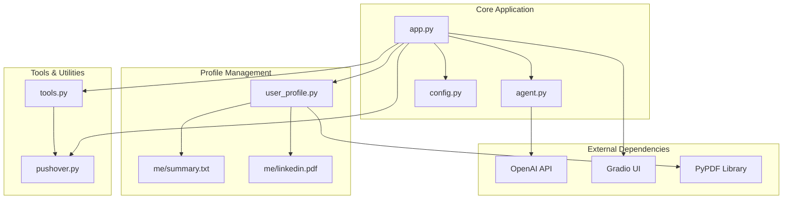
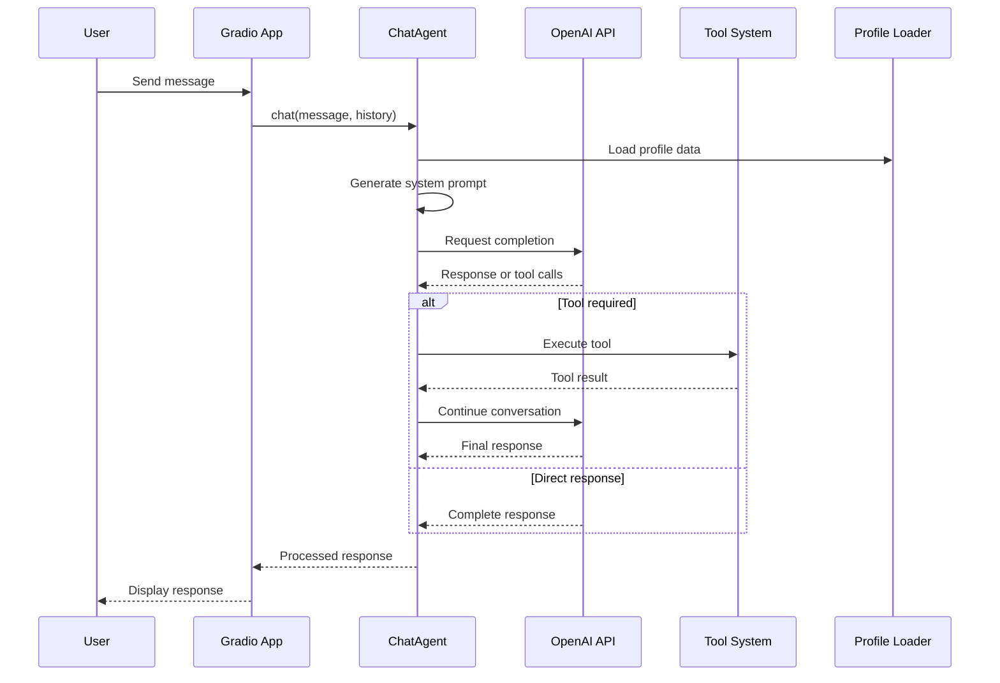
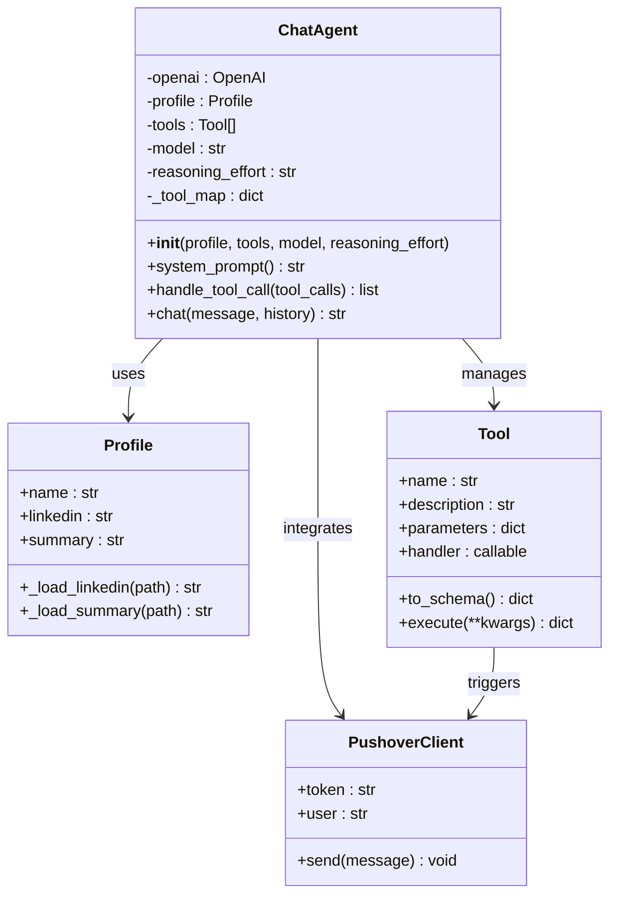
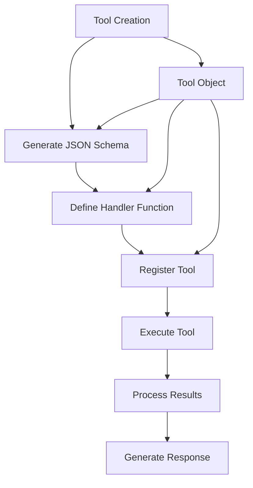
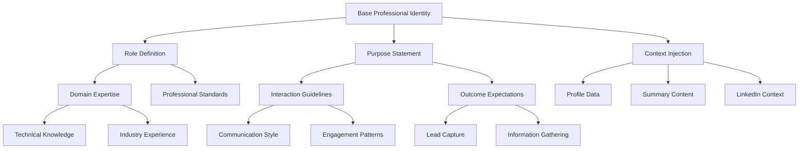

# Customization Guidelines

<cite>
**Referenced Files in This Document**
- [README.md](file://README.md)
- [agent.py](file://agent.py)
- [app.py](file://app.py)
- [config.py](file://config.py)
- [user_profile.py](file://user_profile.py)
- [tools.py](file://tools.py)
- [pushover.py](file://pushover.py)
- [pyproject.toml](file://pyproject.toml)
- [me/summary.txt](file://me/summary.txt)
- [me/linkedin.pdf](file://me/linkedin.pdf)
</cite>

## Table of Contents
1. [Introduction](#introduction)
2. [Project Structure](#project-structure)
3. [Core Components](#core-components)
4. [Architecture Overview](#architecture-overview)
5. [Detailed Component Analysis](#detailed-component-analysis)
6. [Customization Framework](#customization-framework)
7. [Personality and Professional Persona Customization](#personality-and-professional-persona-customization)
8. [Conversation Flow Customization](#conversation-flow-customization)
9. [System Prompt Engineering](#system-prompt-engineering)
10. [Context Injection Patterns](#context-injection-patterns)
11. [Domain-Specific Knowledge Integration](#domain-specific-knowledge-integration)
12. [Common Customization Scenarios](#common-customization-scenarios)
13. [Implementation Examples](#implementation-examples)
14. [Performance Considerations](#performance-considerations)
15. [Troubleshooting Guide](#troubleshooting-guide)
16. [Conclusion](#conclusion)

## Introduction

The Professional Alter-Ego chatbot is designed to emulate a professional persona and provide personalized interactions based on individual profiles. This system allows for extensive customization to adapt the chatbot to different use cases, personalities, and professional contexts. The platform supports dynamic personality modification, conversation flow adjustments, system prompt customization, and integration of domain-specific knowledge.

The chatbot operates as a professional representative, capable of maintaining character consistency while adapting to various interaction scenarios. It leverages advanced AI models with tool-calling capabilities to provide both conversational intelligence and practical functionality.

## Project Structure

The project follows a modular architecture with clear separation of concerns:

**Diagram sources**
- [app.py:1-76](file://app.py#L1-L76)
- [agent.py:1-80](file://agent.py#L1-L80)
- [user_profile.py:1-22](file://user_profile.py#L1-L22)

**Section sources**
- [pyproject.toml:1-20](file://pyproject.toml#L1-L20)
- [README.md:1-3](file://README.md#L1-L3)

## Core Components

The system consists of several interconnected components that work together to provide customizable chatbot functionality:

### ChatAgent Component
The central intelligence module responsible for conversation management, system prompt generation, and tool orchestration.

### Profile Management System
Handles loading and processing of professional profiles from multiple sources including PDF LinkedIn profiles and text-based summaries.

### Tool System
Provides extensible functionality through a standardized tool interface that can be customized for different use cases.

### Configuration Management
Centralizes environment variable handling and system-wide settings.

**Section sources**
- [agent.py:6-80](file://agent.py#L6-L80)
- [user_profile.py:4-22](file://user_profile.py#L4-L22)
- [tools.py:4-25](file://tools.py#L4-L25)
- [config.py:1-14](file://config.py#L1-L14)

## Architecture Overview

The chatbot architecture implements a sophisticated conversation flow with dynamic tool integration:

**Diagram sources**
- [agent.py:57-80](file://agent.py#L57-L80)
- [app.py:66-76](file://app.py#L66-L76)

The architecture supports iterative conversations with automatic tool invocation when the AI requires external data or actions.

## Detailed Component Analysis

### ChatAgent Class Analysis

The ChatAgent serves as the primary interface for conversation management and personality implementation:

**Diagram sources**
- [agent.py:6-80](file://agent.py#L6-L80)
- [user_profile.py:4-22](file://user_profile.py#L4-L22)
- [tools.py:4-25](file://tools.py#L4-L25)
- [pushover.py:4-17](file://pushover.py#L4-L17)

**Section sources**
- [agent.py:6-80](file://agent.py#L6-L80)
- [user_profile.py:4-22](file://user_profile.py#L4-L22)
- [tools.py:4-25](file://tools.py#L4-L25)

### Tool System Architecture

The tool system provides extensible functionality through a standardized interface:

**Diagram sources**
- [tools.py:12-25](file://tools.py#L12-L25)
- [app.py:10-63](file://app.py#L10-L63)

**Section sources**
- [tools.py:4-25](file://tools.py#L4-L25)
- [app.py:10-63](file://app.py#L10-L63)

## Customization Framework

The system provides multiple layers of customization to adapt the chatbot to different use cases and personalities:

### Personality Modification Techniques

Personality customization occurs primarily through system prompt engineering and profile data manipulation:

1. **Profile-Based Personalization**: Modify the individual's professional summary and LinkedIn profile to reflect desired personality traits
2. **System Prompt Engineering**: Adjust the AI's behavioral guidelines and response patterns
3. **Tool Behavior Customization**: Modify tool handlers to change the chatbot's reactive behavior
4. **Conversation Flow Control**: Implement conditional logic to guide conversations toward specific outcomes

### Context Injection Patterns

The system supports dynamic context injection through multiple mechanisms:

- **Profile Context**: Automatic injection of professional background and expertise
- **Conversation History**: Maintained context for coherent dialogue continuation
- **Tool Results**: Dynamic context updates based on tool executions
- **Environment Variables**: Runtime configuration for different deployment scenarios

**Section sources**
- [agent.py:16-40](file://agent.py#L16-L40)
- [user_profile.py:11-21](file://user_profile.py#L11-L21)

## Personality and Professional Persona Customization

### Professional Persona Adaptation

The chatbot can be adapted to represent different professional personas through systematic modifications:

#### Name and Identity
- Modify the profile name to reflect the target persona
- Update professional summary to match desired expertise level
- Customize LinkedIn profile content to align with target industry

#### Communication Style
- Adjust formality levels in system prompts
- Modify response patterns for different professional contexts
- Implement tone variations for various audience types

#### Expertise Representation
- Update technical skill descriptions
- Customize industry-specific terminology
- Adapt experience descriptions to target domain

### Personality Trait Implementation

Personality traits can be encoded through:

1. **Behavioral Constraints**: System prompts that define acceptable response patterns
2. **Response Templates**: Structured response formats for different scenarios
3. **Tool-Triggered Behaviors**: Specific reactions to user inputs through tool handlers
4. **Contextual Adaptations**: Dynamic personality shifts based on conversation context

**Section sources**
- [agent.py:16-40](file://agent.py#L16-L40)
- [user_profile.py:6-9](file://user_profile.py#L6-L9)

## Conversation Flow Customization

### Flow Control Mechanisms

The conversation flow can be customized through multiple approaches:

#### Conditional Response Logic
Implement decision trees for different conversation branches based on user input patterns and context.

#### Tool-Triggered Interventions
Configure tools to automatically intervene at specific conversation points to guide discussions toward desired outcomes.

#### Context-Dependent Adaptations
Modify response strategies based on conversation history, user engagement patterns, and interaction goals.

### Conversation State Management

The system maintains conversation state through:

- **Message History**: Preserved conversation context
- **Tool Call Tracking**: Record of tool executions and results
- **Profile Updates**: Dynamic context based on profile data
- **Configuration Settings**: Runtime behavior modifications

**Section sources**
- [agent.py:57-80](file://agent.py#L57-L80)
- [app.py:66-76](file://app.py#L66-L76)

## System Prompt Engineering

### Prompt Structure Analysis

The system prompt framework provides comprehensive customization capabilities:

**Diagram sources**
- [agent.py:16-40](file://agent.py#L16-L40)

### Prompt Customization Strategies

#### Professional Persona Alignment
- Align role definitions with target professional identity
- Customize communication standards for different audiences
- Adapt interaction guidelines for various business contexts

#### Domain-Specific Adaptations
- Incorporate industry-specific terminology and concepts
- Customize expertise representation for target domains
- Adjust response patterns for specialized professional environments

#### Behavioral Pattern Modifications
- Modify lead capture strategies for different business models
- Adapt engagement patterns for various customer service contexts
- Implement conditional response logic for complex interaction scenarios

**Section sources**
- [agent.py:16-40](file://agent.py#L16-L40)

## Context Injection Patterns

### Multi-Layered Context Management

The system implements sophisticated context injection through multiple layers:

#### Static Context Loading
- Profile-based context from summary and LinkedIn data
- Environment-specific context from configuration files
- Template-based context from predefined prompt structures

#### Dynamic Context Updates
- Tool execution results integrated into conversation context
- User interaction patterns influencing subsequent responses
- Conversation history maintaining contextual coherence

#### Context Transformation
- Raw data processed and formatted for AI consumption
- Context prioritization based on relevance and recency
- Context summarization for memory efficiency

**Section sources**
- [agent.py:57-62](file://agent.py#L57-L62)
- [user_profile.py:11-21](file://user_profile.py#L11-L21)

## Domain-Specific Knowledge Integration

### Knowledge Base Enhancement

The system supports integration of domain-specific knowledge through:

#### Structured Knowledge Sources
- Professional certifications and qualifications
- Industry-specific experience and projects
- Technical skills and competencies aligned with target domain
- Professional network and connections

#### Dynamic Knowledge Access
- Tool-based knowledge retrieval systems
- Context-aware information provision
- Adaptive knowledge presentation based on user needs

#### Knowledge Validation and Quality Control
- Cross-referencing multiple knowledge sources
- Consistency checking for professional claims
- Accuracy verification for technical information

**Section sources**
- [user_profile.py:11-21](file://user_profile.py#L11-L21)
- [agent.py:16-40](file://agent.py#L16-L40)

## Common Customization Scenarios

### Scenario 1: Academic Professional Persona

**Objective**: Transform the chatbot to represent an academic researcher or professor persona.

**Implementation Approach**:
- Modify profile summary to emphasize academic achievements and research focus
- Update system prompt to reflect scholarly communication standards
- Configure tools for academic networking and research collaboration
- Adjust response styles to formal academic language patterns

### Scenario 2: Entrepreneurial Coach Persona

**Objective**: Adapt the chatbot to serve as a business coach or mentor.

**Implementation Approach**:
- Customize profile to highlight coaching experience and business expertise
- Modify system prompt to emphasize motivational and developmental communication
- Implement tools for goal setting and progress tracking
- Adjust conversation flows to support coaching methodologies

### Scenario 3: Technical Consultant Persona

**Objective**: Configure the chatbot as a specialized technical consultant.

**Implementation Approach**:
- Update profile with technical certifications and project experience
- Customize system prompt for technical precision and problem-solving focus
- Integrate tools for technical assessment and solution recommendation
- Adapt response patterns for complex technical discussions

### Scenario 4: Creative Professional Persona

**Objective**: Adapt the chatbot to represent a creative professional (designer, writer, artist).

**Implementation Approach**:
- Modify profile to showcase creative portfolio and artistic achievements
- Update system prompt to reflect creative communication and inspiration
- Configure tools for creative collaboration and feedback collection
- Adjust conversation flows to support creative ideation and development

**Section sources**
- [agent.py:16-40](file://agent.py#L16-L40)
- [user_profile.py:6-9](file://user_profile.py#L6-L9)

## Implementation Examples

### Example 1: Professional Summary Modification

To customize the chatbot's professional persona:

1. **Update Summary Content**: Modify the professional summary text in the summary file to reflect desired expertise and experience level
2. **Adjust System Prompt**: Modify the base system prompt to align with target professional standards
3. **Configure Tools**: Customize tool handlers to support professional interaction patterns
4. **Test Integration**: Verify that all components work together cohesively

### Example 2: Conversation Flow Adjustment

To modify conversation patterns:

1. **Analyze Current Flow**: Review existing conversation logic and identify areas for improvement
2. **Define New Patterns**: Specify desired conversation flows and decision points
3. **Implement Changes**: Modify system prompts and tool configurations accordingly
4. **Validate Results**: Test conversation flows with representative user scenarios

### Example 3: Domain-Specific Knowledge Integration

To add domain expertise:

1. **Prepare Knowledge Sources**: Gather relevant documents, certifications, and experience descriptions
2. **Structure Content**: Organize information in a format suitable for AI processing
3. **Integrate Context**: Add domain-specific context to the system prompt
4. **Test Coverage**: Verify that the AI can effectively utilize new knowledge

**Section sources**
- [me/summary.txt:1-117](file://me/summary.txt#L1-L117)
- [agent.py:16-40](file://agent.py#L16-L40)

## Performance Considerations

### Memory and Context Management

The system implements efficient context management through:

- **Selective Context Loading**: Only load relevant profile data for conversation
- **History Optimization**: Manage conversation history length for optimal performance
- **Tool Result Caching**: Cache frequently accessed tool results
- **Model Parameter Tuning**: Adjust reasoning effort and other model parameters

### Scalability Factors

Key considerations for scaling the customization system:

- **Profile Data Size**: Large profile files may impact initialization time
- **Tool Complexity**: Complex tools increase processing overhead
- **Conversation Length**: Extended conversations require careful memory management
- **External Integrations**: Third-party API calls introduce latency considerations

### Optimization Strategies

Recommended approaches for maintaining performance during customization:

- **Incremental Loading**: Load profile data on-demand rather than at initialization
- **Caching Mechanisms**: Implement caching for frequently accessed profile information
- **Asynchronous Processing**: Use async patterns for external API calls
- **Resource Pooling**: Reuse connections and resources where possible

**Section sources**
- [agent.py:57-80](file://agent.py#L57-L80)
- [config.py:9-10](file://config.py#L9-L10)

## Troubleshooting Guide

### Common Customization Issues

#### Profile Loading Problems
- **Issue**: Profile data not loading correctly
- **Solution**: Verify file paths and permissions, check PDF parsing functionality
- **Prevention**: Validate file existence and format before deployment

#### Tool Execution Failures
- **Issue**: Tools not executing as expected
- **Solution**: Check tool schema definitions and handler functions
- **Prevention**: Implement comprehensive error handling and logging

#### Conversation Flow Breakdowns
- **Issue**: Conversations not following intended patterns
- **Solution**: Review system prompt modifications and tool configurations
- **Prevention**: Test conversation flows incrementally during development

#### Performance Degradation
- **Issue**: Slow response times after customization
- **Solution**: Optimize profile data loading and conversation history management
- **Prevention**: Monitor performance metrics and implement caching strategies

### Debugging Strategies

Effective approaches for troubleshooting customization issues:

1. **Isolate Components**: Test individual components (profile loading, tool execution, conversation flow)
2. **Log Analysis**: Implement comprehensive logging for all system interactions
3. **Unit Testing**: Create tests for critical customization scenarios
4. **Performance Monitoring**: Track system performance under different customization loads

**Section sources**
- [agent.py:42-55](file://agent.py#L42-L55)
- [tools.py:22-25](file://tools.py#L22-L25)

## Conclusion

The Professional Alter-Ego chatbot provides a robust foundation for personality and professional persona customization. Through systematic modifications to system prompts, profile data, and tool configurations, the chatbot can be adapted to represent virtually any professional persona while maintaining conversational coherence and effectiveness.

The modular architecture enables targeted customization without disrupting core functionality, while the tool system provides extensible capabilities for specialized use cases. By following the guidelines and implementation approaches outlined in this document, developers can successfully adapt the chatbot for diverse professional contexts and interaction scenarios.

Key success factors for customization include:
- Thorough testing of conversation flows and personality adaptations
- Careful balance between customization depth and system performance
- Comprehensive validation of domain-specific knowledge integration
- Progressive rollout of complex customization scenarios

The system's flexibility and extensibility make it suitable for a wide range of professional applications, from academic representation to entrepreneurial coaching, technical consulting, and creative professional services.