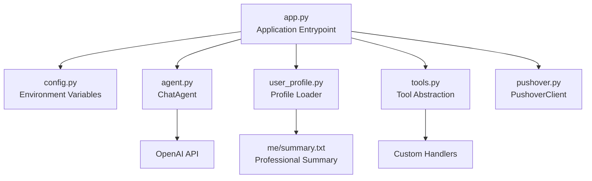
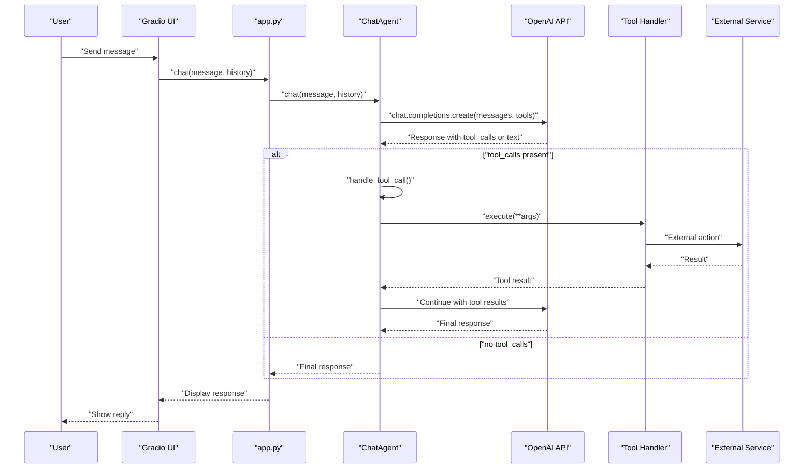
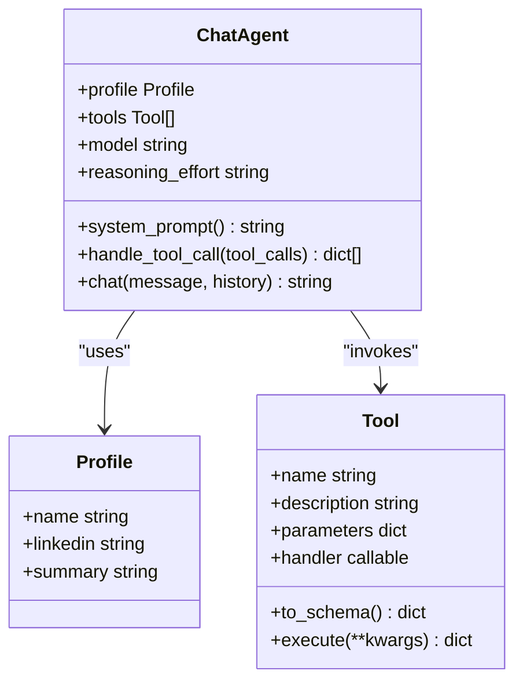
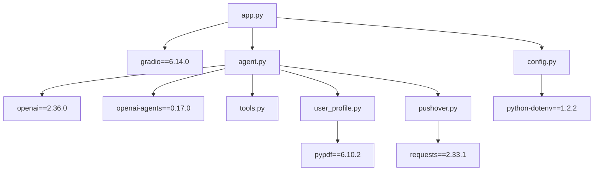

# Development Guide

<cite>
**Referenced Files in This Document**
- [README.md](file://README.md)
- [agent.py](file://agent.py)
- [app.py](file://app.py)
- [config.py](file://config.py)
- [tools.py](file://tools.py)
- [user_profile.py](file://user_profile.py)
- [pushover.py](file://pushover.py)
- [pyproject.toml](file://pyproject.toml)
- [me/summary.txt](file://me/summary.txt)
- [.gitignore](file://.gitignore)
</cite>

## Table of Contents
1. [Introduction](#introduction)
2. [Project Structure](#project-structure)
3. [Core Components](#core-components)
4. [Architecture Overview](#architecture-overview)
5. [Detailed Component Analysis](#detailed-component-analysis)
6. [Dependency Analysis](#dependency-analysis)
7. [Development Workflow](#development-workflow)
8. [Testing Strategies](#testing-strategies)
9. [Debugging Approaches](#debugging-approaches)
10. [Extending the System](#extending-the-system)
11. [Integration Patterns](#integration-patterns)
12. [Performance Considerations](#performance-considerations)
13. [Code Quality Standards](#code-quality-standards)
14. [Documentation Requirements](#documentation-requirements)
15. [Release Procedures](#release-procedures)
16. [Troubleshooting Guide](#troubleshooting-guide)
17. [Conclusion](#conclusion)

## Introduction
This guide documents how to develop, extend, and customize the Professional Alter Ego chatbot. The system simulates a professional persona by combining a user-defined profile with an LLM to deliver coherent, on-brand responses. It uses a tool-based architecture to perform actions (such as capturing user contact details or logging unknown questions) and integrates with external services for notifications.

The primary goal is to enable contributors to add new tools, implement custom business functions, modify conversation flows, and integrate external services while maintaining system integrity and performance.

## Project Structure
The repository follows a minimal, modular layout designed for easy extension:

- Application entrypoint and UI: [app.py](file://app.py)
- Agent orchestration and LLM integration: [agent.py](file://agent.py)
- Tool abstraction and execution: [tools.py](file://tools.py)
- User profile loading: [user_profile.py](file://user_profile.py)
- External notification service: [pushover.py](file://pushover.py)
- Environment configuration: [config.py](file://config.py)
- Project metadata and dependencies: [pyproject.toml](file://pyproject.toml)
- Example profile resources: [me/summary.txt](file://me/summary.txt)
- Version control ignores: [.gitignore](file://.gitignore)

**Diagram sources**
- [app.py:1-76](file://app.py#L1-L76)
- [agent.py:1-80](file://agent.py#L1-L80)
- [tools.py:1-25](file://tools.py#L1-L25)
- [user_profile.py:1-22](file://user_profile.py#L1-L22)
- [pushover.py:1-17](file://pushover.py#L1-L17)
- [config.py:1-14](file://config.py#L1-L14)
- [pyproject.toml:1-20](file://pyproject.toml#L1-L20)
- [me/summary.txt:1-117](file://me/summary.txt#L1-L117)

**Section sources**
- [app.py:1-76](file://app.py#L1-L76)
- [agent.py:1-80](file://agent.py#L1-L80)
- [tools.py:1-25](file://tools.py#L1-L25)
- [user_profile.py:1-22](file://user_profile.py#L1-L22)
- [pushover.py:1-17](file://pushover.py#L1-L17)
- [config.py:1-14](file://config.py#L1-L14)
- [pyproject.toml:1-20](file://pyproject.toml#L1-L20)
- [me/summary.txt:1-117](file://me/summary.txt#L1-L117)

## Core Components
- ChatAgent: Orchestrates system prompts, manages conversation history, invokes the LLM, and executes tools when requested.
- Tool: Defines a callable function schema and executes a handler with validated parameters.
- Profile: Loads and exposes a professional summary and LinkedIn content for the system prompt.
- PushoverClient: Sends notifications to a Pushover endpoint for external integrations.
- Application: Builds tools, loads configuration, initializes the agent, and launches the Gradio UI.

Key responsibilities:
- Conversation control and tool invocation loop
- Parameter validation and tool execution
- Prompt construction and context injection
- External service integration for notifications

**Section sources**
- [agent.py:6-80](file://agent.py#L6-L80)
- [tools.py:4-25](file://tools.py#L4-L25)
- [user_profile.py:4-22](file://user_profile.py#L4-L22)
- [pushover.py:4-17](file://pushover.py#L4-L17)
- [app.py:10-71](file://app.py#L10-L71)

## Architecture Overview
The system uses a tool-centric architecture where the LLM decides when to call tools. The agent maintains conversation history and iteratively calls the LLM until a non-tool-call finish reason is reached. Tools encapsulate business logic and can trigger external integrations.

**Diagram sources**
- [app.py:66-71](file://app.py#L66-L71)
- [agent.py:42-79](file://agent.py#L42-L79)
- [tools.py:22-24](file://tools.py#L22-L24)
- [pushover.py:12-16](file://pushover.py#L12-L16)

## Detailed Component Analysis

### ChatAgent
Responsibilities:
- Build a system prompt from the profile and append conversation history and user message.
- Call the LLM with tools enabled.
- Loop while the LLM requests tool calls, appending tool results to continue the conversation.
- Return the final assistant message.

Important behaviors:
- Tool resolution by name using a tool map.
- Optional reasoning effort parameter passed to the LLM.
- Robust handling of tool execution results.

**Diagram sources**
- [agent.py:6-80](file://agent.py#L6-L80)
- [user_profile.py:4-22](file://user_profile.py#L4-L22)
- [tools.py:4-25](file://tools.py#L4-L25)

**Section sources**
- [agent.py:6-80](file://agent.py#L6-L80)

### Tool Abstraction
Responsibilities:
- Define a function schema for the LLM.
- Execute a handler with validated parameters.
- Normalize results to dictionaries for tool responses.

Best practices:
- Keep handlers pure and deterministic when possible.
- Validate parameters in handlers to prevent runtime errors.
- Return structured dictionaries for consistent tool responses.

**Section sources**
- [tools.py:4-25](file://tools.py#L4-L25)

### Profile Loader
Responsibilities:
- Load LinkedIn PDF content and a professional summary text file.
- Provide formatted text for inclusion in the system prompt.

Considerations:
- Ensure file paths are correct and readable.
- Handle encoding and missing pages gracefully.

**Section sources**
- [user_profile.py:4-22](file://user_profile.py#L4-L22)
- [me/summary.txt:1-117](file://me/summary.txt#L1-L117)

### PushoverClient
Responsibilities:
- Send HTTP POST requests to the Pushover API with configured token and user keys.

Security considerations:
- Store tokens securely via environment variables.
- Avoid logging sensitive data.

**Section sources**
- [pushover.py:4-17](file://pushover.py#L4-L17)

### Application Entrypoint
Responsibilities:
- Initialize configuration, profile, and tools.
- Construct the ChatAgent and launch the Gradio interface.

Extensibility points:
- Add new tools in the tool builder function.
- Modify system prompt construction in the agent.
- Integrate additional external services by passing clients to tools.

**Section sources**
- [app.py:10-71](file://app.py#L10-L71)

## Dependency Analysis
The project relies on several key libraries:

- Gradio: UI and chat interface
- OpenAI: LLM integration
- PyPDF: Loading LinkedIn PDF content
- Requests: External HTTP integrations
- python-dotenv: Environment variable loading

**Diagram sources**
- [pyproject.toml:7-14](file://pyproject.toml#L7-L14)
- [app.py:1-7](file://app.py#L1-L7)
- [agent.py:1-3](file://agent.py#L1-L3)
- [user_profile.py:1](file://user_profile.py#L1)
- [pushover.py:1](file://pushover.py#L1)
- [config.py:3](file://config.py#L3)

**Section sources**
- [pyproject.toml:1-20](file://pyproject.toml#L1-L20)

## Development Workflow
Recommended steps for contributing:

1. Fork and clone the repository.
2. Install dependencies using your preferred Python environment manager.
3. Configure environment variables (see Configuration section).
4. Run the application locally to validate setup.
5. Add or modify tools and conversation logic.
6. Test with representative scenarios.
7. Commit changes with clear messages and update documentation.
8. Submit a pull request for review.

Version control:
- Use .gitignore to exclude virtual environments, logs, and secrets.

**Section sources**
- [.gitignore:150-159](file://.gitignore#L150-L159)

## Testing Strategies
Approach:
- Unit tests for tools: validate parameter parsing and handler behavior.
- Integration tests: simulate conversation loops with the LLM and verify tool execution.
- Manual testing: use the Gradio UI to validate end-to-end flows.
- Edge case testing: invalid inputs, missing files, network failures.

Validation checklist:
- Tool schemas match handler signatures.
- Results are returned consistently as dictionaries.
- Conversation history is preserved and extended correctly.
- External integrations fail gracefully.

[No sources needed since this section provides general guidance]

## Debugging Approaches
Common debugging techniques:
- Enable verbose logging for LLM calls and tool invocations.
- Inspect conversation history and tool results.
- Verify environment variables and file paths.
- Test external service connectivity separately.

Local debugging tips:
- Use a small model or reasoning effort setting for faster iterations.
- Temporarily replace external integrations with stubs during development.

**Section sources**
- [agent.py:47-55](file://agent.py#L47-L55)

## Extending the System

### Adding New Tools
Steps:
1. Define a Tool with a unique name, description, JSON Schema parameters, and a handler.
2. Register the tool in the application’s tool builder function.
3. Optionally integrate external services inside the handler.
4. Update the system prompt to guide the LLM to use the new tool when appropriate.

Guidelines:
- Keep parameter schemas strict and include required fields.
- Validate inputs in handlers to prevent runtime errors.
- Return structured dictionaries for consistent tool responses.

Example patterns:
- Logging unknown questions
- Capturing user contact details
- Triggering notifications or alerts

**Section sources**
- [tools.py:4-25](file://tools.py#L4-L25)
- [app.py:10-63](file://app.py#L10-L63)

### Implementing Custom Business Functions
Patterns:
- Encapsulate business logic in handlers.
- Use the profile context to tailor responses.
- Maintain idempotency where possible (e.g., repeated logging).

Examples:
- Lead qualification workflows
- Content recommendation based on profile
- Automated follow-up scheduling

**Section sources**
- [agent.py:16-40](file://agent.py#L16-L40)
- [user_profile.py:4-22](file://user_profile.py#L4-L22)

### Modifying Conversation Flows
Options:
- Adjust the system prompt to change tone and directives.
- Add conditional logic in the agent to steer conversations toward desired outcomes.
- Introduce multi-turn tool sequences for complex tasks.

Caution:
- Ensure tool usage remains explicit and documented.
- Preserve user privacy and avoid capturing sensitive data unintentionally.

**Section sources**
- [agent.py:16-40](file://agent.py#L16-L40)
- [agent.py:57-79](file://agent.py#L57-L79)

## Integration Patterns
External service integration examples:
- Pushover notifications: demonstrated via PushoverClient.
- Email capture: demonstrated via a tool that records user details and sends a notification.

Best practices:
- Centralize integrations in dedicated clients.
- Use environment variables for credentials.
- Implement retry and timeout policies for reliability.
- Log non-sensitive metadata only.

**Section sources**
- [pushover.py:4-17](file://pushover.py#L4-L17)
- [app.py:10-63](file://app.py#L10-L63)

## Performance Considerations
Optimization techniques:
- Reduce conversation length by trimming unnecessary history.
- Use smaller models or reasoning effort for rapid iteration.
- Cache expensive operations (e.g., profile loading) when appropriate.
- Batch external calls where feasible.

Monitoring:
- Track token usage and response times.
- Observe tool call frequency and latency.

[No sources needed since this section provides general guidance]

## Code Quality Standards
Standards to follow:
- Clear, descriptive names for tools, handlers, and functions.
- Comprehensive docstrings for public APIs.
- Consistent JSON Schema definitions for tool parameters.
- Defensive programming: validate inputs and handle errors gracefully.
- Minimal coupling: keep tools focused and cohesive.

[No sources needed since this section provides general guidance]

## Documentation Requirements
Requirements:
- Update this guide when adding major features.
- Document new tools with parameter descriptions and usage examples.
- Provide configuration instructions for environment variables.
- Include screenshots or short videos demonstrating new capabilities.

[No sources needed since this section provides general guidance]

## Release Procedures
Release steps:
- Update version in project metadata.
- Validate environment variables and configuration.
- Run integration tests against the target environment.
- Tag and publish releases as appropriate.

[No sources needed since this section provides general guidance]

## Troubleshooting Guide
Common issues and resolutions:
- Missing environment variables: ensure all required variables are set.
- File not found errors: verify profile file paths.
- Network errors for external services: check credentials and connectivity.
- Tool execution failures: validate handler signatures and parameter schemas.

**Section sources**
- [config.py:7-14](file://config.py#L7-L14)
- [user_profile.py:11-21](file://user_profile.py#L11-L21)
- [pushover.py:12-16](file://pushover.py#L12-L16)

## Conclusion
This guide provides a foundation for extending and customizing the Professional Alter Ego chatbot. By leveraging the tool abstraction, maintaining clean separation of concerns, and following the outlined patterns, contributors can add powerful capabilities while preserving system integrity and performance.