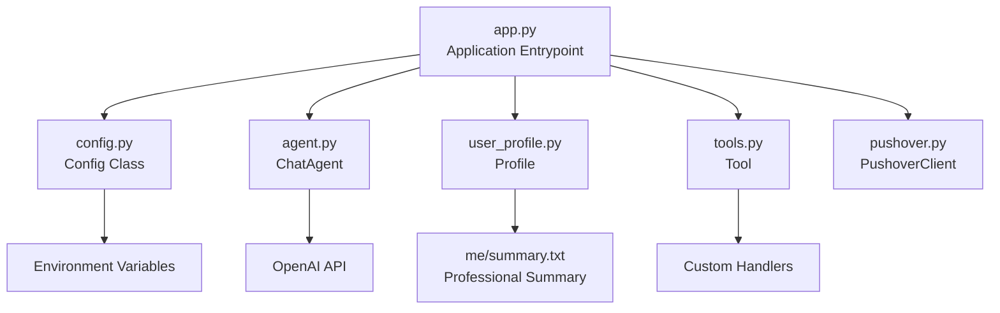
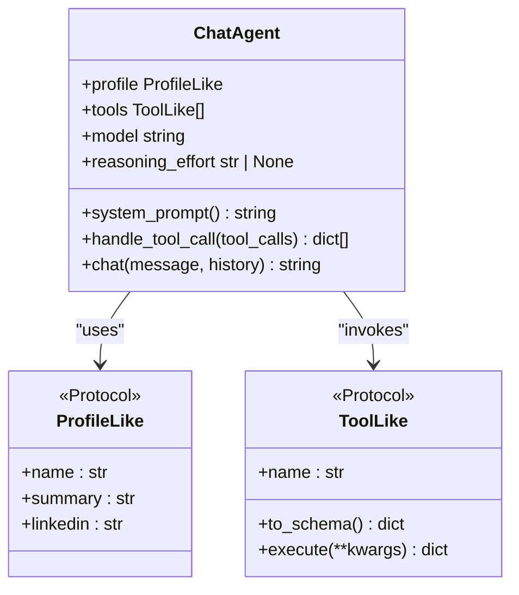
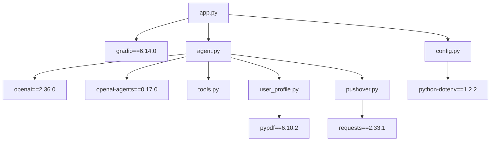

# Development Guide

<cite>
**Referenced Files in This Document**
- [README.md](file://README.md)
- [agent.py](file://agent.py)
- [app.py](file://app.py)
- [config.py](file://config.py)
- [tools.py](file://tools.py)
- [user_profile.py](file://user_profile.py)
- [pushover.py](file://pushover.py)
- [pyproject.toml](file://pyproject.toml)
- [me/summary.txt](file://me/summary.txt)
- [.gitignore](file://.gitignore)
</cite>

## Update Summary
**Changes Made**
- Added comprehensive coverage of protocol-based typing patterns and type safety best practices
- Enhanced customization guidelines with new typing interfaces and improved testing approaches
- Updated architecture diagrams to reflect protocol-based design patterns
- Added detailed documentation for object-oriented configuration management
- Expanded testing strategies to include protocol-based testing approaches

## Table of Contents
1. [Introduction](#introduction)
2. [Project Structure](#project-structure)
3. [Core Components](#core-components)
4. [Architecture Overview](#architecture-overview)
5. [Type Safety and Protocol-Based Design](#type-safety-and-protocol-based-design)
6. [Detailed Component Analysis](#detailed-component-analysis)
7. [Dependency Analysis](#dependency-analysis)
8. [Development Workflow](#development-workflow)
9. [Testing Strategies](#testing-strategies)
10. [Debugging Approaches](#debugging-approaches)
11. [Extending the System](#extending-the-system)
12. [Integration Patterns](#integration-patterns)
13. [Performance Considerations](#performance-considerations)
14. [Code Quality Standards](#code-quality-standards)
15. [Documentation Requirements](#documentation-requirements)
16. [Release Procedures](#release-procedures)
17. [Troubleshooting Guide](#troubleshooting-guide)
18. [Conclusion](#conclusion)

## Introduction
This guide documents how to develop, extend, and customize the Professional Alter Ego chatbot. The system simulates a professional persona by combining a user-defined profile with an LLM to deliver coherent, on-brand responses. It uses a tool-based architecture to perform actions (such as capturing user contact details or logging unknown questions) and integrates with external services for notifications.

The system now employs modern Python typing patterns including protocol-based interfaces, type hints, and object-oriented configuration management to ensure type safety and maintainable code architecture.

## Project Structure
The repository follows a minimal, modular layout designed for easy extension with strong type safety:

- Application entrypoint and UI: [app.py](file://app.py)
- Agent orchestration and LLM integration: [agent.py](file://agent.py)
- Tool abstraction and execution: [tools.py](file://tools.py)
- User profile loading: [user_profile.py](file://user_profile.py)
- External notification service: [pushover.py](file://pushover.py)
- Object-oriented configuration management: [config.py](file://config.py)
- Project metadata and dependencies: [pyproject.toml](file://pyproject.toml)
- Example profile resources: [me/summary.txt](file://me/summary.txt)
- Version control ignores: [.gitignore](file://.gitignore)

**Diagram sources**
- [app.py:1-83](file://app.py#L1-L83)
- [agent.py:1-95](file://agent.py#L1-L95)
- [tools.py:1-26](file://tools.py#L1-L26)
- [user_profile.py:1-22](file://user_profile.py#L1-L22)
- [pushover.py:1-17](file://pushover.py#L1-L17)
- [config.py:1-17](file://config.py#L1-L17)
- [pyproject.toml:1-20](file://pyproject.toml#L1-L20)
- [me/summary.txt:1-117](file://me/summary.txt#L1-L117)

**Section sources**
- [app.py:1-83](file://app.py#L1-L83)
- [agent.py:1-95](file://agent.py#L1-L95)
- [tools.py:1-26](file://tools.py#L1-L26)
- [user_profile.py:1-22](file://user_profile.py#L1-L22)
- [pushover.py:1-17](file://pushover.py#L1-L17)
- [config.py:1-17](file://config.py#L1-L17)
- [pyproject.toml:1-20](file://pyproject.toml#L1-L20)
- [me/summary.txt:1-117](file://me/summary.txt#L1-L117)

## Core Components
- **ChatAgent**: Orchestrates system prompts, manages conversation history, invokes the LLM, and executes tools when requested. Now uses protocol-based typing for type safety.
- **Tool**: Defines a callable function schema and executes a handler with validated parameters. Enhanced with proper type hints.
- **Profile**: Loads and exposes a professional summary and LinkedIn content for the system prompt.
- **PushoverClient**: Sends notifications to a Pushover endpoint for external integrations.
- **Config**: Centralized configuration management with environment variable loading.
- **Application**: Builds tools, loads configuration, initializes the agent, and launches the Gradio UI.

Key responsibilities:
- Conversation control and tool invocation loop with type safety
- Parameter validation and tool execution with protocol-based interfaces
- Prompt construction and context injection with typed profiles
- External service integration for notifications with protocol-based clients
- Centralized configuration management with environment variables

**Section sources**
- [agent.py:21-95](file://agent.py#L21-L95)
- [tools.py:5-26](file://tools.py#L5-L26)
- [user_profile.py:4-22](file://user_profile.py#L4-L22)
- [pushover.py:4-17](file://pushover.py#L4-L17)
- [config.py:6-17](file://config.py#L6-L17)
- [app.py:72-83](file://app.py#L72-L83)

## Architecture Overview
The system uses a tool-centric architecture with protocol-based interfaces where the LLM decides when to call tools. The agent maintains conversation history and iteratively calls the LLM until a non-tool-call finish reason is reached. Tools encapsulate business logic and can trigger external integrations through protocol-based clients.

**Diagram sources**
- [app.py:72-83](file://app.py#L72-L83)
- [agent.py:72-95](file://agent.py#L72-L95)
- [tools.py:23-26](file://tools.py#L23-L26)
- [pushover.py:12-16](file://pushover.py#L12-L16)

## Type Safety and Protocol-Based Design

### Protocol-Based Interfaces
The system now employs Python protocols for type safety and flexible interfaces:

- **ProfileLike Protocol**: Defines the contract for profile objects with name, summary, and linkedin attributes
- **ToolLike Protocol**: Specifies the interface for tools with name, to_schema(), and execute() methods  
- **Notifiable Protocol**: Establishes the contract for notification clients with send() method

### Enhanced Type Hints
The codebase now includes comprehensive type annotations:

- Union types: `str | None` for optional parameters like reasoning_effort
- Protocol typing: Strongly typed interfaces for extensibility
- Generic collections: `list[ToolLike]` for tool collections
- Callable types: `Callable` for handler functions

### Object-Oriented Configuration Management
The Config class centralizes all configuration management:

- Environment variable loading with python-dotenv
- Centralized access to all configuration values
- Type-safe configuration properties
- Default values for optional settings

**Section sources**
- [agent.py:7-18](file://agent.py#L7-L18)
- [app.py:11-14](file://app.py#L11-L14)
- [config.py:6-17](file://config.py#L6-L17)
- [agent.py:23](file://agent.py#L23)

## Detailed Component Analysis

### ChatAgent
Responsibilities:
- Build a system prompt from the profile and append conversation history and user message.
- Call the LLM with tools enabled using protocol-based typing.
- Loop while the LLM requests tool calls, appending tool results to continue the conversation.
- Return the final assistant message.

Important behaviors:
- Tool resolution by name using a tool map with protocol-based interface.
- Optional reasoning effort parameter with union type annotation.
- Robust handling of tool execution results with type safety.

**Diagram sources**
- [agent.py:21-95](file://agent.py#L21-L95)
- [agent.py:7-18](file://agent.py#L7-L18)

**Section sources**
- [agent.py:21-95](file://agent.py#L21-L95)

### Tool Abstraction
Responsibilities:
- Define a function schema for the LLM with proper type hints.
- Execute a handler with validated parameters using Callable type.
- Normalize results to dictionaries for tool responses with type safety.

Best practices:
- Keep handlers pure and deterministic when possible.
- Validate parameters in handlers to prevent runtime errors.
- Return structured dictionaries for consistent tool responses.
- Use proper type annotations for all method signatures.

**Section sources**
- [tools.py:5-26](file://tools.py#L5-L26)

### Profile Loader
Responsibilities:
- Load LinkedIn PDF content and a professional summary text file.
- Provide formatted text for inclusion in the system prompt.

Considerations:
- Ensure file paths are correct and readable.
- Handle encoding and missing pages gracefully.

**Section sources**
- [user_profile.py:4-22](file://user_profile.py#L4-L22)
- [me/summary.txt:1-117](file://me/summary.txt#L1-L117)

### PushoverClient
Responsibilities:
- Send HTTP POST requests to the Pushover API with configured token and user keys.

Security considerations:
- Store tokens securely via environment variables.
- Avoid logging sensitive data.

**Section sources**
- [pushover.py:4-17](file://pushover.py#L4-L17)

### Application Entrypoint
Responsibilities:
- Initialize configuration, profile, and tools with type safety.
- Construct the ChatAgent and launch the Gradio interface.
- Use protocol-based typing for flexible tool integration.

Extensibility points:
- Add new tools in the tool builder function with proper type annotations.
- Modify system prompt construction in the agent.
- Integrate additional external services by passing protocol-based clients to tools.

**Section sources**
- [app.py:72-83](file://app.py#L72-L83)

### Configuration Management
Responsibilities:
- Load environment variables using python-dotenv.
- Provide centralized access to all configuration values.
- Support default values for optional settings.

Configuration keys:
- PUSHOVER_TOKEN: Pushover API token
- PUSHOVER_USER: Pushover user key
- OPENAI_MODEL: OpenAI model identifier (default: gpt-4o-mini)
- OPENAI_REASONING_EFFORT: Reasoning effort level (optional)
- PROFILE_NAME: Professional name (default: John Doe)
- LINKEDIN_PATH: LinkedIn PDF file path (default: me/linkedin.pdf)
- SUMMARY_PATH: Summary text file path (default: me/summary.txt)

**Section sources**
- [config.py:6-17](file://config.py#L6-L17)

## Dependency Analysis
The project relies on several key libraries with enhanced type support:

- Gradio: UI and chat interface
- OpenAI: LLM integration with type hints
- PyPDF: Loading LinkedIn PDF content
- Requests: External HTTP integrations
- python-dotenv: Environment variable loading with type safety

**Diagram sources**
- [pyproject.toml:7-14](file://pyproject.toml#L7-L14)
- [app.py:1-8](file://app.py#L1-L8)
- [agent.py:1-5](file://agent.py#L1-L5)
- [user_profile.py:1](file://user_profile.py#L1)
- [pushover.py:1](file://pushover.py#L1)
- [config.py:3](file://config.py#L3)

**Section sources**
- [pyproject.toml:1-20](file://pyproject.toml#L1-L20)

## Development Workflow
Recommended steps for contributing with type safety:

1. Fork and clone the repository.
2. Install dependencies using your preferred Python environment manager.
3. Configure environment variables (see Configuration section).
4. Run the application locally to validate setup.
5. Add or modify tools and conversation logic with proper type annotations.
6. Test with representative scenarios using protocol-based testing.
7. Commit changes with clear messages and update documentation.
8. Submit a pull request for review.

Version control:
- Use .gitignore to exclude virtual environments, logs, and secrets.

**Section sources**
- [.gitignore:150-159](file://.gitignore#L150-L159)

## Testing Strategies
Approach:
- Unit tests for tools: validate parameter parsing and handler behavior with protocol-based interfaces.
- Integration tests: simulate conversation loops with the LLM and verify tool execution using type-safe protocols.
- Manual testing: use the Gradio UI to validate end-to-end flows.
- Edge case testing: invalid inputs, missing files, network failures.
- Protocol testing: verify that custom implementations satisfy protocol contracts.

Validation checklist:
- Tool schemas match handler signatures with proper type annotations.
- Results are returned consistently as dictionaries with type safety.
- Conversation history is preserved and extended correctly.
- External integrations fail gracefully.
- Protocol implementations satisfy interface contracts.

**Updated** Enhanced testing strategies now include protocol-based testing and type safety validation.

## Debugging Approaches
Common debugging techniques:
- Enable verbose logging for LLM calls and tool invocations.
- Inspect conversation history and tool results.
- Verify environment variables and file paths.
- Test external service connectivity separately.
- Validate protocol implementations at runtime.

Local debugging tips:
- Use a small model or reasoning effort setting for faster iterations.
- Temporarily replace external integrations with stubs during development.
- Leverage IDE type checking for early error detection.

**Section sources**
- [agent.py:57-70](file://agent.py#L57-L70)

## Extending the System

### Adding New Tools
Steps:
1. Define a Tool with a unique name, description, JSON Schema parameters, and a handler with proper type annotations.
2. Register the tool in the application's tool builder function.
3. Optionally integrate external services inside the handler.
4. Update the system prompt to guide the LLM to use the new tool when appropriate.

Guidelines:
- Keep parameter schemas strict and include required fields.
- Validate inputs in handlers to prevent runtime errors.
- Return structured dictionaries for consistent tool responses.
- Use protocol-based typing for flexible tool integration.

Example patterns:
- Logging unknown questions
- Capturing user contact details
- Triggering notifications or alerts

**Section sources**
- [tools.py:5-26](file://tools.py#L5-L26)
- [app.py:16-69](file://app.py#L16-L69)

### Implementing Custom Business Functions
Patterns:
- Encapsulate business logic in handlers with proper type annotations.
- Use the profile context to tailor responses.
- Maintain idempotency where possible (e.g., repeated logging).
- Implement protocol-based interfaces for extensibility.

Examples:
- Lead qualification workflows
- Content recommendation based on profile
- Automated follow-up scheduling

**Section sources**
- [agent.py:31-55](file://agent.py#L31-L55)
- [user_profile.py:4-22](file://user_profile.py#L4-L22)

### Modifying Conversation Flows
Options:
- Adjust the system prompt to change tone and directives.
- Add conditional logic in the agent to steer conversations toward desired outcomes.
- Introduce multi-turn tool sequences for complex tasks.
- Use protocol-based typing for flexible conversation management.

Caution:
- Ensure tool usage remains explicit and documented.
- Preserve user privacy and avoid capturing sensitive data unintentionally.
- Maintain type safety throughout conversation modifications.

**Section sources**
- [agent.py:31-55](file://agent.py#L31-L55)
- [agent.py:72-95](file://agent.py#L72-L95)

### Protocol-Based Extension Patterns
New extension patterns enabled by protocol-based design:

- **Custom Profile Implementations**: Create classes that implement ProfileLike for different data sources
- **Custom Tool Implementations**: Develop classes that implement ToolLike for specialized functionality  
- **Custom Notification Clients**: Implement Notifiable protocol for different notification systems
- **Flexible Configuration**: Use Config class for centralized, type-safe configuration management

**Section sources**
- [agent.py:7-18](file://agent.py#L7-L18)
- [app.py:11-14](file://app.py#L11-L14)
- [config.py:6-17](file://config.py#L6-L17)

## Integration Patterns
External service integration examples:
- Pushover notifications: demonstrated via PushoverClient with protocol-based interface.
- Email capture: demonstrated via a tool that records user details and sends a notification.

Best practices:
- Centralize integrations in dedicated clients with protocol-based interfaces.
- Use environment variables for credentials with type-safe configuration.
- Implement retry and timeout policies for reliability.
- Log non-sensitive metadata only.
- Use protocol-based typing for flexible service integration.

**Section sources**
- [pushover.py:4-17](file://pushover.py#L4-L17)
- [app.py:16-69](file://app.py#L16-L69)

## Performance Considerations
Optimization techniques:
- Reduce conversation length by trimming unnecessary history.
- Use smaller models or reasoning effort for rapid iteration.
- Cache expensive operations (e.g., profile loading) when appropriate.
- Batch external calls where feasible.
- Leverage protocol-based design for efficient tool resolution.

Monitoring:
- Track token usage and response times.
- Observe tool call frequency and latency.
- Monitor type checking performance with modern Python versions.

**Updated** Enhanced performance considerations now include protocol-based design benefits and type checking optimization.

## Code Quality Standards
Standards to follow:
- Clear, descriptive names for tools, handlers, and functions with proper type annotations.
- Comprehensive docstrings for public APIs with type information.
- Consistent JSON Schema definitions for tool parameters.
- Defensive programming: validate inputs and handle errors gracefully.
- Minimal coupling: keep tools focused and cohesive.
- Protocol-based design: use interfaces for flexible, testable code.
- Type safety: leverage Python's type hint system for better code quality.
- Object-oriented configuration: centralize configuration management with the Config class.

**Updated** Enhanced code quality standards now include protocol-based design principles and comprehensive type safety requirements.

## Documentation Requirements
Requirements:
- Update this guide when adding major features with protocol-based implementations.
- Document new tools with parameter descriptions, usage examples, and type annotations.
- Provide configuration instructions for environment variables with type safety.
- Include screenshots or short videos demonstrating new capabilities.
- Document protocol-based interfaces and their usage patterns.
- Specify type requirements for custom implementations.

**Updated** Documentation requirements now include protocol-based interface documentation and type safety guidelines.

## Release Procedures
Release steps:
- Update version in project metadata.
- Validate environment variables and configuration with type safety checks.
- Run integration tests against the target environment.
- Test protocol-based implementations thoroughly.
- Tag and publish releases as appropriate.

**Updated** Release procedures now include protocol-based implementation validation.

## Troubleshooting Guide
Common issues and resolutions:
- Missing environment variables: ensure all required variables are set with proper types.
- File not found errors: verify profile file paths and accessibility.
- Network errors for external services: check credentials and connectivity.
- Tool execution failures: validate handler signatures and parameter schemas.
- Protocol implementation errors: verify that custom classes satisfy protocol contracts.
- Type annotation issues: ensure proper type hints are used throughout the codebase.
- Configuration loading failures: check environment variable formatting and defaults.

**Section sources**
- [config.py:10-17](file://config.py#L10-L17)
- [user_profile.py:11-21](file://user_profile.py#L11-L21)
- [pushover.py:12-16](file://pushover.py#L12-L16)

## Conclusion
This guide provides a foundation for extending and customizing the Professional Alter Ego chatbot with modern Python typing patterns. By leveraging protocol-based interfaces, maintaining clean separation of concerns, following type safety best practices, and utilizing object-oriented configuration management, contributors can add powerful capabilities while preserving system integrity and performance. The enhanced type safety and protocol-based design patterns ensure maintainable, testable, and extensible code that can evolve with changing requirements.