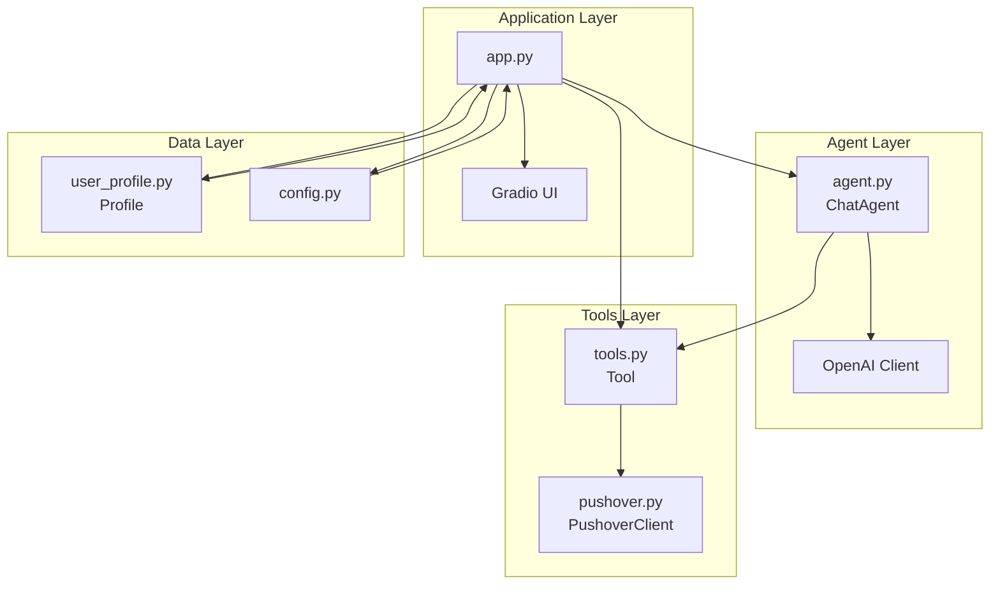
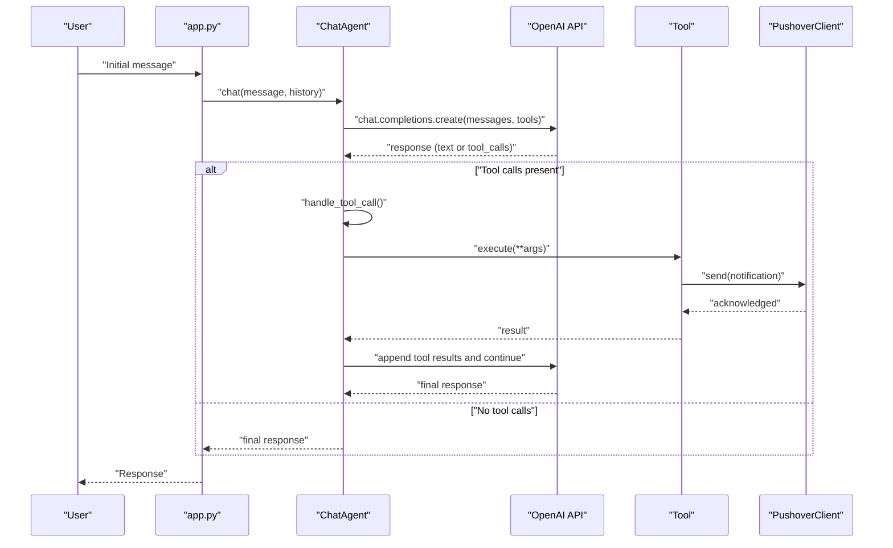

# Testing and Debugging

<cite>
**Referenced Files in This Document**
- [agent.py](file://agent.py)
- [app.py](file://app.py)
- [tools.py](file://tools.py)
- [config.py](file://config.py)
- [user_profile.py](file://user_profile.py)
- [pushover.py](file://pushover.py)
- [pyproject.toml](file://pyproject.toml)
</cite>

## Table of Contents
1. [Introduction](#introduction)
2. [Project Structure](#project-structure)
3. [Core Components](#core-components)
4. [Architecture Overview](#architecture-overview)
5. [Unit Testing Strategies](#unit-testing-strategies)
6. [Integration Testing Approaches](#integration-testing-approaches)
7. [End-to-End Testing](#end-to-end-testing)
8. [Debugging Techniques](#debugging-techniques)
9. [Logging and Error Handling Patterns](#logging-and-error-handling-patterns)
10. [Troubleshooting Guide](#troubleshooting-guide)
11. [Testing Frameworks and Mock Implementations](#testing-frameworks-and-mock-implementations)
12. [Conclusion](#conclusion)

## Introduction
This document provides comprehensive testing and debugging guidance for the Professional Alter Ego chatbot. It covers unit testing strategies for individual components, integration testing approaches for tool execution, and end-to-end testing of conversation flows. It also explains debugging techniques for OpenAI API interactions, tool execution failures, and conversation context issues, along with logging strategies, error handling patterns, and troubleshooting guides tailored to the chatbot architecture.

## Project Structure
The chatbot follows a modular structure with clear separation of concerns:
- Agent module orchestrates conversation and tool invocation
- Tools module defines the tool abstraction and execution interface
- Application module wires configuration, profiles, and UI integration
- Configuration module manages environment variables
- User profile module loads contextual data from PDF and text files
- Pushover module integrates external notifications

**Diagram sources**
- [app.py:66-76](file://app.py#L66-L76)
- [agent.py:57-80](file://agent.py#L57-L80)
- [tools.py:4-25](file://tools.py#L4-L25)
- [pushover.py:4-17](file://pushover.py#L4-L17)
- [user_profile.py:4-22](file://user_profile.py#L4-L22)
- [config.py:1-14](file://config.py#L1-L14)

**Section sources**
- [app.py:1-76](file://app.py#L1-L76)
- [agent.py:1-80](file://agent.py#L1-L80)
- [tools.py:1-25](file://tools.py#L1-L25)
- [pushover.py:1-17](file://pushover.py#L1-L17)
- [user_profile.py:1-22](file://user_profile.py#L1-L22)
- [config.py:1-14](file://config.py#L1-L14)

## Core Components
This section analyzes the primary building blocks of the chatbot and their roles in testing and debugging.

- ChatAgent: Manages conversation flow, constructs system prompts, handles tool calls, and interacts with the OpenAI API. It maintains tool mapping and orchestrates iterative turns until completion.
- Tool: Defines a function schema and execution handler for actions like recording user details or unknown questions.
- Profile: Loads contextual information from a PDF and a text summary to inform the agent’s personality and responses.
- PushoverClient: Sends notifications via the Pushover service for tool executions.
- Configuration: Centralizes environment variables for API keys, model selection, and file paths.

Key testing considerations:
- Isolate ChatAgent from external APIs during unit tests
- Mock OpenAI client and Pushover service
- Validate tool schema generation and execution
- Verify profile loading and prompt construction
- Test conversation loops and termination conditions

**Section sources**
- [agent.py:6-80](file://agent.py#L6-L80)
- [tools.py:4-25](file://tools.py#L4-L25)
- [user_profile.py:4-22](file://user_profile.py#L4-L22)
- [pushover.py:4-17](file://pushover.py#L4-L17)
- [config.py:1-14](file://config.py#L1-L14)

## Architecture Overview
The chatbot architecture supports iterative conversations with tool invocation. The flow alternates between:
- Sending messages to OpenAI
- Receiving tool call requests
- Executing tools and appending results
- Continuing until the model decides the conversation is complete

**Diagram sources**
- [agent.py:57-80](file://agent.py#L57-L80)
- [agent.py:42-55](file://agent.py#L42-L55)
- [tools.py:22-25](file://tools.py#L22-L25)
- [app.py:66-76](file://app.py#L66-L76)
- [pushover.py:12-17](file://pushover.py#L12-L17)

## Unit Testing Strategies
Unit tests focus on validating isolated component behavior without external dependencies.

### Testing ChatAgent
- Prompt construction: Verify system prompt composition with profile data and context.
- Tool call handling: Validate parsing of tool calls and mapping to registered tools.
- Conversation loop: Ensure iterative calls terminate correctly when finish_reason indicates completion.
- Schema integration: Confirm tool schemas are passed to OpenAI.

Recommended assertions:
- System prompt includes profile name, summary, and LinkedIn content.
- Tool call parsing produces expected tool_call_id and JSON-decoded arguments.
- Loop continues until finish_reason equals tool_calls or completion.
- Tool execution returns structured results suitable for appending to messages.

Mocking strategy:
- Replace OpenAI client with a mock that returns deterministic responses.
- Mock tool handlers to return controlled results.
- Capture calls to verify correct argument passing.

**Section sources**
- [agent.py:16-40](file://agent.py#L16-L40)
- [agent.py:42-55](file://agent.py#L42-L55)
- [agent.py:57-80](file://agent.py#L57-L80)

### Testing Tool
- Schema generation: Validate function schema matches expected structure.
- Execution behavior: Ensure execute returns a dictionary and defaults to a standardized result when handler does not return a dict.

Recommended assertions:
- to_schema produces a function type with name, description, and parameters.
- execute returns a dict; if handler returns non-dict, wrap with a standardized structure.

**Section sources**
- [tools.py:12-25](file://tools.py#L12-L25)

### Testing Profile
- PDF loading: Verify extraction of text from pages.
- Summary loading: Ensure UTF-8 decoding and content presence.
- Combined context: Confirm concatenated LinkedIn text and summary are included in prompts.

Recommended assertions:
- LinkedIn text concatenation includes all pages.
- Summary content is readable and non-empty.

**Section sources**
- [user_profile.py:11-22](file://user_profile.py#L11-L22)

### Testing PushoverClient
- Request construction: Validate endpoint URL and payload fields.
- Network behavior: Ensure POST request is sent with token, user, and message.

Recommended assertions:
- POST request reaches the correct URL.
- Message payload includes token, user, and message fields.

**Section sources**
- [pushover.py:12-17](file://pushover.py#L12-L17)

## Integration Testing Approaches
Integration tests validate interactions between components, especially tool execution and OpenAI API communication.

### Tool Execution Integration
- Build tools with a real PushoverClient and confirm notifications are sent.
- Simulate tool execution outcomes and verify message append behavior in the conversation loop.

Test scenarios:
- Tool with required parameters triggers notification and returns structured result.
- Tool with missing parameters handled gracefully by schema validation.

**Section sources**
- [app.py:10-63](file://app.py#L10-L63)
- [tools.py:22-25](file://tools.py#L22-L25)
- [pushover.py:12-17](file://pushover.py#L12-L17)

### OpenAI API Integration
- Configure environment variables for API credentials and model selection.
- Validate that chat.completions.create receives messages, tools, and optional reasoning effort.
- Simulate tool call responses and verify loop continuation and final message extraction.

Test scenarios:
- Successful tool call response leads to appended tool results and continued conversation.
- Non-tool-call finish_reason ends the loop and returns final content.

**Section sources**
- [agent.py:65-79](file://agent.py#L65-L79)
- [config.py:7-10](file://config.py#L7-L10)

## End-to-End Testing
E2E tests simulate realistic user interactions through the Gradio interface and validate complete conversation flows.

### Conversation Flow Validation
- Initialize ChatAgent with a minimal profile and tools.
- Invoke chat with a series of messages representing a typical user journey.
- Verify tool invocations occur when appropriate and notifications are sent.

Test scenarios:
- User asks a question outside known expertise → record_unknown_question invoked.
- User provides contact details → record_user_details invoked with email and optional name/notes.

**Section sources**
- [app.py:66-76](file://app.py#L66-L76)
- [agent.py:57-80](file://agent.py#L57-L80)

### UI Integration
- Launch Gradio ChatInterface with the agent and capture responses.
- Validate that the UI renders and responds to user input without errors.

**Section sources**
- [app.py:70-71](file://app.py#L70-L71)

## Debugging Techniques
Effective debugging requires isolating failure points and instrumenting key areas.

### OpenAI API Interactions
Common issues:
- Authentication failures due to missing or invalid API keys
- Rate limits or quota exceeded
- Model availability or configuration errors

Debugging steps:
- Log request payloads and response metadata
- Capture exceptions and inspect error messages
- Validate environment variables and model selection
- Add retry logic with exponential backoff for transient failures

**Section sources**
- [agent.py:65-79](file://agent.py#L65-L79)
- [config.py:7-10](file://config.py#L7-L10)

### Tool Execution Failures
Common issues:
- Handler exceptions during execution
- Malformed arguments or missing required parameters
- Notification delivery failures

Debugging steps:
- Wrap tool.execute in try-catch and log exceptions
- Validate handler signatures against schema parameters
- Monitor Pushover responses for delivery issues
- Record tool_call_id and arguments for traceability

**Section sources**
- [agent.py:42-55](file://agent.py#L42-L55)
- [tools.py:22-25](file://tools.py#L22-L25)
- [pushover.py:12-17](file://pushover.py#L12-L17)

### Conversation Context Issues
Common issues:
- Missing or incorrect profile data leading to incomplete prompts
- History accumulation causing context overflow
- Tool result formatting errors affecting subsequent API calls

Debugging steps:
- Inspect constructed system prompt and ensure all context is present
- Limit conversation history length to prevent excessive context
- Normalize tool results to JSON-serializable dictionaries
- Add checkpoints to verify message composition before API calls

**Section sources**
- [agent.py:16-40](file://agent.py#L16-L40)
- [agent.py:57-62](file://agent.py#L57-L62)
- [user_profile.py:11-22](file://user_profile.py#L11-L22)

## Logging and Error Handling Patterns
Robust logging and error handling improve observability and reliability.

### Logging Strategy
- Instrument critical paths: tool invocation, OpenAI requests, and response handling
- Include identifiers: tool_call_id, conversation turn index, and request/response sizes
- Log structured data for correlation and analysis

Recommended log entries:
- Tool call received with function name and arguments
- OpenAI request sent with model and message count
- Tool execution result and any exceptions
- Final response content and finish_reason

### Error Handling Patterns
- Wrap external calls in try-catch blocks and re-raise with context
- Validate inputs early and fail fast with descriptive errors
- Implement retries for transient network errors
- Normalize tool results to ensure compatibility with downstream consumers

**Section sources**
- [agent.py:47](file://agent.py#L47)
- [agent.py:72](file://agent.py#L72)
- [tools.py:22-25](file://tools.py#L22-L25)

## Troubleshooting Guide
Common problems and solutions:

- OpenAI API errors
  - Symptom: Exceptions when calling chat.completions.create
  - Actions: Verify API key, check rate limits, confirm model availability
  - References: [agent.py:65-79](file://agent.py#L65-L79), [config.py:7-10](file://config.py#L7-L10)

- Tool execution failures
  - Symptom: Handler exceptions or malformed results
  - Actions: Validate handler signatures, ensure dict return, log arguments
  - References: [tools.py:22-25](file://tools.py#L22-L25), [agent.py:42-55](file://agent.py#L42-L55)

- Profile loading issues
  - Symptom: Empty or corrupted LinkedIn/summary content
  - Actions: Verify file paths, check permissions, ensure UTF-8 encoding
  - References: [user_profile.py:11-22](file://user_profile.py#L11-L22), [config.py:11-13](file://config.py#L11-L13)

- Conversation context overflow
  - Symptom: Excessive context length or repeated messages
  - Actions: Limit history length, normalize messages, trim older entries
  - References: [agent.py:57-62](file://agent.py#L57-L62)

- Pushover notification failures
  - Symptom: Notifications not delivered
  - Actions: Check token/user credentials, verify network connectivity, inspect response codes
  - References: [pushover.py:12-17](file://pushover.py#L12-L17), [app.py:10-63](file://app.py#L10-L63)

## Testing Frameworks and Mock Implementations
Recommended frameworks and mocking strategies:

### Frameworks
- pytest: For organizing unit and integration tests
- unittest.mock: For mocking OpenAI client and Pushover service
- hypothesis: For property-based testing of tool schemas and conversation loops

### Mock Implementations
- OpenAI client mock: Return deterministic responses with tool_calls or final text
- PushoverClient mock: Capture sent messages without network calls
- Tool handler mocks: Return controlled results for predictable outcomes

### Environment Setup
- Install development dependencies from the project configuration
- Configure environment variables for testing (e.g., mock tokens, test model)
- Use fixtures to initialize ChatAgent with predefined profiles and tools

**Section sources**
- [pyproject.toml:16-20](file://pyproject.toml#L16-L20)
- [config.py:1-14](file://config.py#L1-L14)

## Conclusion
This testing and debugging guide provides a comprehensive foundation for ensuring the Professional Alter Ego chatbot behaves reliably across unit, integration, and end-to-end scenarios. By focusing on isolated component testing, validating tool execution, and simulating realistic conversation flows, teams can identify and resolve issues early. Robust logging, structured error handling, and targeted troubleshooting procedures will improve maintainability and user experience.