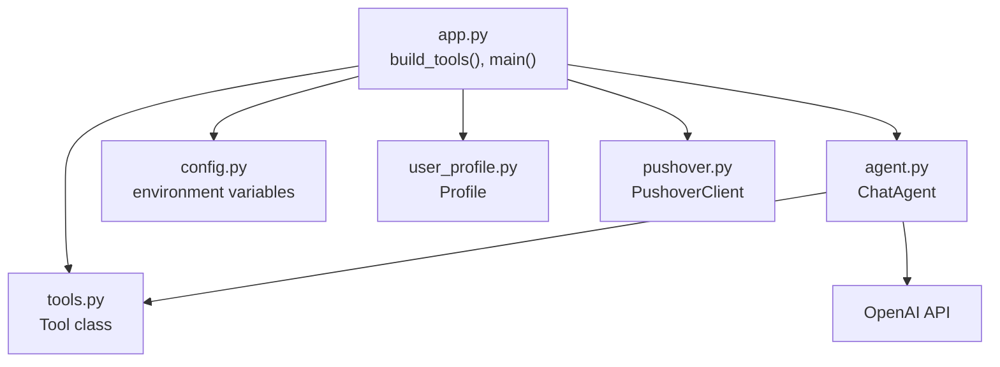
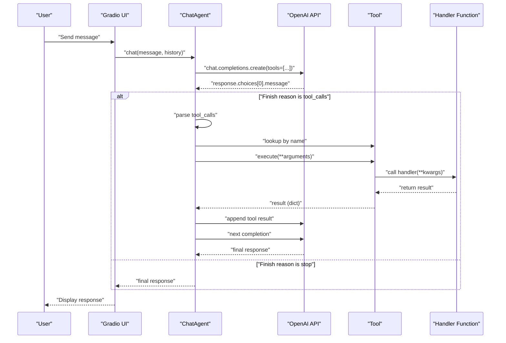
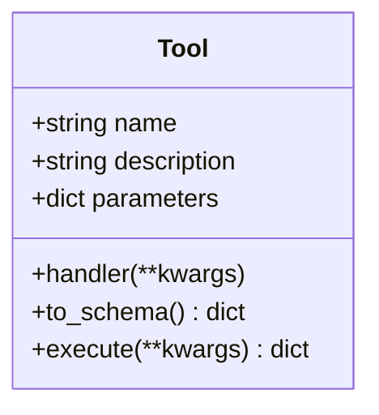
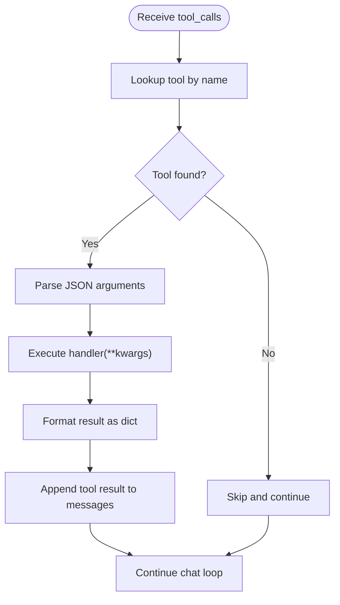
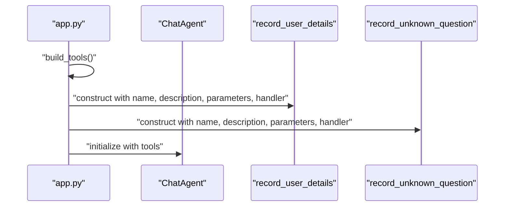
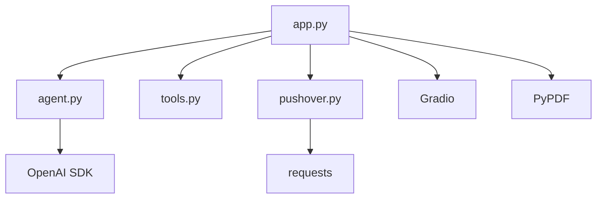

# Tool Development

<cite>
**Referenced Files in This Document**
- [tools.py](file://tools.py)
- [agent.py](file://agent.py)
- [app.py](file://app.py)
- [config.py](file://config.py)
- [user_profile.py](file://user_profile.py)
- [pushover.py](file://pushover.py)
- [pyproject.toml](file://pyproject.toml)
</cite>

## Table of Contents
1. [Introduction](#introduction)
2. [Project Structure](#project-structure)
3. [Core Components](#core-components)
4. [Architecture Overview](#architecture-overview)
5. [Detailed Component Analysis](#detailed-component-analysis)
6. [Dependency Analysis](#dependency-analysis)
7. [Performance Considerations](#performance-considerations)
8. [Troubleshooting Guide](#troubleshooting-guide)
9. [Conclusion](#conclusion)
10. [Appendices](#appendices)

## Introduction
This document explains how to develop tools for the Professional Alter Ego chatbot. It covers the Tool class architecture, JSON schema generation, parameter handling, tool registration, execution flow, and integration with the ChatAgent. It also provides step-by-step examples for building custom tools, designing function schemas, implementing handlers, and integrating with external systems. Best practices for error handling and return value formatting are included, along with templates for common business functions such as email capture, data recording, and external API integrations.

## Project Structure
The tooling system centers around a small set of focused modules:
- tools.py defines the Tool abstraction and its JSON schema conversion and execution behavior.
- agent.py integrates tools into the chat loop, invoking tool handlers when the model requests tool calls.
- app.py constructs tools, wires them into the ChatAgent, and launches the UI.
- config.py loads environment variables for credentials and configuration.
- user_profile.py loads profile data from PDF and text files.
- pushover.py provides a simple external notification client used by example tools.
- pyproject.toml lists dependencies including OpenAI, Gradio, PyPDF, and requests.

**Diagram sources**
- [tools.py:1-25](file://tools.py#L1-L25)
- [agent.py:1-80](file://agent.py#L1-L80)
- [app.py:1-76](file://app.py#L1-L76)
- [config.py:1-14](file://config.py#L1-L14)
- [user_profile.py:1-22](file://user_profile.py#L1-L22)
- [pushover.py:1-17](file://pushover.py#L1-L17)

**Section sources**
- [pyproject.toml:1-20](file://pyproject.toml#L1-L20)

## Core Components
- Tool: Encapsulates a named function with a JSON schema and a handler. It converts itself to a function schema and executes the handler with validated parameters.
- ChatAgent: Manages the OpenAI chat session, supplies tools to the model, receives tool call requests, resolves tool names to handlers, executes them, and appends tool results back into the conversation.
- Tool Registration: Tools are constructed in app.py and passed to ChatAgent during initialization.
- Execution Flow: The model responds with tool_calls; ChatAgent parses tool names and arguments, executes the handler, and posts results back to the model.

Key behaviors:
- Schema generation: Tool.to_schema produces a function schema compatible with the OpenAI tools protocol.
- Parameter handling: Arguments are parsed from JSON and passed to the handler as keyword arguments.
- Return value formatting: Tool.execute ensures the handler’s result is a dict; otherwise it wraps a default acknowledgment.

**Section sources**
- [tools.py:4-25](file://tools.py#L4-L25)
- [agent.py:42-55](file://agent.py#L42-L55)
- [agent.py:64-79](file://agent.py#L64-L79)
- [app.py:10-63](file://app.py#L10-L63)

## Architecture Overview
The tool system is designed around a minimal, composable interface. Tools are registered with the ChatAgent, which exposes them to the LLM. When the model decides to call a tool, the agent resolves the tool by name, invokes the handler with validated parameters, and returns the result back to the model.

**Diagram sources**
- [agent.py:57-79](file://agent.py#L57-L79)
- [agent.py:42-55](file://agent.py#L42-L55)
- [tools.py:22-24](file://tools.py#L22-L24)

## Detailed Component Analysis

### Tool Class
The Tool class encapsulates:
- name: Unique identifier used to match model tool calls.
- description: Human-readable description shown to the model.
- parameters: JSON Schema defining the function signature.
- handler: Callable invoked with validated keyword arguments.

Behavior highlights:
- to_schema: Produces a function schema suitable for the OpenAI tools protocol.
- execute: Invokes handler with kwargs and ensures a dict result.

**Diagram sources**
- [tools.py:4-25](file://tools.py#L4-L25)

**Section sources**
- [tools.py:4-25](file://tools.py#L4-L25)

### ChatAgent Integration
ChatAgent manages:
- Tool registry: Maps tool names to Tool instances.
- Tool call handling: Parses tool_calls, resolves tool by name, executes handler, and formats tool results for the model.
- Chat loop: Supplies tools to the model, handles tool_calls, and continues until the model stops requesting tools.

**Diagram sources**
- [agent.py:42-55](file://agent.py#L42-L55)

**Section sources**
- [agent.py:6-14](file://agent.py#L6-L14)
- [agent.py:42-55](file://agent.py#L42-L55)
- [agent.py:57-79](file://agent.py#L57-L79)

### Tool Registration and Construction
Tools are built in app.py and passed to ChatAgent. Each tool defines:
- name: Must match the function name used by the model.
- description: Describes the tool’s purpose.
- parameters: JSON Schema specifying required properties and types.
- handler: Lambda or function that performs the action and returns a dict.

Example tools:
- record_user_details: Records contact details and notes via an external service.
- record_unknown_question: Logs questions that could not be answered.

**Diagram sources**
- [app.py:10-63](file://app.py#L10-L63)

**Section sources**
- [app.py:10-63](file://app.py#L10-L63)

### Parameter Handling and Validation
- The model passes tool arguments as JSON strings; ChatAgent parses them into Python kwargs.
- Tool.parameters defines the JSON Schema for validation. The system relies on the model to enforce schema compliance.
- Handlers receive validated kwargs; Tool.execute ensures the result is a dict.

Best practices:
- Define required fields explicitly in parameters.
- Use additionalProperties: false to prevent unexpected fields.
- Keep parameter descriptions clear and actionable.

**Section sources**
- [agent.py:42-55](file://agent.py#L42-L55)
- [app.py:17-38](file://app.py#L17-L38)
- [app.py:49-59](file://app.py#L49-L59)

### Return Value Formatting
- Tool.execute returns a dict. If the handler returns a non-dict, Tool wraps a default acknowledgment.
- ChatAgent expects tool results to be serializable; results are JSON-encoded and appended as tool role messages.

Guidelines:
- Always return a dict from handlers.
- Include meaningful keys and values for downstream consumption.
- Avoid returning raw strings or None unless wrapped.

**Section sources**
- [tools.py:22-24](file://tools.py#L22-L24)
- [agent.py:49-54](file://agent.py#L49-L54)

## Dependency Analysis
External dependencies relevant to tool development:
- OpenAI SDK: Used by ChatAgent to call the model and manage tool_calls.
- Gradio: Provides the UI entry point and invokes ChatAgent.chat.
- requests: Used by PushoverClient to integrate with external APIs.
- PyPDF: Used by Profile to extract text from PDFs for context.

**Diagram sources**
- [agent.py:1-14](file://agent.py#L1-L14)
- [app.py:1-7](file://app.py#L1-L7)
- [pushover.py:1-17](file://pushover.py#L1-L17)
- [pyproject.toml:7-13](file://pyproject.toml#L7-L13)

**Section sources**
- [pyproject.toml:7-13](file://pyproject.toml#L7-L13)

## Performance Considerations
- Minimize external calls inside handlers to reduce latency. Batch or cache where appropriate.
- Keep parameter schemas concise to reduce token usage and improve reliability.
- Avoid heavy synchronous I/O in handlers; consider async patterns if extending the system.
- Limit tool result sizes to keep messages manageable.

## Troubleshooting Guide
Common issues and resolutions:
- Tool not found: Ensure the tool name in parameters matches the function name emitted by the model.
- Schema mismatch: Verify required fields and types align with handler expectations.
- Handler errors: Wrap handler logic in try/except and return structured dicts with error details.
- Serialization failures: Ensure handler returns a dict; ChatAgent will serialize results to JSON.
- External API failures: Add retries and fallbacks in handlers; log failures for observability.

**Section sources**
- [agent.py:42-55](file://agent.py#L42-L55)
- [tools.py:22-24](file://tools.py#L22-L24)
- [pushover.py:12-16](file://pushover.py#L12-L16)

## Conclusion
The Professional Alter Ego tool system provides a clean, extensible foundation for adding capabilities to the chatbot. By defining clear function schemas, implementing robust handlers, and returning structured results, developers can integrate business logic and external services seamlessly. Following the patterns demonstrated here ensures reliable tool execution and smooth integration with the ChatAgent and OpenAI model.

## Appendices

### Step-by-Step: Creating a Custom Tool
1. Define the function schema:
   - Choose a unique name and write a clear description.
   - Define parameters as a JSON object schema with required properties and types.
   - Set additionalProperties to false to enforce strict validation.
2. Implement the handler:
   - Accept validated kwargs.
   - Perform the desired action (e.g., API call, database write, logging).
   - Return a dict with structured results.
3. Register the tool:
   - Instantiate Tool with name, description, parameters, and handler.
   - Include the tool in the list passed to ChatAgent.
4. Test:
   - Run the app and trigger the tool via the model.
   - Verify the tool result appears in the conversation and the model proceeds appropriately.

**Section sources**
- [app.py:10-63](file://app.py#L10-L63)
- [tools.py:4-25](file://tools.py#L4-L25)

### Templates for Common Business Functions

- Email Capture
  - Purpose: Record user interest and collect email.
  - Schema: Properties include email, name, notes; email required.
  - Handler: Send a notification or persist data; return a dict with status.

- Data Recording
  - Purpose: Log questions or events that require follow-up.
  - Schema: Properties include question; required.
  - Handler: Persist to storage or notify; return a dict with recorded status.

- External API Integration
  - Purpose: Invoke third-party services (e.g., notifications, CRM).
  - Schema: Define input fields aligned with the API.
  - Handler: Call the external service; wrap errors in a dict; return success or failure.

**Section sources**
- [app.py:10-63](file://app.py#L10-L63)

### Best Practices for Tool Design
- Keep tool responsibilities narrow and focused.
- Use explicit, human-readable descriptions and parameter docs.
- Enforce strict schemas to reduce ambiguity.
- Return structured dicts from handlers for consistent processing.
- Handle errors gracefully and communicate outcomes clearly.
- Avoid long-running operations in handlers; offload to background tasks if needed.

[No sources needed since this section provides general guidance]