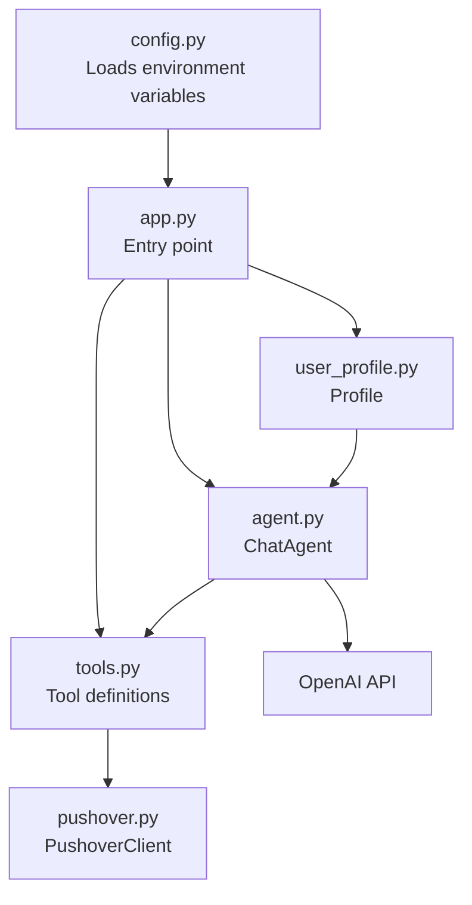

# Getting Started

<cite>
**Referenced Files in This Document**
- [README.md](file://README.md)
- [pyproject.toml](file://pyproject.toml)
- [uv.lock](file://uv.lock)
- [config.py](file://config.py)
- [app.py](file://app.py)
- [agent.py](file://agent.py)
- [user_profile.py](file://user_profile.py)
- [pushover.py](file://pushover.py)
- [tools.py](file://tools.py)
- [me/summary.txt](file://me/summary.txt)
</cite>

## Table of Contents
1. [Introduction](#introduction)
2. [Prerequisites](#prerequisites)
3. [Installation](#installation)
4. [Environment Setup](#environment-setup)
5. [File Structure](#file-structure)
6. [Initial Deployment](#initial-deployment)
7. [Configuration Options](#configuration-options)
8. [Verification Steps](#verification-steps)
9. [Basic Usage Examples](#basic-usage-examples)
10. [Common Setup Issues](#common-setup-issues)
11. [Architecture Overview](#architecture-overview)
12. [Troubleshooting Guide](#troubleshooting-guide)
13. [Conclusion](#conclusion)

## Introduction
Professional Alter Ego is a chatbot that emulates a professional persona for website interactions. It uses OpenAI's models to answer questions about career, background, skills, and experience, and integrates with Pushover for notifications. The system is designed to be deployed locally via a web interface built with Gradio.

## Prerequisites
- Python 3.12 or newer
- An OpenAI API key configured in your environment
- A Pushover account and credentials (token and user key)
- A PDF copy of your LinkedIn profile saved as me/linkedin.pdf
- A text summary of your professional background saved as me/summary.txt

**Section sources**
- [pyproject.toml:6](file://pyproject.toml#L6)
- [config.py:7-8](file://config.py#L7-L8)
- [user_profile.py:11-21](file://user_profile.py#L11-L21)
- [me/summary.txt:1-117](file://me/summary.txt#L1-L117)

## Installation
Professional Alter Ego uses the uv package manager. Install dependencies using the project's declared dependencies and lock file.

Step-by-step:
1. Ensure uv is installed on your system.
2. Navigate to the project root directory.
3. Install dependencies with uv sync to match the locked versions.

Notes:
- The project requires Python 3.12 or newer.
- Dependencies are pinned in the lock file to ensure reproducible installs.

**Section sources**
- [pyproject.toml:1-20](file://pyproject.toml#L1-L20)
- [uv.lock:1-200](file://uv.lock#L1-L200)

## Environment Setup
Create a .env file in the project root with the following variables:
- OPENAI_API_KEY: Your OpenAI API key
- OPENAI_MODEL: Model identifier (default value is provided in configuration)
- OPENAI_REASONING_EFFORT: Optional reasoning effort setting
- PROFILE_NAME: Name used in prompts (default value is provided in configuration)
- LINKEDIN_PATH: Path to your LinkedIn PDF (default value is provided in configuration)
- SUMMARY_PATH: Path to your summary text file (default value is provided in configuration)
- PUSHOVER_TOKEN: Your Pushover API token
- PUSHOVER_USER: Your Pushover user key

These variables are loaded by the configuration module and consumed by the application.

**Section sources**
- [config.py:1-14](file://config.py#L1-L14)

## File Structure
The minimal required file structure for local deployment:
- me/linkedin.pdf: Your LinkedIn profile as a PDF
- me/summary.txt: Your professional summary as a text file
- app.py: Application entrypoint
- config.py: Configuration loader
- agent.py: Chat agent implementation
- user_profile.py: Profile loading utilities
- pushover.py: Pushover notification client
- tools.py: Tool definition and execution utilities
- pyproject.toml: Project metadata and dependencies
- uv.lock: Locked dependency versions

Optional:
- .env: Environment variables for API keys and paths

**Section sources**
- [user_profile.py:6-21](file://user_profile.py#L6-L21)
- [config.py:11-12](file://config.py#L11-L12)
- [me/summary.txt:1-117](file://me/summary.txt#L1-L117)

## Initial Deployment
To start the chatbot locally:
1. Ensure dependencies are installed via uv sync.
2. Confirm your .env file contains the required API keys and paths.
3. Run the application entrypoint script.

The application launches a Gradio web interface for chatting with the agent.

**Section sources**
- [app.py:66-76](file://app.py#L66-L76)

## Configuration Options
Key configuration values and defaults:
- OPENAI_MODEL: Defaults to a specific model if not set
- OPENAI_REASONING_EFFORT: Optional; can be omitted
- PROFILE_NAME: Defaults to a placeholder name if not set
- LINKEDIN_PATH: Defaults to a specific path if not set
- SUMMARY_PATH: Defaults to a specific path if not set
- PUSHOVER_TOKEN: Required for notifications
- PUSHOVER_USER: Required for notifications

Behavior:
- The agent constructs a system prompt using your profile summary and LinkedIn content.
- Tools are registered to record user contact details and unknown questions.

**Section sources**
- [config.py:9-13](file://config.py#L9-L13)
- [agent.py:16-40](file://agent.py#L16-L40)
- [app.py:10-63](file://app.py#L10-L63)

## Verification Steps
After installation and environment setup:
1. Confirm Python version meets the requirement.
2. Verify that the required files exist:
   - me/linkedin.pdf
   - me/summary.txt
3. Launch the application and check for errors in the console.
4. Test the chat interface in your browser.
5. Ensure Pushover notifications are sent when tools are invoked.

**Section sources**
- [pyproject.toml:6](file://pyproject.toml#L6)
- [user_profile.py:11-21](file://user_profile.py#L11-L21)
- [app.py:66-76](file://app.py#L66-L76)

## Basic Usage Examples
- Start the application and navigate to the Gradio interface in your browser.
- Ask questions about the professional persona; the agent will answer based on your uploaded profile and summary.
- If the agent does not know an answer, it will record the question via a tool and notify via Pushover.
- If a user provides contact details during the conversation, the agent will record it via a tool and notify via Pushover.

**Section sources**
- [agent.py:57-79](file://agent.py#L57-L79)
- [app.py:10-63](file://app.py#L10-L63)
- [pushover.py:12-16](file://pushover.py#L12-L16)

## Common Setup Issues
- Missing Python version: Ensure Python 3.12+ is installed.
- Missing environment variables: Add OPENAI_API_KEY, PUSHOVER_TOKEN, and PUSHOVER_USER to your .env file.
- Missing profile files: Ensure me/linkedin.pdf and me/summary.txt exist with valid content.
- Dependency mismatch: Use uv sync to align with the locked versions.
- Port conflicts: If the Gradio interface fails to launch, check for port availability or specify a different port in your deployment configuration.

**Section sources**
- [pyproject.toml:6](file://pyproject.toml#L6)
- [config.py:7-8](file://config.py#L7-L8)
- [user_profile.py:11-21](file://user_profile.py#L11-L21)
- [uv.lock:1-200](file://uv.lock#L1-L200)

## Architecture Overview
High-level runtime flow:
- app.py initializes configuration, profile, tools, and the chat agent.
- agent.py handles conversation logic, system prompts, and tool invocation.
- user_profile.py loads and parses the LinkedIn PDF and summary text.
- pushover.py sends notifications for recorded details and unknown questions.
- tools.py defines the tool schema and execution.

**Diagram sources**
- [app.py:66-76](file://app.py#L66-L76)
- [agent.py:8-14](file://agent.py#L8-L14)
- [user_profile.py:6-21](file://user_profile.py#L6-L21)
- [pushover.py:8-16](file://pushover.py#L8-L16)
- [tools.py:6-24](file://tools.py#L6-L24)

## Troubleshooting Guide
- OpenAI API errors: Verify OPENAI_API_KEY is present and valid in your .env file.
- Pushover delivery failures: Confirm PUSHOVER_TOKEN and PUSHOVER_USER are set correctly.
- FileNotFoundError for profile files: Ensure me/linkedin.pdf and me/summary.txt exist and are readable.
- Dependency resolution failures: Re-run uv sync to reconcile with uv.lock.
- Gradio launch issues: Check for port conflicts or firewall restrictions.

**Section sources**
- [config.py:7-8](file://config.py#L7-L8)
- [user_profile.py:11-21](file://user_profile.py#L11-L21)
- [uv.lock:1-200](file://uv.lock#L1-L200)

## Conclusion
You now have the essential steps to install, configure, and deploy Professional Alter Ego locally. Ensure your environment variables, profile files, and dependencies are correctly set up, then test the chat interface and Pushover notifications to confirm everything works as expected.