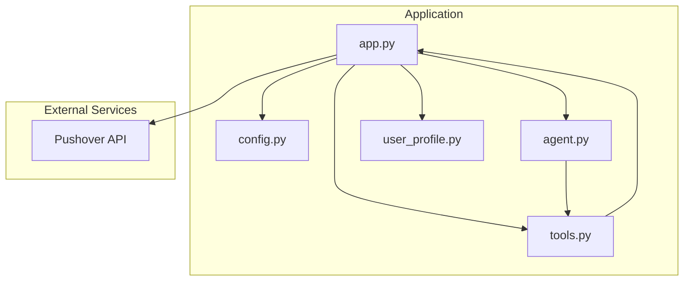
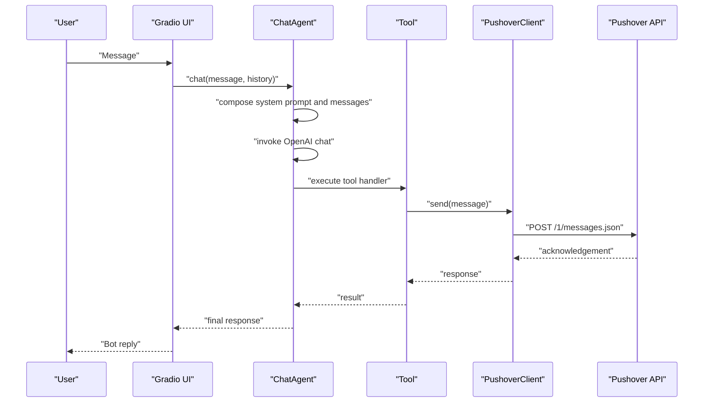
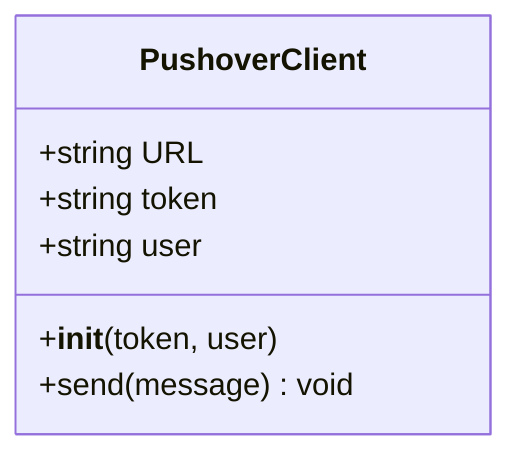
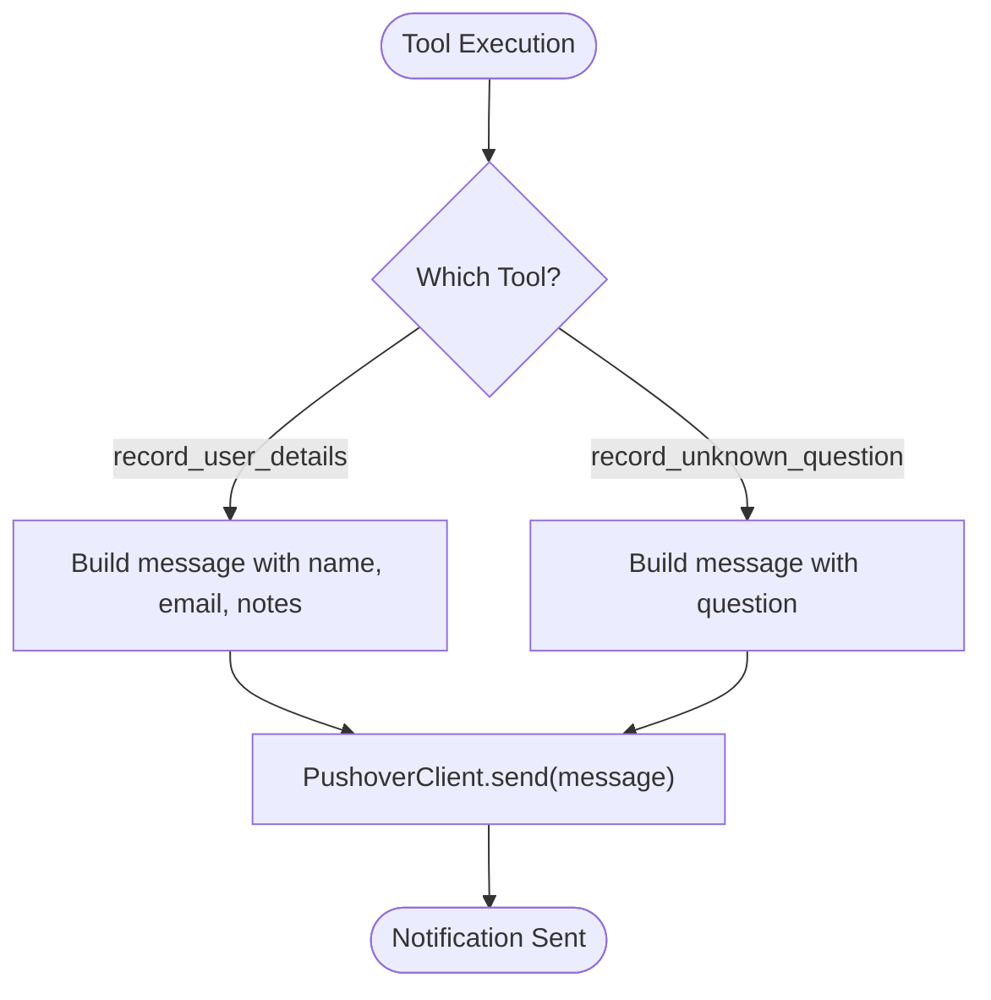
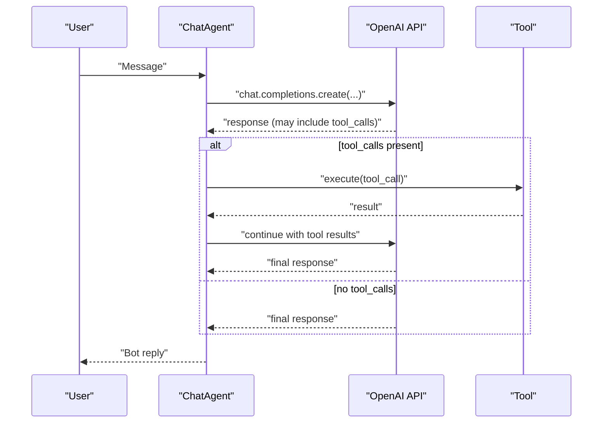
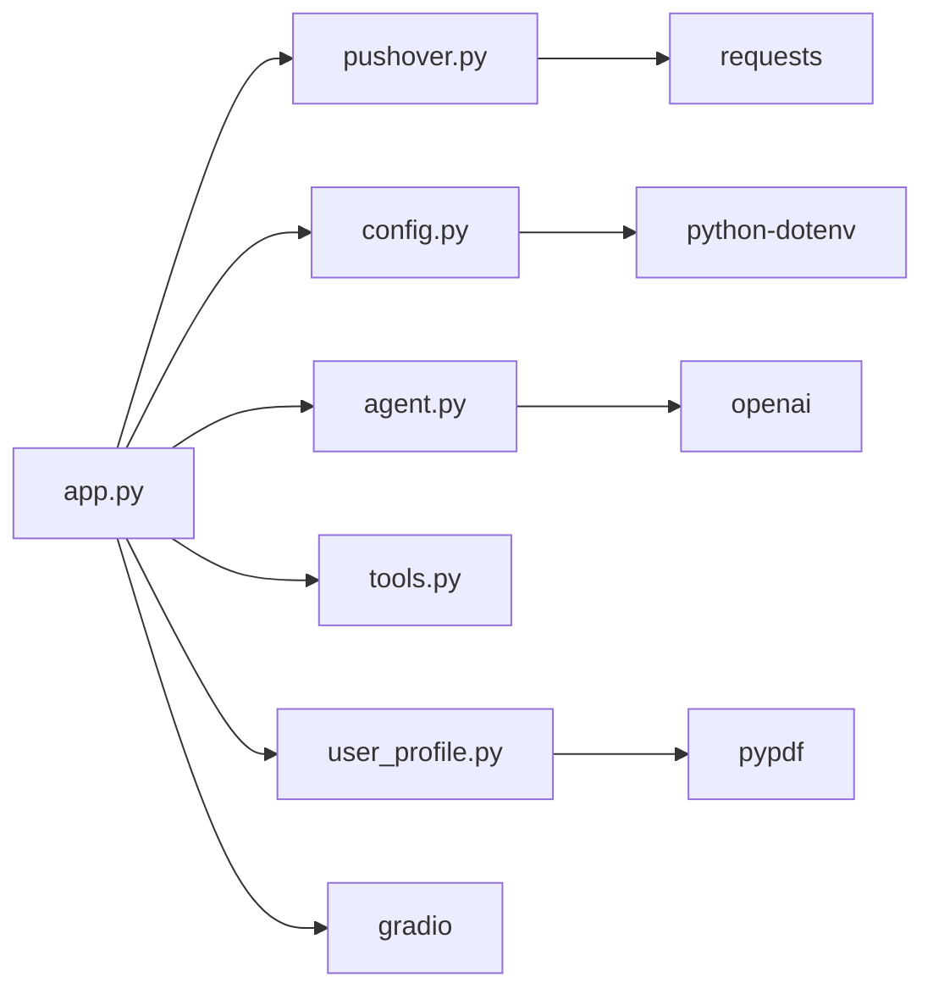

# Notification System

<cite>
**Referenced Files in This Document**
- [pushover.py](file://pushover.py)
- [config.py](file://config.py)
- [app.py](file://app.py)
- [tools.py](file://tools.py)
- [agent.py](file://agent.py)
- [user_profile.py](file://user_profile.py)
- [pyproject.toml](file://pyproject.toml)
- [README.md](file://README.md)
- [me/summary.txt](file://me/summary.txt)
</cite>

## Table of Contents
1. [Introduction](#introduction)
2. [Project Structure](#project-structure)
3. [Core Components](#core-components)
4. [Architecture Overview](#architecture-overview)
5. [Detailed Component Analysis](#detailed-component-analysis)
6. [Dependency Analysis](#dependency-analysis)
7. [Performance Considerations](#performance-considerations)
8. [Troubleshooting Guide](#troubleshooting-guide)
9. [Conclusion](#conclusion)
10. [Appendices](#appendices)

## Introduction
This document explains the Pushover notification system integration within the professional chatbot application. It covers how notifications are triggered during lead capture interactions, how the PushoverClient delivers messages, and how the system is configured and used. It also documents the API integration patterns, message formatting, configuration requirements, authentication setup, payload structure, scheduling considerations, delivery reliability, error handling strategies, and practical examples for different business scenarios.

## Project Structure
The project is a small, focused application with a clear separation of concerns:
- Configuration and environment variables
- Pushover client for external notifications
- Agent that orchestrates chat and tool execution
- Tools that define actions and trigger notifications
- User profile loader for context
- Application entrypoint that wires everything together

**Diagram sources**
- [app.py:66-76](file://app.py#L66-L76)
- [config.py:7-14](file://config.py#L7-L14)
- [agent.py:57-80](file://agent.py#L57-L80)
- [tools.py:4-25](file://tools.py#L4-L25)
- [user_profile.py:4-22](file://user_profile.py#L4-L22)

**Section sources**
- [app.py:1-76](file://app.py#L1-L76)
- [config.py:1-14](file://config.py#L1-L14)
- [pushover.py:1-17](file://pushover.py#L1-L17)
- [agent.py:1-80](file://agent.py#L1-L80)
- [tools.py:1-25](file://tools.py#L1-L25)
- [user_profile.py:1-22](file://user_profile.py#L1-L22)
- [pyproject.toml:1-20](file://pyproject.toml#L1-L20)

## Core Components
- PushoverClient: Minimal HTTP client that posts messages to the Pushover API endpoint using a token and user key.
- Tools: Define actions (lead capture and unknown question logging) and delegate notification sending to PushoverClient.
- ChatAgent: Orchestrates conversation and tool invocation; integrates with OpenAI chat completions.
- Configuration: Loads environment variables for Pushover credentials and other runtime settings.
- Application entrypoint: Initializes PushoverClient, builds tools, constructs the agent, and launches the chat interface.

Key integration points:
- Tools call PushoverClient.send(message) to emit notifications.
- Configuration provides PUSHOVER_TOKEN and PUSHOVER_USER used by PushoverClient.
- Agent’s tool execution loop triggers notifications when tools are invoked.

**Section sources**
- [pushover.py:4-17](file://pushover.py#L4-L17)
- [tools.py:4-25](file://tools.py#L4-L25)
- [app.py:10-63](file://app.py#L10-L63)
- [config.py:7-14](file://config.py#L7-L14)
- [agent.py:42-80](file://agent.py#L42-L80)

## Architecture Overview
The notification flow occurs when a user interacts with the chatbot. Depending on the conversation, the agent may decide to call specific tools. When tools execute, they send a formatted message to Pushover, which delivers it to the configured device(s).

**Diagram sources**
- [app.py:10-63](file://app.py#L10-L63)
- [tools.py:22-25](file://tools.py#L22-L25)
- [pushover.py:12-17](file://pushover.py#L12-L17)
- [agent.py:57-80](file://agent.py#L57-L80)

## Detailed Component Analysis

### PushoverClient Implementation
The PushoverClient encapsulates the minimal logic required to deliver a message to Pushover:
- Endpoint: Uses the official Pushover messages endpoint.
- Authentication: Requires a token and user key.
- Delivery: Sends a POST request with the message payload.

Implementation highlights:
- Constructor stores token and user keys.
- send(message) performs an HTTP POST with the required fields.
- No retry, timeout, or error handling is implemented in the client itself.

**Diagram sources**
- [pushover.py:4-17](file://pushover.py#L4-L17)

**Section sources**
- [pushover.py:4-17](file://pushover.py#L4-L17)

### Tool Definitions and Notification Triggers
Two tools are defined to trigger notifications:
- record_user_details: Triggered when a user provides contact details; sends a message containing name, email, and notes.
- record_unknown_question: Triggered when the agent cannot answer a question; sends a message containing the question.

Trigger conditions:
- record_user_details: Invoked when the agent steers the user to provide an email and records it via the tool.
- record_unknown_question: Invoked when the agent records a question it could not answer.

Execution flow:
- Tool.execute invokes the handler lambda.
- Handler calls PushoverClient.send with a formatted message.
- The message is delivered asynchronously to Pushover.

**Diagram sources**
- [app.py:10-63](file://app.py#L10-L63)
- [tools.py:22-25](file://tools.py#L22-L25)
- [pushover.py:12-17](file://pushover.py#L12-L17)

**Section sources**
- [app.py:10-63](file://app.py#L10-L63)
- [tools.py:4-25](file://tools.py#L4-L25)

### Agent and Conversation Flow
The ChatAgent composes prompts, manages conversation history, and decides whether to call tools. When tools are invoked, the agent collects tool results and continues the conversation.

Key behaviors:
- system_prompt constructs a persona and context using the profile.
- chat loops until no more tool calls are produced.
- handle_tool_call executes tool handlers and appends results to messages.

**Diagram sources**
- [agent.py:57-80](file://agent.py#L57-L80)
- [agent.py:42-55](file://agent.py#L42-L55)

**Section sources**
- [agent.py:16-41](file://agent.py#L16-L41)
- [agent.py:42-80](file://agent.py#L42-L80)

### Configuration and Authentication Setup
Environment variables are loaded via python-dotenv and consumed by the application:
- PUSHOVER_TOKEN: API token for Pushover authentication.
- PUSHOVER_USER: User or group key for Pushover recipients.
- OPENAI_MODEL: Model identifier for OpenAI chat.
- OPENAI_REASONING_EFFORT: Optional reasoning effort setting.
- PROFILE_NAME: Name used in the agent’s persona.
- LINKEDIN_PATH: Path to the LinkedIn PDF for context.
- SUMMARY_PATH: Path to the personal summary text for context.

These values are used to:
- Initialize PushoverClient with token and user.
- Configure ChatAgent with model and reasoning effort.
- Load profile context for the agent.

**Section sources**
- [config.py:1-14](file://config.py#L1-L14)
- [app.py:66-71](file://app.py#L66-L71)

### Message Formatting and Payload Structure
The tools construct human-readable messages that are sent to Pushover. The PushoverClient sends these messages using the Pushover API’s JSON endpoint with the following fields:
- token: Provided by PUSHOVER_TOKEN.
- user: Provided by PUSHOVER_USER.
- message: The formatted string built by the tools.

Delivery characteristics:
- Asynchronous HTTP POST to the Pushover endpoint.
- No explicit scheduling or retry logic in the client.

**Section sources**
- [app.py:39-40](file://app.py#L39-L40)
- [app.py:60](file://app.py#L60)
- [pushover.py:12-17](file://pushover.py#L12-L17)

### Real-Time Alert Functionality
Notifications occur synchronously with tool execution within the agent’s tool loop. When a tool handler is executed, the message is posted to Pushover immediately. There is no background queue or delayed delivery in the current implementation.

**Section sources**
- [tools.py:22-25](file://tools.py#L22-L25)
- [agent.py:42-55](file://agent.py#L42-L55)

### Notification Scheduling
There is no built-in scheduling mechanism in the current implementation. Notifications are emitted in real-time when tools are invoked. If scheduling is desired, it would require extending the tool handlers or introducing a task queue.

**Section sources**
- [app.py:10-63](file://app.py#L10-L63)

### Delivery Reliability and Error Handling
Current implementation:
- No retries on failed HTTP requests.
- No timeouts configured for the HTTP call.
- No explicit error handling or logging around the Pushover request.

Recommended improvements (conceptual):
- Add retry with exponential backoff.
- Configure request timeouts.
- Log failures and implement dead-letter handling.
- Validate environment variables before initializing PushoverClient.

**Section sources**
- [pushover.py:12-17](file://pushover.py#L12-L17)

### Examples and Customization Options
Below are practical examples of notification templates and customization options for different business scenarios. These examples illustrate how to tailor messages for various contexts without exposing code.

- Lead capture alert
  - Template: “New lead captured: [Name] ([Email]). Notes: [Notes].”
  - Customization: Include additional attributes (job title, company, source campaign) by extending the tool’s handler to build a richer message.

- Unknown question alert
  - Template: “Unanswered question recorded: [Question].”
  - Customization: Append conversation context or timestamps to aid triage.

- Urgent follow-up reminder
  - Template: “Urgent: [Lead Name] ([Email]) requires immediate attention.”
  - Customization: Add priority tags or routing instructions.

- Weekly summary digest
  - Template: “Weekly summary: [X] new leads, [Y] unanswered questions.”
  - Customization: Aggregate counts and include links to reports.

[No sources needed since this section provides conceptual examples]

## Dependency Analysis
External dependencies include:
- requests: Used by PushoverClient for HTTP requests.
- python-dotenv: Loads environment variables from .env.
- gradio: Provides the chat interface.
- pypdf: Reads PDF content for profile context.
- openai: Integrates with OpenAI chat completions.
- openai-agents: Not directly used in the current code.

**Diagram sources**
- [app.py:1-8](file://app.py#L1-L8)
- [pushover.py:1](file://pushover.py#L1)
- [config.py:1-3](file://config.py#L1-L3)
- [agent.py:1-4](file://agent.py#L1-L4)
- [user_profile.py:1](file://user_profile.py#L1)
- [pyproject.toml:7-14](file://pyproject.toml#L7-L14)

**Section sources**
- [pyproject.toml:1-20](file://pyproject.toml#L1-L20)

## Performance Considerations
- Network latency: Each notification triggers an HTTP request; consider batching or asynchronous processing if volume increases.
- Tool execution overhead: Tool execution is synchronous; ensure handlers remain lightweight.
- Rate limits: Pushover may enforce rate limits; implement throttling or retries if needed.

[No sources needed since this section provides general guidance]

## Troubleshooting Guide
Common issues and remedies:
- Missing environment variables
  - Symptom: PushoverClient initialization fails or messages do not send.
  - Action: Ensure PUSHOVER_TOKEN and PUSHOVER_USER are set in the environment.

- HTTP errors from Pushover
  - Symptom: Requests fail silently or raise exceptions.
  - Action: Add logging and error handling around the HTTP call; implement retries with backoff.

- Tool not triggering
  - Symptom: No notification despite expected user action.
  - Action: Verify tool schema and handler logic; confirm agent’s reasoning leads to tool calls.

- Message formatting
  - Symptom: Messages unreadable or missing context.
  - Action: Enhance message construction in tool handlers to include relevant metadata.

**Section sources**
- [config.py:7-14](file://config.py#L7-L14)
- [pushover.py:12-17](file://pushover.py#L12-L17)
- [app.py:10-63](file://app.py#L10-L63)

## Conclusion
The Pushover integration is intentionally minimal and focused: tools trigger notifications by sending formatted messages to PushoverClient, which posts them to the Pushover API. The system is easy to configure and integrates naturally with the agent’s tool execution flow. For production use, consider adding robust error handling, retries, timeouts, and possibly scheduling or aggregation to improve reliability and scalability.

[No sources needed since this section summarizes without analyzing specific files]

## Appendices

### Configuration Reference
- PUSHOVER_TOKEN: Pushover API token.
- PUSHOVER_USER: Pushover user or group key.
- OPENAI_MODEL: OpenAI model identifier.
- OPENAI_REASONING_EFFORT: Optional reasoning effort setting.
- PROFILE_NAME: Agent’s persona name.
- LINKEDIN_PATH: Path to LinkedIn PDF.
- SUMMARY_PATH: Path to personal summary text.

**Section sources**
- [config.py:7-14](file://config.py#L7-L14)

### Example Business Scenarios
- Sales funnel lead capture: Notify on new contact submissions with context.
- Customer support: Notify on unresolved questions for escalation.
- Reporting: Aggregate daily summaries and send periodic digests.

[No sources needed since this section provides conceptual examples]