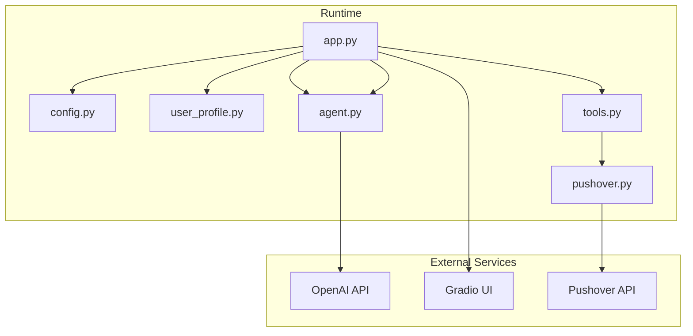
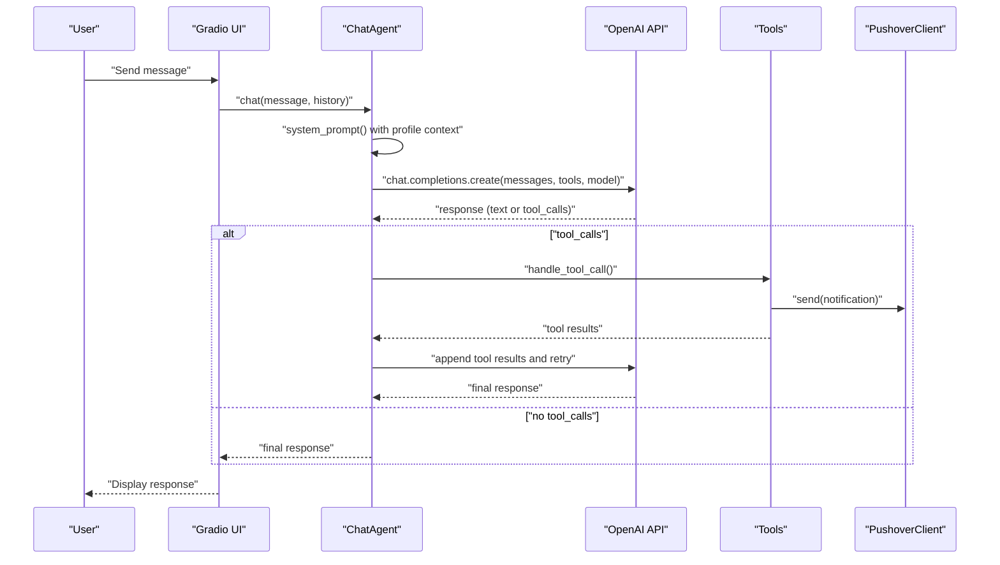
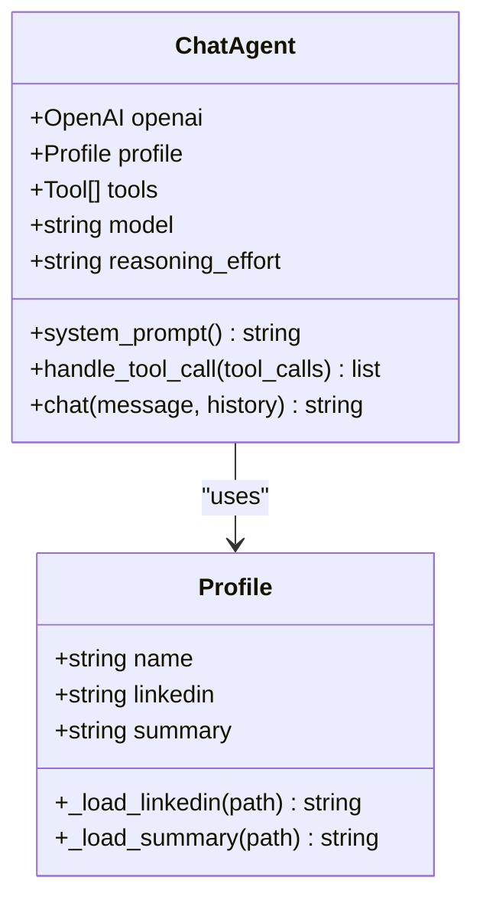
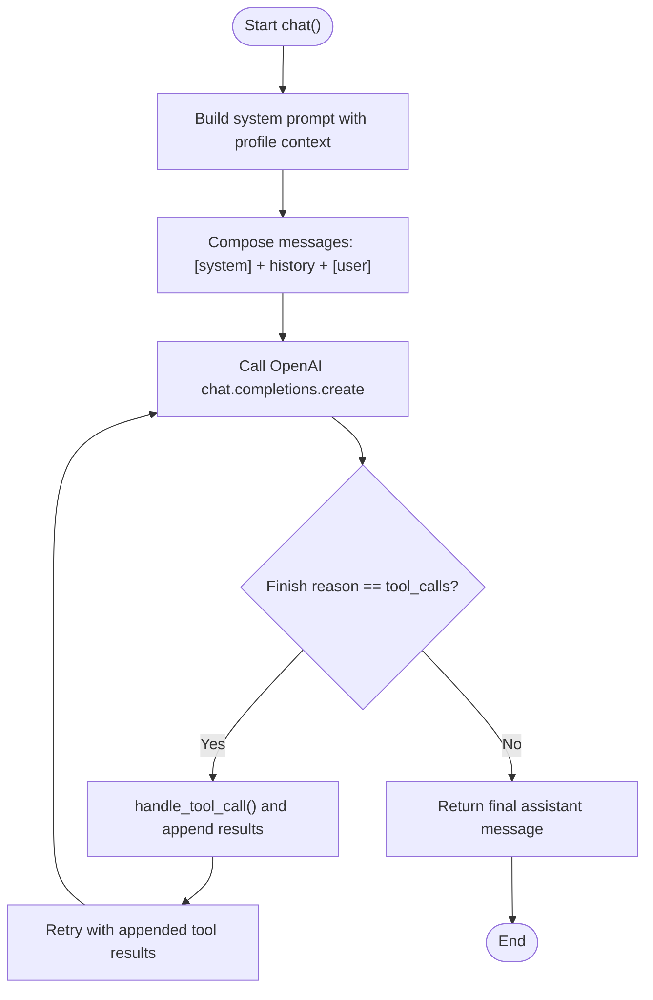
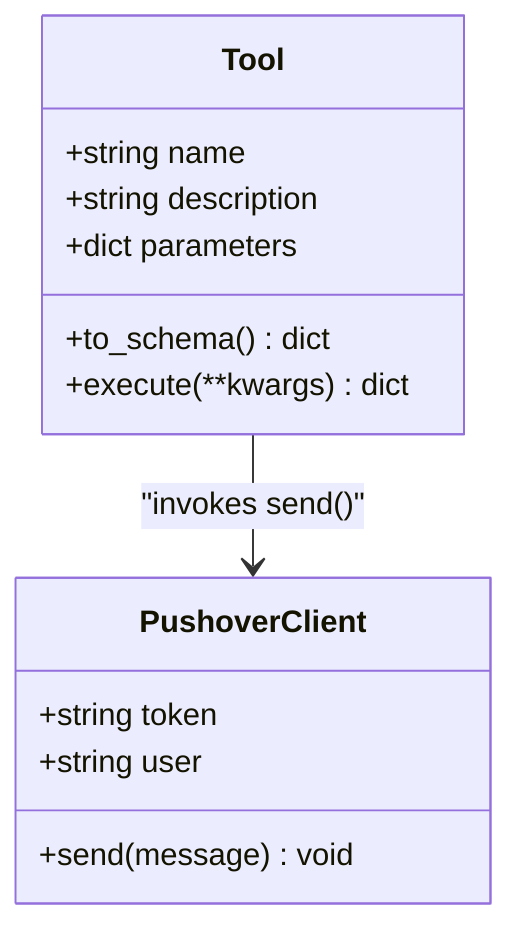
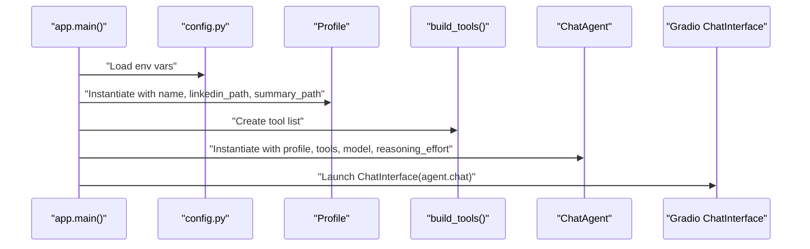
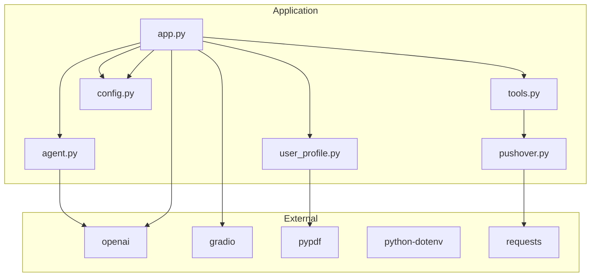

# Context Management and Enhancement

<cite>
**Referenced Files in This Document**
- [user_profile.py](file://user_profile.py)
- [agent.py](file://agent.py)
- [app.py](file://app.py)
- [config.py](file://config.py)
- [tools.py](file://tools.py)
- [pushover.py](file://pushover.py)
- [pyproject.toml](file://pyproject.toml)
- [README.md](file://README.md)
</cite>

## Table of Contents
1. [Introduction](#introduction)
2. [Project Structure](#project-structure)
3. [Core Components](#core-components)
4. [Architecture Overview](#architecture-overview)
5. [Detailed Component Analysis](#detailed-component-analysis)
6. [Dependency Analysis](#dependency-analysis)
7. [Performance Considerations](#performance-considerations)
8. [Troubleshooting Guide](#troubleshooting-guide)
9. [Conclusion](#conclusion)

## Introduction
This document explains how profile data context is managed and enhanced to improve conversation quality and lead generation. It focuses on how parsed LinkedIn text and summary content are integrated into conversation context, the mechanisms used to inject context into the LLM, and the data preprocessing steps taken to optimize performance. It also documents the Profile class constructor parameters, data structure organization, and patterns for context utilization. Finally, it provides practical examples of how profile information enhances response quality, enables personalized interactions, and improves lead generation effectiveness, along with guidance on context length optimization, data filtering strategies, and conversation flow integration.

## Project Structure
The system is organized around a small set of focused modules:
- user_profile.py: Loads and exposes profile data (LinkedIn PDF and summary text).
- agent.py: Orchestrates conversation, builds system prompts with profile context, and manages tool calls.
- app.py: Composes the runtime by loading configuration, building tools, instantiating the Profile and ChatAgent, and launching the UI.
- config.py: Centralizes environment-driven configuration for credentials and file paths.
- tools.py: Defines a generic Tool abstraction used by the agent to record user details and unknown questions.
- pushover.py: Provides a simple notification client used by tools to report outcomes.
- pyproject.toml: Declares dependencies including OpenAI, Gradio, PyPDF, and python-dotenv.
- README.md: Brief project description.

**Diagram sources**
- [app.py:66-76](file://app.py#L66-L76)
- [agent.py:6-15](file://agent.py#L6-L15)
- [tools.py:4-25](file://tools.py#L4-L25)
- [pushover.py:4-17](file://pushover.py#L4-L17)
- [config.py:7-14](file://config.py#L7-L14)

**Section sources**
- [app.py:1-76](file://app.py#L1-L76)
- [config.py:1-14](file://config.py#L1-L14)
- [pyproject.toml:1-20](file://pyproject.toml#L1-L20)

## Core Components
- Profile: Encapsulates parsed LinkedIn text and summary content, exposing them as attributes for downstream consumption.
- ChatAgent: Builds a system prompt enriched with profile data, maintains conversation history, and integrates tool-use capabilities.
- Tools: Define structured functions (schemas) that the agent can call to record user details and unknown questions.
- PushoverClient: Sends notifications to Pushover when tools execute.
- Runtime composition: app.py loads configuration, constructs Profile and ChatAgent, and launches the UI.

Key responsibilities:
- Profile: Load and normalize raw content from PDF and text files.
- ChatAgent: Inject profile context into the system prompt, manage message history, and route tool calls to handlers.
- Tools: Provide schema-compatible functions for the LLM to call during conversations.
- app.py: Wire everything together and expose a chat interface.

**Section sources**
- [user_profile.py:4-22](file://user_profile.py#L4-L22)
- [agent.py:6-80](file://agent.py#L6-L80)
- [tools.py:4-25](file://tools.py#L4-L25)
- [pushover.py:4-17](file://pushover.py#L4-L17)
- [app.py:66-76](file://app.py#L66-L76)

## Architecture Overview
The conversation pipeline integrates profile context into the LLM’s system prompt and augments it with conversation history. When the LLM decides to call tools, the agent executes them and appends the results back into the conversation history, enabling iterative refinement of responses and capturing user intents.

**Diagram sources**
- [agent.py:57-80](file://agent.py#L57-L80)
- [agent.py:16-40](file://agent.py#L16-L40)
- [tools.py:22-25](file://tools.py#L22-L25)
- [pushover.py:12-17](file://pushover.py#L12-L17)
- [app.py:66-76](file://app.py#L66-L76)

## Detailed Component Analysis

### Profile Data Loading and Context Injection
The Profile class encapsulates two primary data sources:
- LinkedIn PDF: Parsed into text using a PDF reader.
- Summary text: Loaded directly from a text file.

Context injection occurs in the ChatAgent’s system prompt builder, which concatenates:
- A role and persona directive aligned with the profile name.
- The summary content.
- The LinkedIn content.
- A directive to stay in character and respond accordingly.

This ensures the LLM has a coherent, unified context for the entire conversation.

**Diagram sources**
- [user_profile.py:4-22](file://user_profile.py#L4-L22)
- [agent.py:6-40](file://agent.py#L6-L40)

**Section sources**
- [user_profile.py:6-22](file://user_profile.py#L6-L22)
- [agent.py:16-40](file://agent.py#L16-L40)

### Conversation Context Construction and Message History
The ChatAgent composes the conversation by:
- Prepending a system message containing the profile-enhanced prompt.
- Appending prior conversation history.
- Adding the latest user message.

It then invokes the OpenAI API with the constructed message list and tool schemas. If the model responds with tool_calls, the agent executes the tools and retries with the tool results appended to the message list.

**Diagram sources**
- [agent.py:57-80](file://agent.py#L57-L80)

**Section sources**
- [agent.py:57-80](file://agent.py#L57-L80)

### Tool Schema and Execution
Two tools are defined:
- record_user_details: Captures user interest and contact information, sending a notification via Pushover.
- record_unknown_question: Records questions that could not be answered, enabling future content updates.

Each tool defines:
- A JSON schema describing its name, description, and parameters.
- An execute method that invokes the handler and returns a standardized result.

The agent maps tool names to tool instances and executes them when the model requests tool_use.

**Diagram sources**
- [tools.py:4-25](file://tools.py#L4-L25)
- [pushover.py:4-17](file://pushover.py#L4-L17)

**Section sources**
- [tools.py:12-25](file://tools.py#L12-L25)
- [app.py:10-63](file://app.py#L10-L63)
- [pushover.py:12-17](file://pushover.py#L12-L17)

### Runtime Composition and Environment Configuration
The runtime is assembled in app.py:
- Loads environment variables from config.py.
- Creates a Profile using configured paths and name.
- Builds tools with a PushoverClient instance.
- Instantiates ChatAgent with the profile, tools, and model configuration.
- Launches a Gradio ChatInterface bound to the agent’s chat method.

Environment variables include credentials and file paths, allowing flexible deployment and testing.

**Diagram sources**
- [app.py:66-76](file://app.py#L66-L76)
- [config.py:7-14](file://config.py#L7-L14)

**Section sources**
- [app.py:66-76](file://app.py#L66-L76)
- [config.py:7-14](file://config.py#L7-L14)

## Dependency Analysis
External dependencies include:
- OpenAI SDK for chat completions and tool-use orchestration.
- Gradio for the chat UI.
- PyPDF for parsing LinkedIn PDF content.
- python-dotenv for environment configuration.
- requests for Pushover notifications.

**Diagram sources**
- [pyproject.toml:7-14](file://pyproject.toml#L7-L14)
- [app.py:3-7](file://app.py#L3-L7)
- [agent.py:3](file://agent.py#L3)
- [user_profile.py:1](file://user_profile.py#L1)
- [tools.py:1](file://tools.py#L1)
- [pushover.py:1](file://pushover.py#L1)
- [config.py:3](file://config.py#L3)

**Section sources**
- [pyproject.toml:7-14](file://pyproject.toml#L7-L14)
- [app.py:3-7](file://app.py#L3-L7)

## Performance Considerations
- Context length optimization:
  - The system prompt includes both summary and LinkedIn content. For long LinkedIn PDFs, consider truncating or summarizing the LinkedIn content before injection to keep the total context within model limits.
  - Use a sliding window over conversation history to cap tokens retained for previous turns.
- Data filtering strategies:
  - Remove low-signal content (e.g., repeated boilerplate) from LinkedIn text before ingestion.
  - Normalize whitespace and remove excessive blank lines to reduce token count.
- Model selection and reasoning effort:
  - Adjust OPENAI_MODEL and OPENAI_REASONING_EFFORT via environment variables to balance cost, latency, and quality.
- Tool-call efficiency:
  - Keep tool schemas minimal and precise to reduce ambiguity and unnecessary retries.
- UI responsiveness:
  - Stream responses when possible and avoid blocking the UI thread during tool execution.

[No sources needed since this section provides general guidance]

## Troubleshooting Guide
Common issues and resolutions:
- Missing environment variables:
  - Ensure PUSHOVER_TOKEN, PUSHOVER_USER, OPENAI_MODEL, PROFILE_NAME, LINKEDIN_PATH, and SUMMARY_PATH are set. The app reads these from the environment.
- PDF parsing failures:
  - Verify the LinkedIn PDF path is correct and readable. The Profile loader iterates pages and extracts text; ensure the PDF is not password-protected or corrupted.
- Tool execution errors:
  - Confirm tool schemas match the parameters expected by handlers. The Tool.execute method expects a dictionary-like result.
- Notification delivery:
  - Check Pushover credentials and network connectivity. The PushoverClient makes a POST request to the Pushover API.

**Section sources**
- [config.py:7-14](file://config.py#L7-L14)
- [user_profile.py:11-17](file://user_profile.py#L11-L17)
- [tools.py:22-25](file://tools.py#L22-L25)
- [pushover.py:12-17](file://pushover.py#L12-L17)

## Conclusion
The system integrates profile data—LinkedIn text and summary—into a cohesive conversation context that guides the LLM to respond in-character and professionally. The ChatAgent composes a system prompt enriched with profile content, manages conversation history, and leverages tools to capture leads and track unknown questions. By optimizing context length, filtering noisy data, and aligning tool schemas with the model’s capabilities, the system enhances response quality, personalization, and lead generation effectiveness. The modular design allows easy extension and deployment across environments.