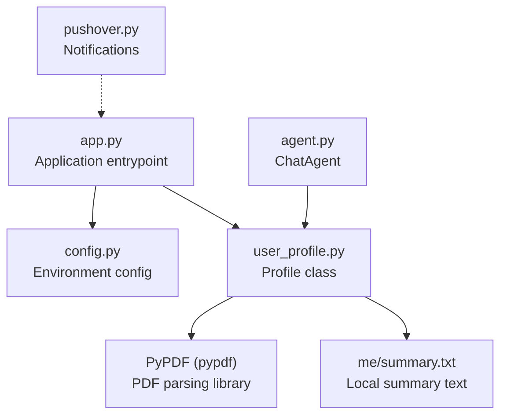
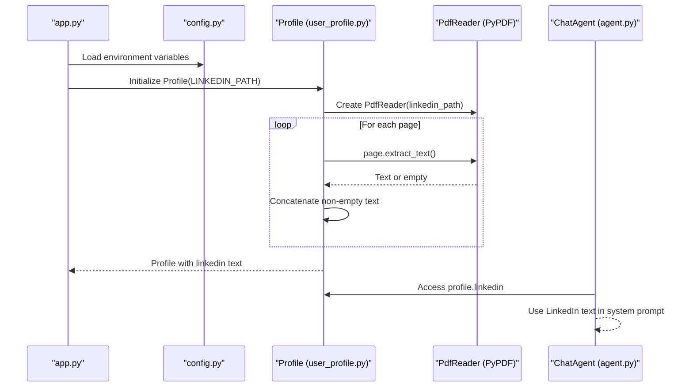
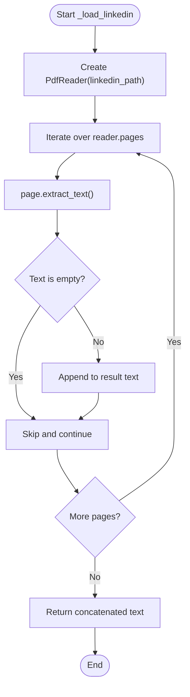
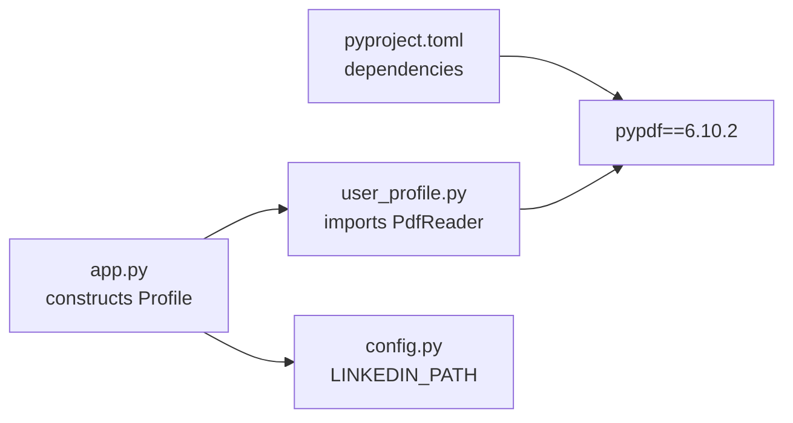

# LinkedIn PDF Parsing

<cite>
**Referenced Files in This Document**
- [user_profile.py](file://user_profile.py)
- [pyproject.toml](file://pyproject.toml)
- [config.py](file://config.py)
- [app.py](file://app.py)
- [agent.py](file://agent.py)
- [pushover.py](file://pushover.py)
- [me/summary.txt](file://me/summary.txt)
</cite>

## Table of Contents
1. [Introduction](#introduction)
2. [Project Structure](#project-structure)
3. [Core Components](#core-components)
4. [Architecture Overview](#architecture-overview)
5. [Detailed Component Analysis](#detailed-component-analysis)
6. [Dependency Analysis](#dependency-analysis)
7. [Performance Considerations](#performance-considerations)
8. [Troubleshooting Guide](#troubleshooting-guide)
9. [Security Considerations](#security-considerations)
10. [Conclusion](#conclusion)
11. [Appendices](#appendices)

## Introduction
This document explains the LinkedIn PDF parsing functionality implemented in the project. It focuses on how the Profile class extracts text from a LinkedIn PDF using PyPDF, the page-by-page extraction process, and the concatenation strategy. It also covers supported PDF formats, text encoding handling, known limitations, error handling, empty page detection, fallback mechanisms, performance considerations, troubleshooting, and security recommendations.

## Project Structure
The parsing logic resides in a small set of focused modules:
- user_profile.py: Implements the Profile class and the LinkedIn PDF loading logic.
- pyproject.toml: Declares the PyPDF dependency used for PDF parsing.
- config.py: Provides environment-driven configuration, including the LinkedIn PDF path.
- app.py: Orchestrates the application lifecycle and passes configuration to Profile.
- agent.py: Uses the Profile’s LinkedIn text during chat interactions.
- pushover.py: Utility for notifications (unrelated to PDF parsing).
- me/summary.txt: Local text resource loaded alongside LinkedIn text.

**Diagram sources**
- [app.py:66-76](file://app.py#L66-L76)
- [config.py:12-13](file://config.py#L12-L13)
- [user_profile.py:11-17](file://user_profile.py#L11-L17)
- [pyproject.toml:11](file://pyproject.toml#L11)
- [agent.py:68-68](file://agent.py#L68-L68)

**Section sources**
- [app.py:66-76](file://app.py#L66-L76)
- [config.py:12-13](file://config.py#L12-L13)
- [user_profile.py:11-17](file://user_profile.py#L11-L17)
- [pyproject.toml:11](file://pyproject.toml#L11)

## Core Components
- Profile class: Loads and parses the LinkedIn PDF and a local summary file. The LinkedIn parsing is implemented in the _load_linkedin method.
- PyPDF dependency: Provided by pypdf, enabling PDF reading and text extraction.
- Environment configuration: LINKEDIN_PATH determines the PDF file path used by Profile.

Key responsibilities:
- Extract text from each page of the LinkedIn PDF.
- Concatenate non-empty page texts into a single string.
- Provide the concatenated LinkedIn text to the chat agent.

**Section sources**
- [user_profile.py:11-17](file://user_profile.py#L11-L17)
- [pyproject.toml:11](file://pyproject.toml#L11)
- [config.py:12](file://config.py#L12)

## Architecture Overview
The parsing pipeline is straightforward: the application constructs a Profile with the configured LinkedIn PDF path, which internally uses PyPDF to iterate pages and extract text. The resulting text is stored on the Profile instance and later consumed by the ChatAgent.

**Diagram sources**
- [app.py:68-68](file://app.py#L68-L68)
- [config.py:12](file://config.py#L12)
- [user_profile.py:11-17](file://user_profile.py#L11-L17)

## Detailed Component Analysis

### Profile._load_linkedin: PdfReader Implementation and Page-by-Page Extraction
- PdfReader instantiation: The method creates a PdfReader bound to the LinkedIn PDF path.
- Iteration over pages: It loops through all pages exposed by the reader.
- Text extraction per page: For each page, it calls the page’s extract_text method.
- Empty page detection: It checks whether the extracted text is truthy (non-empty) before concatenating.
- Concatenation strategy: Non-empty page texts are appended to a growing string, preserving order.

**Diagram sources**
- [user_profile.py:11-17](file://user_profile.py#L11-L17)

**Section sources**
- [user_profile.py:11-17](file://user_profile.py#L11-L17)

### Supported PDF Formats and Text Encoding
- Library: The implementation relies on PyPDF (pypdf). The project declares version 6.10.2.
- Text extraction: The code uses the page-level extract_text method provided by PyPDF.
- Text encoding: The code does not explicitly set an encoding; it trusts PyPDF’s default behavior. The summary loader uses UTF-8 explicitly, but the PDF loader does not set an encoding parameter.

Notes:
- PyPDF supports a wide variety of PDF formats commonly produced by desktop publishing and PDF generators.
- Some PDFs may embed fonts or use advanced encodings; PyPDF generally handles these cases, but extraction quality depends on the PDF’s internal structure.

**Section sources**
- [pyproject.toml:11](file://pyproject.toml#L11)
- [user_profile.py:11-17](file://user_profile.py#L11-L17)
- [user_profile.py:19-21](file://user_profile.py#L19-L21)

### Text Concatenation Strategy
- Strategy: The method concatenates non-empty page texts in the order pages appear in the PDF.
- Separator: No explicit separator is added between page texts; adjacent page texts are simply joined.
- Result: A single string containing all non-empty page content.

Implications:
- The resulting text preserves page boundaries implicitly through whitespace/newlines left by the underlying extraction.
- If page separation is desired, a custom separator could be introduced.

**Section sources**
- [user_profile.py:11-17](file://user_profile.py#L11-L17)

### Error Handling, Empty Page Detection, and Fallback Mechanisms
- Empty page detection: The method checks whether page.extract_text() returns a truthy value before appending to the result. This effectively filters out truly empty pages.
- Error handling: The current implementation does not wrap the extraction in try/except blocks. If a page fails to parse or raises an exception, the program would propagate the error.
- Fallback mechanisms: There is no explicit fallback (e.g., alternative extraction method or logging). If a page fails, the method may raise an exception depending on the underlying library behavior.

Recommendations:
- Wrap page extraction in try/except to catch parsing errors.
- Log skipped pages and consider emitting warnings.
- Optionally append a placeholder or separator for failed pages to preserve structure.

**Section sources**
- [user_profile.py:11-17](file://user_profile.py#L11-L17)

### Typical LinkedIn PDF Structures
LinkedIn-generated PDFs are typically clean, text-based documents. Typical sections include:
- Professional summary
- Experience entries
- Education
- Skills
- Certifications

These are usually presented as readable text, which PyPDF can extract effectively. The concatenation strategy preserves the order of pages, which aligns with the logical flow of a resume/CV.

[No sources needed since this section describes general expectations based on common PDF structures]

### How the Parsed Content Is Used
- The Profile instance exposes profile.linkedin, which is the concatenated LinkedIn text.
- The ChatAgent composes a system prompt that includes the LinkedIn text along with a summary.
- The agent uses this combined context to answer user questions.

**Section sources**
- [user_profile.py:8-8](file://user_profile.py#L8-L8)
- [agent.py:16-40](file://agent.py#L16-L40)

## Dependency Analysis
- PyPDF dependency: Declared in pyproject.toml under dependencies. The project uses pypdf version 6.10.2.
- Runtime usage: The Profile class imports PdfReader from pypdf and uses it to read the LinkedIn PDF.
- Configuration: app.py constructs a Profile using LINKEDIN_PATH from config.py.

**Diagram sources**
- [pyproject.toml:11](file://pyproject.toml#L11)
- [user_profile.py:1](file://user_profile.py#L1)
- [app.py:68](file://app.py#L68)
- [config.py:12](file://config.py#L12)

**Section sources**
- [pyproject.toml:11](file://pyproject.toml#L11)
- [user_profile.py:1](file://user_profile.py#L1)
- [app.py:68](file://app.py#L68)
- [config.py:12](file://config.py#L12)

## Performance Considerations
- Page iteration: The method iterates through all pages and performs text extraction for each page. For very large PDFs, this can be time-consuming.
- Memory usage: The concatenated string grows with the total length of extracted text. For extremely large PDFs, memory usage increases accordingly.
- I/O overhead: Reading the PDF file and iterating pages introduces I/O overhead proportional to the number of pages.
- Recommendations:
  - Consider streaming or chunked processing if PDFs become very large.
  - Add progress reporting for long-running extractions.
  - Cache the parsed text if the PDF rarely changes.

[No sources needed since this section provides general guidance]

## Troubleshooting Guide
Common issues and remedies:
- Empty or garbled text:
  - Verify the PDF is not encrypted or password-protected.
  - Ensure the PDF contains selectable text; scanned images require OCR before extraction.
- Unexpectedly short or missing content:
  - Confirm the LINKEDIN_PATH points to the intended file.
  - Check that the PDF was generated by LinkedIn and not corrupted.
- Exceptions during extraction:
  - Wrap page extraction in try/except to capture and log errors.
  - Consider skipping problematic pages and logging warnings.
- Encoding issues:
  - The current implementation does not set an encoding; if encountering character issues, investigate the PDF’s embedded font/encoding.
- Large PDFs:
  - Monitor memory usage and consider chunking or streaming approaches.

**Section sources**
- [user_profile.py:11-17](file://user_profile.py#L11-L17)
- [config.py:12](file://config.py#L12)

## Security Considerations
- Input validation:
  - Validate the LINKEDIN_PATH to prevent path traversal or unintended file access.
  - Restrict allowed paths to a dedicated directory (e.g., me/) to minimize risk.
- Least privilege:
  - Ensure the application runs with minimal permissions required to read the PDF.
- Sandboxing:
  - Consider running PDF parsing in a sandboxed environment if processing untrusted documents.
- Logging:
  - Avoid logging sensitive content; sanitize logs if they must include extracted text.
- Dependencies:
  - Pin and audit dependencies regularly to mitigate known vulnerabilities.

[No sources needed since this section provides general guidance]

## Conclusion
The LinkedIn PDF parsing functionality is implemented with a minimal, robust approach using PyPDF. The Profile class extracts text page-by-page, filters out empty pages, and concatenates the results. While the current implementation is straightforward and effective for typical LinkedIn PDFs, adding error handling, logging, and optional separators would improve reliability and observability. Security and performance considerations should be addressed for production deployments.

[No sources needed since this section summarizes without analyzing specific files]

## Appendices

### Appendix A: Environment Configuration
- LINKEDIN_PATH: Path to the LinkedIn PDF file. Defaults to me/linkedin.pdf if not set.

**Section sources**
- [config.py:12](file://config.py#L12)

### Appendix B: Example File Preparation
- Place your LinkedIn PDF in the me/ directory with the filename linkedin.pdf.
- Ensure the file is readable by the application user.
- Confirm the PDF contains selectable text for optimal extraction.

[No sources needed since this section provides general guidance]