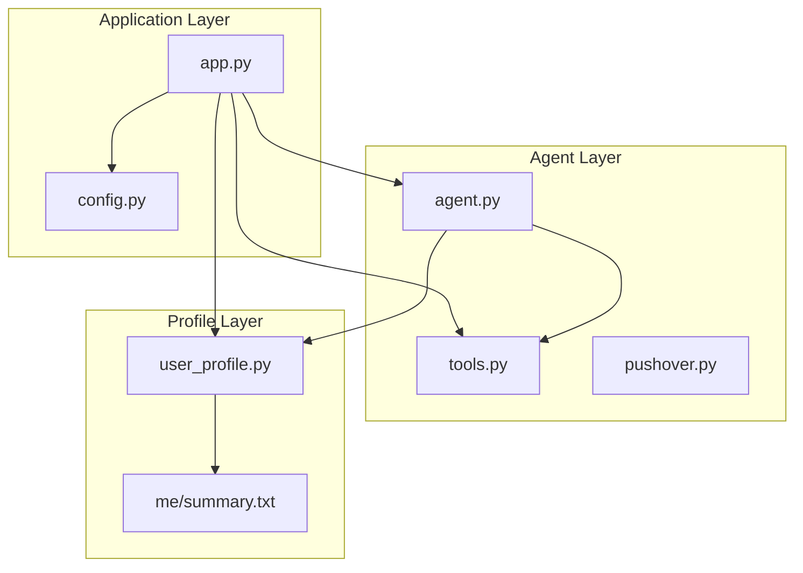
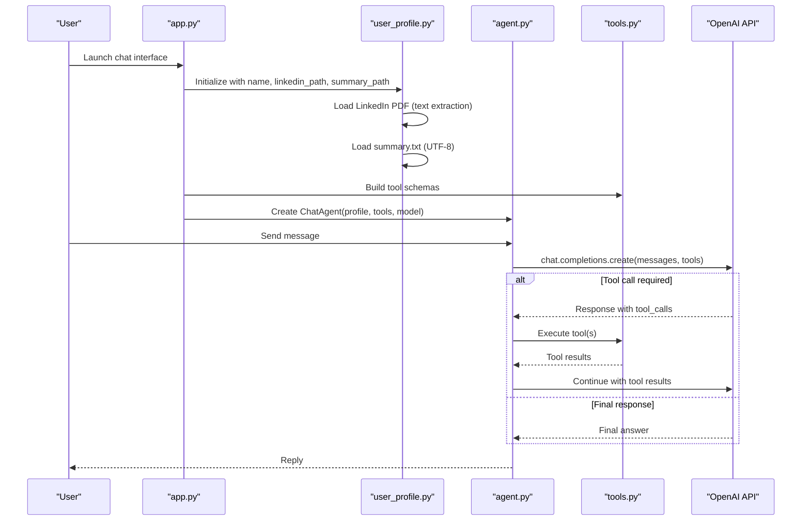
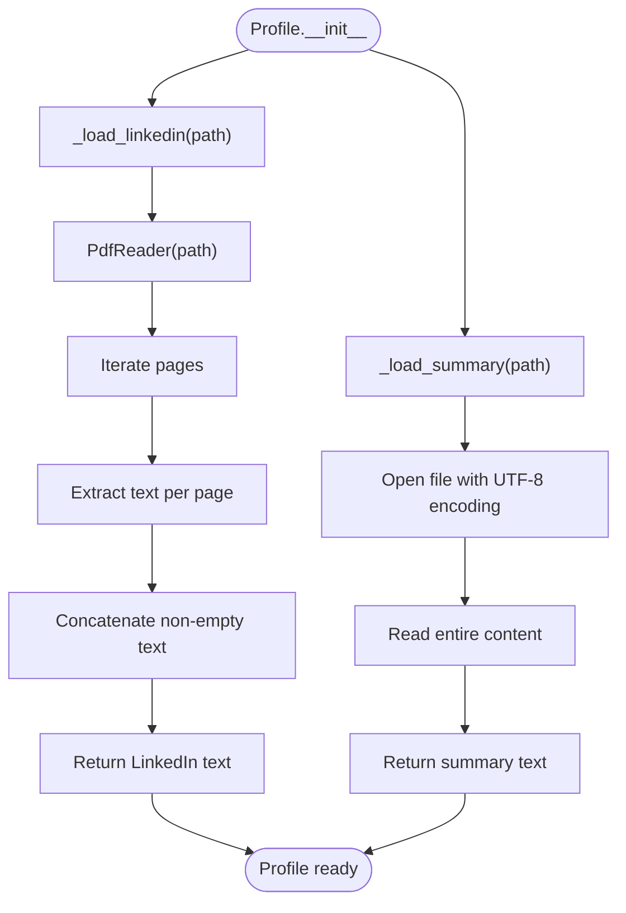
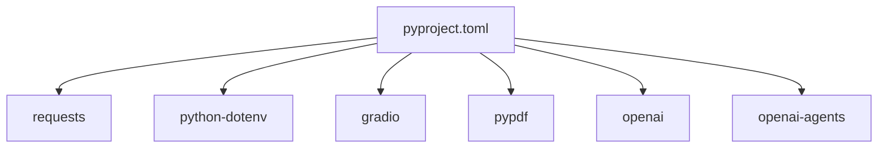

# Professional Summary Integration

<cite>
**Referenced Files in This Document**
- [agent.py](file://agent.py)
- [app.py](file://app.py)
- [user_profile.py](file://user_profile.py)
- [config.py](file://config.py)
- [tools.py](file://tools.py)
- [pushover.py](file://pushover.py)
- [pyproject.toml](file://pyproject.toml)
- [me/summary.txt](file://me/summary.txt)
</cite>

## Table of Contents
1. [Introduction](#introduction)
2. [Project Structure](#project-structure)
3. [Core Components](#core-components)
4. [Architecture Overview](#architecture-overview)
5. [Detailed Component Analysis](#detailed-component-analysis)
6. [Dependency Analysis](#dependency-analysis)
7. [Performance Considerations](#performance-considerations)
8. [Troubleshooting Guide](#troubleshooting-guide)
9. [Conclusion](#conclusion)
10. [Appendices](#appendices)

## Introduction
This document explains the professional summary integration system that powers a chatbot capable of emulating a professional persona. The system loads a structured summary from a text file and a LinkedIn PDF, integrates them into the chat agent's system prompt, and enhances conversation quality by providing consistent, context-aware responses. It covers the file loading process, UTF-8 encoding handling, file I/O operations, error handling strategies, and integration patterns with conversation context.

## Project Structure
The project follows a modular structure:
- Application entrypoint initializes configuration, builds tools, creates a profile, and launches the chat interface.
- The profile loader encapsulates file I/O for both the summary text and LinkedIn PDF.
- The chat agent composes a system prompt enriched with profile content and manages conversation loops with tool calls.
- Tools define capabilities for capturing user details and logging unknown questions.
- Pushover integration enables notifications for tool actions.

**Diagram sources**
- [app.py:66-76](file://app.py#L66-L76)
- [agent.py:57-80](file://agent.py#L57-L80)
- [user_profile.py:4-22](file://user_profile.py#L4-L22)
- [config.py:1-14](file://config.py#L1-L14)
- [tools.py:4-25](file://tools.py#L4-L25)
- [pushover.py:4-17](file://pushover.py#L4-L17)

**Section sources**
- [app.py:66-76](file://app.py#L66-L76)
- [user_profile.py:4-22](file://user_profile.py#L4-L22)
- [agent.py:57-80](file://agent.py#L57-L80)
- [config.py:1-14](file://config.py#L1-L14)
- [tools.py:4-25](file://tools.py#L4-L25)
- [pushover.py:4-17](file://pushover.py#L4-L17)

## Core Components
- Profile loader: Reads a LinkedIn PDF and a summary text file, returning extracted text for use in prompts.
- Chat agent: Builds a system prompt that includes profile content and manages conversation loops with tool calls.
- Tools: Define structured functions exposed to the LLM for capturing user details and logging unknown questions.
- Application bootstrap: Initializes configuration, constructs the profile, builds tools, and launches the chat interface.

Key responsibilities:
- File I/O: UTF-8 decoding for the summary text and text extraction from the LinkedIn PDF.
- Prompt construction: Injects profile content into the system prompt for consistent persona representation.
- Conversation orchestration: Handles tool calls and maintains conversation history.

**Section sources**
- [user_profile.py:19-21](file://user_profile.py#L19-L21)
- [agent.py:16-40](file://agent.py#L16-L40)
- [tools.py:12-24](file://tools.py#L12-L24)
- [app.py:66-76](file://app.py#L66-L76)

## Architecture Overview
The system integrates configuration, profile loading, tool definitions, and chat orchestration into a cohesive pipeline. The profile loader resolves file paths and performs I/O operations, while the agent composes a persona-informed system prompt and manages tool-enabled interactions.

**Diagram sources**
- [app.py:66-76](file://app.py#L66-L76)
- [user_profile.py:6-21](file://user_profile.py#L6-L21)
- [agent.py:57-80](file://agent.py#L57-L80)
- [tools.py:12-24](file://tools.py#L12-L24)

## Detailed Component Analysis

### Profile Loader: File Path Resolution and Content Extraction
The Profile class encapsulates two primary file I/O operations:
- LinkedIn PDF loading: Uses a PDF reader to extract text from each page and concatenate into a single string.
- Summary text loading: Opens the summary file with explicit UTF-8 encoding and reads the entire content.

Implementation highlights:
- File path resolution: Paths are passed from configuration and used directly by the loader.
- PDF text extraction: Iterates over pages and concatenates non-empty extracted text.
- UTF-8 handling: Explicitly opens the summary file with UTF-8 encoding to ensure correct character decoding.
- Return values: Both loaders return raw text suitable for inclusion in the system prompt.

**Diagram sources**
- [user_profile.py:11-21](file://user_profile.py#L11-L21)

**Section sources**
- [user_profile.py:6-21](file://user_profile.py#L6-L21)

### _load_summary Method Implementation
The `_load_summary` method performs a straightforward file I/O operation:
- Opens the file in text mode with UTF-8 encoding.
- Reads the entire content and returns it as a string.

Key considerations:
- Encoding: UTF-8 ensures correct handling of international characters and special symbols commonly present in professional summaries.
- Error handling: The method does not include explicit exception handling. If the file is missing or unreadable, the program will raise an exception during runtime.
- Preprocessing: The method returns raw content; any normalization or cleaning should be performed upstream or downstream as needed.

Integration with the system prompt:
- The returned summary text is appended to the system prompt alongside LinkedIn content, enabling the agent to remain faithful to the persona.

**Section sources**
- [user_profile.py:19-21](file://user_profile.py#L19-L21)
- [agent.py:34-40](file://agent.py#L34-L40)

### File Path Resolution and Configuration
Configuration values for profile paths are loaded from environment variables:
- PROFILE_NAME: Human-readable name used in prompts.
- LINKEDIN_PATH: Path to the LinkedIn PDF.
- SUMMARY_PATH: Path to the summary text file.

Resolution behavior:
- Defaults are provided if environment variables are not set.
- The application constructs the Profile with these paths, which are then used by the loader.

Best practices:
- Ensure environment variables are set or defaults are acceptable for local development.
- Verify file permissions and existence prior to launching the application.

**Section sources**
- [config.py:7-13](file://config.py#L7-L13)
- [app.py:68](file://app.py#L68)

### UTF-8 Encoding Handling and Character Set Considerations
- Summary file: Explicitly opened with UTF-8 encoding to support Unicode characters, accented letters, and symbols.
- LinkedIn PDF: Text extraction relies on the PDF reader library; ensure the PDF was generated with compatible encodings to avoid garbled text.

Recommendations:
- Store summary.txt with UTF-8 encoding.
- Validate that the LinkedIn PDF contains searchable text; otherwise, consider converting scanned documents to PDFs with embedded text or OCR preprocessing.

**Section sources**
- [user_profile.py:20](file://user_profile.py#L20)
- [pyproject.toml:11](file://pyproject.toml#L11)

### Integration Patterns with Conversation Context
The agent composes a system prompt that includes:
- Persona instructions and role context.
- The profile summary and LinkedIn content.
- Guidance for tool usage and conversation steering.

The prompt structure:
- System role message containing the persona and profile context.
- History appended from previous exchanges.
- Current user message appended last.

This ensures the agent remains in character and can leverage the profile content for accurate, professional responses.

**Section sources**
- [agent.py:16-40](file://agent.py#L16-L40)
- [agent.py:57-62](file://agent.py#L57-L62)

### Tool Integration and Conversation Enhancement
Two tools are defined:
- record_user_details: Captures user contact information and notes, sending a notification via Pushover.
- record_unknown_question: Logs questions that could not be answered, enabling future content updates.

These tools enhance conversation quality by:
- Collecting actionable insights for follow-up.
- Identifying gaps in knowledge for content improvement.

**Section sources**
- [app.py:10-63](file://app.py#L10-L63)
- [tools.py:4-25](file://tools.py#L4-L25)
- [pushover.py:4-17](file://pushover.py#L4-L17)

## Dependency Analysis
External dependencies and their roles:
- requests: Enables HTTP notifications via Pushover.
- python-dotenv: Loads environment variables from a .env file.
- gradio: Provides the chat interface.
- pypdf: Extracts text from the LinkedIn PDF.
- openai: Interacts with the OpenAI API for chat completions.
- openai-agents: Provides agent-related utilities.

**Diagram sources**
- [pyproject.toml:7-14](file://pyproject.toml#L7-L14)

**Section sources**
- [pyproject.toml:1-20](file://pyproject.toml#L1-L20)

## Performance Considerations
- PDF text extraction: Iterating over pages is linear in the number of pages; keep the LinkedIn PDF reasonably sized for fast loading.
- File I/O: Opening and reading small to medium-sized text files is efficient; avoid excessively large summary files that could increase memory usage.
- Prompt size: The combined length of the system prompt affects token limits; keep profile content concise and focused.
- Network calls: Tool notifications rely on external APIs; consider retry logic or offline fallbacks if reliability is critical.

## Troubleshooting Guide
Common issues and resolutions:
- Missing environment variables:
  - Symptom: Configuration errors or unexpected defaults.
  - Action: Set required environment variables or adjust defaults in configuration.
  - Section sources
    - [config.py:7-13](file://config.py#L7-L13)

- Summary file not found or unreadable:
  - Symptom: Exception raised during file open.
  - Action: Verify file path, permissions, and encoding; ensure UTF-8 encoding for summary.txt.
  - Section sources
    - [user_profile.py:19-21](file://user_profile.py#L19-L21)

- LinkedIn PDF unreadable:
  - Symptom: Empty or garbled LinkedIn content.
  - Action: Confirm the PDF contains searchable text; re-export or OCR the PDF if necessary.
  - Section sources
    - [user_profile.py:11-17](file://user_profile.py#L11-L17)

- Tool notifications not sent:
  - Symptom: No Pushover messages despite tool usage.
  - Action: Verify Pushover credentials and network connectivity; check tool invocation and handler logic.
  - Section sources
    - [app.py:10-63](file://app.py#L10-L63)
    - [pushover.py:12-16](file://pushover.py#L12-L16)

- Conversation not using profile content:
  - Symptom: Agent responses lack persona context.
  - Action: Confirm profile initialization and system prompt composition; verify that summary and LinkedIn content are non-empty.
  - Section sources
    - [agent.py:16-40](file://agent.py#L16-L40)
    - [user_profile.py:6-9](file://user_profile.py#L6-L9)

## Conclusion
The professional summary integration system combines robust file I/O, explicit UTF-8 handling, and structured tooling to deliver a consistent, persona-aware chat experience. By centralizing profile loading and integrating content into the system prompt, the agent remains faithful to the intended persona while leveraging tools to capture valuable conversation insights. Proper configuration, encoding, and file management are essential for reliable operation.

## Appendices

### Summary File Formatting and Content Structure Recommendations
- Use clear section headers and bullet points for readability.
- Include concise professional summary, technical skills, experience, education, and certifications.
- Keep content factual and aligned with the persona’s expertise.
- Example structure outline (do not copy verbatim):
  - Header with name and professional title
  - Contact information
  - Professional summary
  - Technical skills
  - Experience
  - Education
  - Certifications

**Section sources**
- [me/summary.txt:1-117](file://me/summary.txt#L1-L117)

### Example Integration Patterns
- Persona alignment: Ensure the system prompt emphasizes the persona’s role and communication style.
- Tool usage: Encourage the agent to use tools for capturing user details and logging unknown questions.
- Conversation steering: Guide discussions toward contact collection and follow-up actions.

**Section sources**
- [agent.py:16-40](file://agent.py#L16-L40)
- [app.py:10-63](file://app.py#L10-L63)