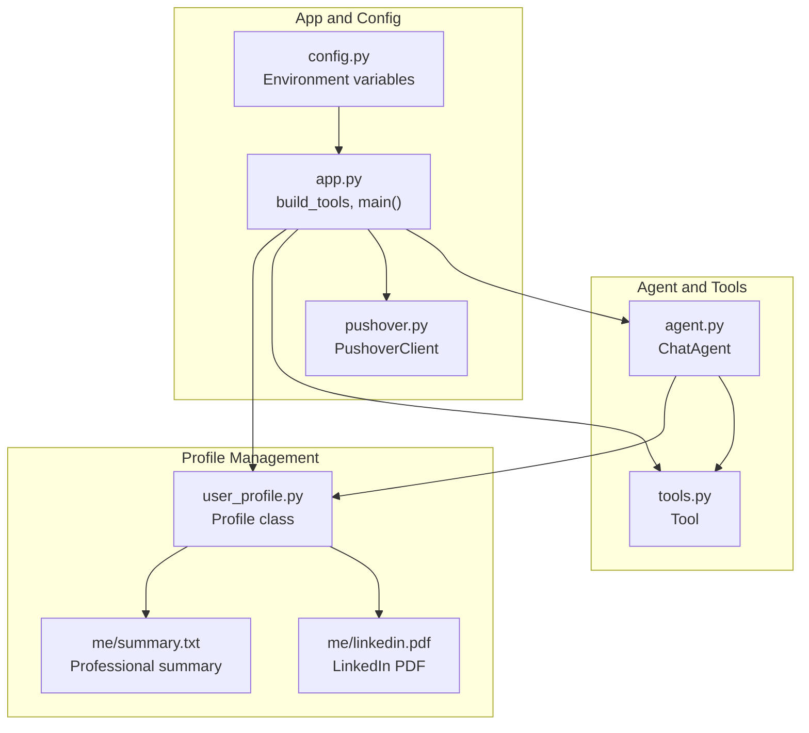
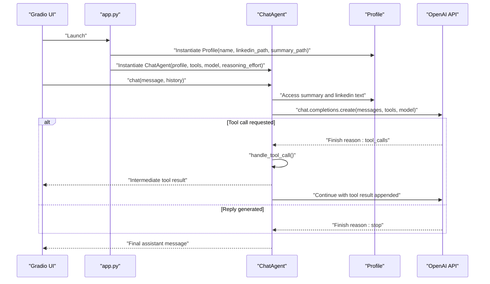
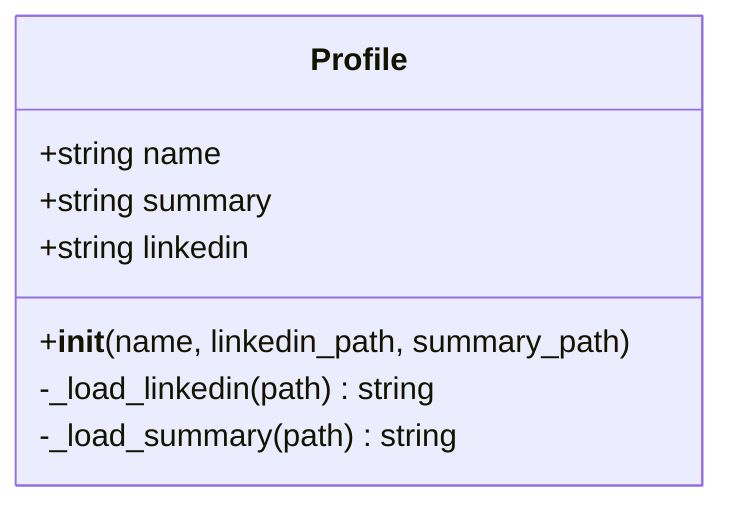
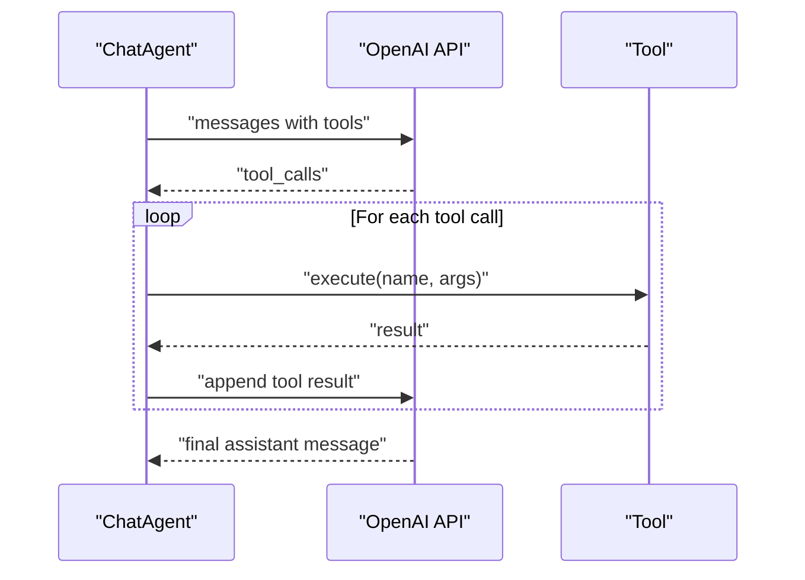
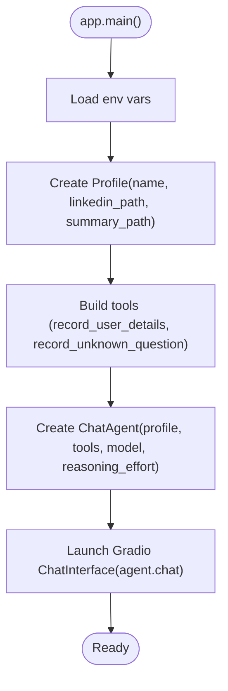
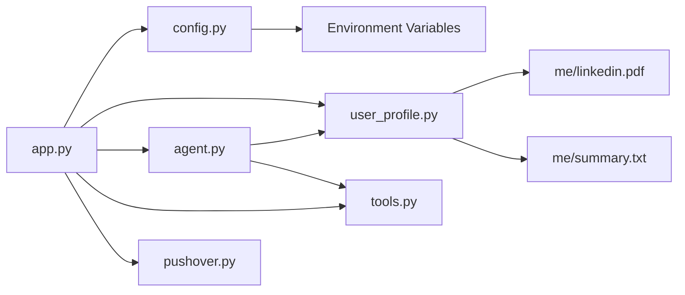

# Profile Management

<cite>
**Referenced Files in This Document**
- [user_profile.py](file://user_profile.py)
- [agent.py](file://agent.py)
- [app.py](file://app.py)
- [tools.py](file://tools.py)
- [config.py](file://config.py)
- [pushover.py](file://pushover.py)
- [me/summary.txt](file://me/summary.txt)
- [me/linkedin.pdf](file://me/linkedin.pdf)
- [README.md](file://README.md)
- [pyproject.toml](file://pyproject.toml)
</cite>

## Table of Contents
1. [Introduction](#introduction)
2. [Project Structure](#project-structure)
3. [Core Components](#core-components)
4. [Architecture Overview](#architecture-overview)
5. [Detailed Component Analysis](#detailed-component-analysis)
6. [Dependency Analysis](#dependency-analysis)
7. [Performance Considerations](#performance-considerations)
8. [Troubleshooting Guide](#troubleshooting-guide)
9. [Conclusion](#conclusion)
10. [Appendices](#appendices)

## Introduction
This document explains the Profile Management system that powers a professional persona chatbot. It focuses on how LinkedIn PDFs are parsed, how the professional summary integrates into conversation context, and how profile data is injected into the AI agent to improve response quality and enable personalized interactions. It also covers supported PDF formats, parsing limitations, fallback strategies, file format requirements, security considerations, and customization options for different professional backgrounds.

## Project Structure
The system is organized around a small set of focused modules:
- Profile loading and text extraction from PDF and text files
- Agent that builds a system prompt enriched with profile data
- Application entrypoint that wires configuration, tools, and UI
- Tool definitions for capturing user details and unknown questions
- Pushover integration for notifications
- Configuration via environment variables
- Example profile assets (LinkedIn PDF and summary text)

**Diagram sources**
- [user_profile.py:1-22](file://user_profile.py#L1-L22)
- [agent.py:1-80](file://agent.py#L1-L80)
- [app.py:1-76](file://app.py#L1-L76)
- [tools.py:1-25](file://tools.py#L1-L25)
- [config.py:1-14](file://config.py#L1-L14)
- [pushover.py:1-17](file://pushover.py#L1-L17)
- [me/summary.txt:1-117](file://me/summary.txt#L1-L117)
- [me/linkedin.pdf](file://me/linkedin.pdf)

**Section sources**
- [README.md:1-3](file://README.md#L1-L3)
- [pyproject.toml:1-20](file://pyproject.toml#L1-L20)

## Core Components
- Profile: Loads and extracts text from a LinkedIn PDF and a professional summary text file. It exposes the raw text for downstream consumption.
- ChatAgent: Builds a system prompt that includes the profile’s summary and LinkedIn content, enabling the AI to answer questions in-character and stay aligned with the professional background.
- Tools: Encapsulate actions the agent can take, such as recording user details or unknown questions, and convert them to OpenAI function tools.
- App: Orchestrates configuration, tools, profile, and agent, and launches a Gradio chat interface.
- PushoverClient: Sends notifications for tool invocations.
- Configuration: Centralizes environment variables for credentials, model selection, and file paths.

**Section sources**
- [user_profile.py:4-22](file://user_profile.py#L4-L22)
- [agent.py:6-80](file://agent.py#L6-L80)
- [tools.py:4-25](file://tools.py#L4-L25)
- [app.py:10-76](file://app.py#L10-L76)
- [pushover.py:4-17](file://pushover.py#L4-L17)
- [config.py:7-14](file://config.py#L7-L14)

## Architecture Overview
The system follows a straightforward pipeline:
- The Profile class reads and concatenates text from a LinkedIn PDF and a summary text file.
- The ChatAgent composes a system prompt that includes both the summary and LinkedIn content, then sends the prompt plus conversation history to OpenAI.
- Tools are dynamically attached to the agent; when the model requests a tool call, the agent executes it and appends the result to the conversation.
- The app wires everything together and exposes a chat UI.

**Diagram sources**
- [app.py:66-76](file://app.py#L66-L76)
- [agent.py:57-80](file://agent.py#L57-L80)
- [user_profile.py:4-22](file://user_profile.py#L4-L22)

## Detailed Component Analysis

### Profile Class Implementation
The Profile class encapsulates:
- Initialization with name, LinkedIn PDF path, and summary text path
- LinkedIn PDF text extraction via a PDF reader
- Summary text loading from a UTF-8 encoded file

Key behaviors:
- Text extraction loops over pages and concatenates extracted text
- Summary is loaded as a single string for prompt injection
- No preprocessing or cleaning is performed; raw text is used as-is

**Diagram sources**
- [user_profile.py:4-22](file://user_profile.py#L4-L22)

**Section sources**
- [user_profile.py:6-22](file://user_profile.py#L6-L22)

### LinkedIn PDF Parsing
- Uses a PDF reader to iterate over pages and extract text
- Concatenates page text into a single string
- No explicit layout or metadata processing; relies on the reader’s text extraction capabilities

Supported formats:
- PDFs readable by the underlying PDF library
- Pages with embedded text or searchable text are supported

Limitations:
- Non-searchable PDFs (scanned images) may yield minimal or empty text
- Complex layouts, columns, or rotated text may reduce readability
- OCR is not integrated; results depend on the PDF’s internal text representation

Fallback strategies:
- Provide a robust summary text alongside the PDF
- Preprocess the PDF to improve text searchability if needed
- Validate that the extracted text is non-empty; otherwise rely on the summary

**Section sources**
- [user_profile.py:11-17](file://user_profile.py#L11-L17)

### Professional Summary Integration
- The summary is loaded as a UTF-8 string and included verbatim in the system prompt
- The ChatAgent injects the summary into the system prompt alongside LinkedIn content
- This ensures the AI maintains a consistent professional persona and answers questions grounded in the provided background

Customization options:
- Replace the summary text file to reflect different roles, industries, or personas
- Structure the summary to highlight key skills, experiences, and values

**Section sources**
- [user_profile.py:19-21](file://user_profile.py#L19-L21)
- [agent.py:16-40](file://agent.py#L16-L40)
- [me/summary.txt:1-117](file://me/summary.txt#L1-L117)

### Context Injection Mechanisms
- The ChatAgent constructs a system prompt that includes:
  - Role and persona instructions
  - The professional summary
  - The LinkedIn profile text
- This combined context enables the AI to answer questions in-character and steer conversations toward desired outcomes (e.g., collecting contact details)

Personalization:
- The prompt is tailored to the individual’s name and background
- The agent can guide users toward email collection and record unknown questions for later review

**Section sources**
- [agent.py:16-40](file://agent.py#L16-L40)

### Data Preprocessing Steps
- No explicit preprocessing is performed in the Profile class
- The agent does not modify the profile text before injection
- Recommendations for improvement:
  - Normalize whitespace and remove excessive blank lines
  - Filter out low-signal content (e.g., repeated headers)
  - Segment LinkedIn text into structured chunks for targeted retrieval

**Section sources**
- [user_profile.py:11-21](file://user_profile.py#L11-L21)
- [agent.py:16-40](file://agent.py#L16-L40)

### Tooling and Conversation Enhancement
- Tools define capabilities the agent can invoke:
  - Record user details (email, name, notes)
  - Record unknown questions
- These tools are exposed to the model as functions; when invoked, their results are appended to the conversation to inform subsequent responses

**Diagram sources**
- [agent.py:42-55](file://agent.py#L42-L55)
- [tools.py:12-25](file://tools.py#L12-L25)

**Section sources**
- [tools.py:4-25](file://tools.py#L4-L25)
- [app.py:10-63](file://app.py#L10-L63)

### Application Orchestration
- The app loads configuration from environment variables
- Creates a Profile, tools, and a ChatAgent
- Launches a Gradio chat interface connected to the agent’s chat method

**Diagram sources**
- [app.py:66-76](file://app.py#L66-L76)
- [config.py:7-14](file://config.py#L7-L14)

**Section sources**
- [app.py:66-76](file://app.py#L66-L76)
- [config.py:7-14](file://config.py#L7-L14)

## Dependency Analysis
External libraries and their roles:
- requests: Used by PushoverClient for HTTP notifications
- python-dotenv: Loads environment variables from a .env file
- gradio: Provides the chat UI
- pypdf: Extracts text from PDFs
- openai: Interacts with OpenAI models
- openai-agents: Enables function/tool calling support

**Diagram sources**
- [app.py:1-76](file://app.py#L1-L76)
- [user_profile.py:1-22](file://user_profile.py#L1-L22)
- [agent.py:1-80](file://agent.py#L1-L80)
- [tools.py:1-25](file://tools.py#L1-L25)
- [pushover.py:1-17](file://pushover.py#L1-L17)
- [config.py:1-14](file://config.py#L1-L14)

**Section sources**
- [pyproject.toml:7-14](file://pyproject.toml#L7-L14)

## Performance Considerations
- PDF text extraction overhead: Large PDFs or many pages increase processing time; consider pre-processing or splitting documents
- Prompt size: Including both summary and LinkedIn content increases token usage; monitor model limits and adjust content length
- Tool invocation: Each tool call adds round-trips; batch related actions when possible
- Model selection: Choose a model appropriate for the workload; smaller models may be faster but less capable for complex tasks

[No sources needed since this section provides general guidance]

## Troubleshooting Guide
Common issues and resolutions:
- Empty or minimal LinkedIn text:
  - Cause: Non-searchable PDF or poor text extraction
  - Resolution: Provide a robust summary text; preprocess PDF to improve text searchability
- Unexpected model behavior:
  - Cause: Insufficient or noisy context
  - Resolution: Trim and structure the summary and LinkedIn content; ensure the prompt clearly defines persona and goals
- Tool call failures:
  - Cause: Incorrect argument schema or missing handler
  - Resolution: Verify tool schemas and handlers; confirm tool names match between agent and tool definitions
- Environment configuration:
  - Cause: Missing tokens or incorrect paths
  - Resolution: Confirm environment variables are set; validate file paths for summary and LinkedIn PDF

**Section sources**
- [user_profile.py:11-17](file://user_profile.py#L11-L17)
- [agent.py:16-40](file://agent.py#L16-L40)
- [tools.py:12-25](file://tools.py#L12-L25)
- [config.py:7-14](file://config.py#L7-L14)

## Conclusion
The Profile Management system integrates a LinkedIn PDF and a professional summary into a cohesive persona for a chatbot. The Profile class extracts raw text from both sources, and the ChatAgent injects this content into a system prompt to guide the AI’s responses. Tools enable the agent to capture user details and unknown questions, enhancing personalization and follow-up. While the current implementation is straightforward, it provides a solid foundation for customization, preprocessing improvements, and expanded context handling.

[No sources needed since this section summarizes without analyzing specific files]

## Appendices

### Supported PDF Formats and Limitations
- Supported: PDFs with embedded or searchable text
- Limitations: Non-searchable PDFs (scanned images), complex layouts, or rotated text may degrade extraction quality
- Fallback: Maintain a high-quality summary text file to ensure continuity

**Section sources**
- [user_profile.py:11-17](file://user_profile.py#L11-L17)

### Security Considerations for Document Processing
- Validate file paths and restrict access to trusted directories
- Avoid embedding sensitive information in PDFs or summaries
- Sanitize extracted text before injection into prompts if needed
- Restrict tool execution to intended actions and validate inputs

[No sources needed since this section provides general guidance]

### Customization Options for Different Professional Backgrounds
- Swap the summary text file to reflect new roles, industries, or personas
- Update LinkedIn PDF to align with current experience
- Adjust the system prompt in the agent to refine tone, goals, and response patterns
- Extend tools to capture additional user intents or preferences

**Section sources**
- [agent.py:16-40](file://agent.py#L16-L40)
- [app.py:10-63](file://app.py#L10-L63)
- [me/summary.txt:1-117](file://me/summary.txt#L1-L117)