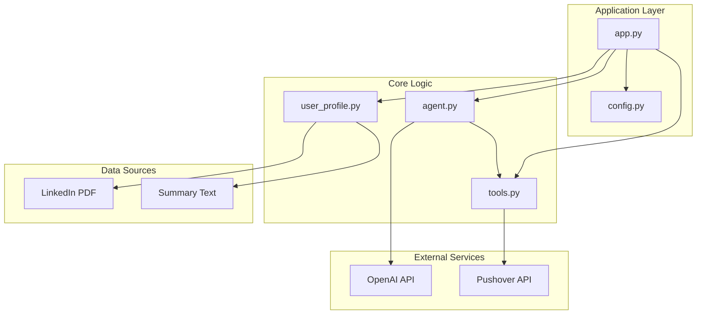
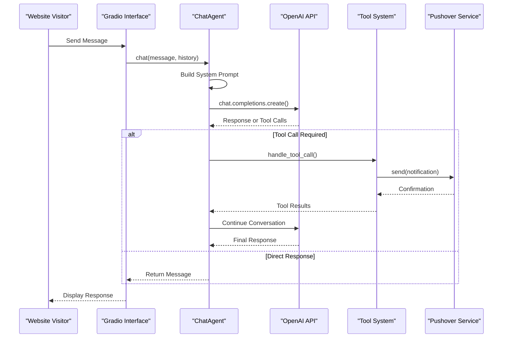
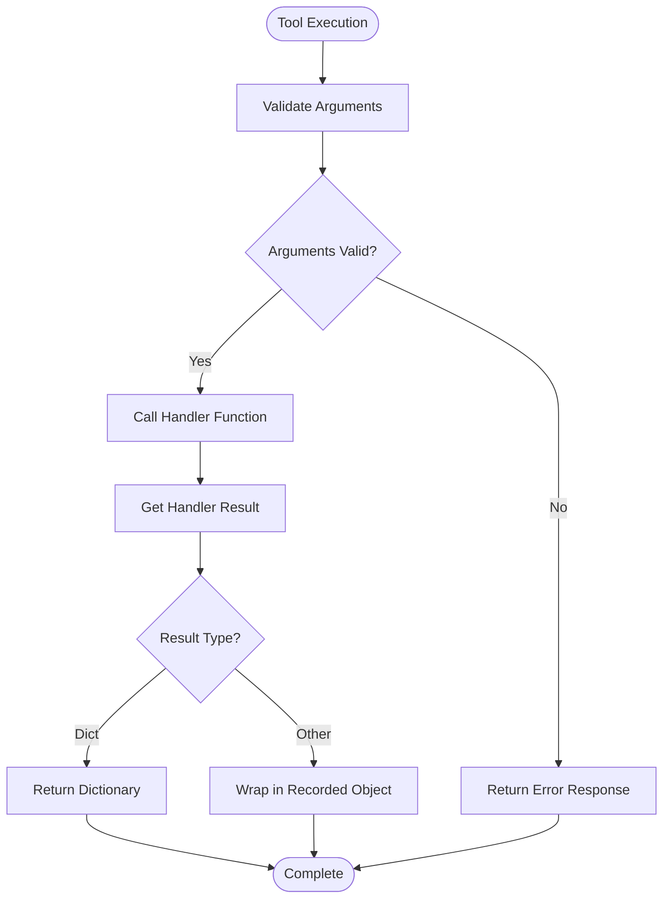
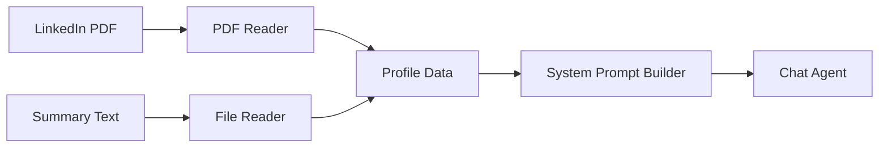
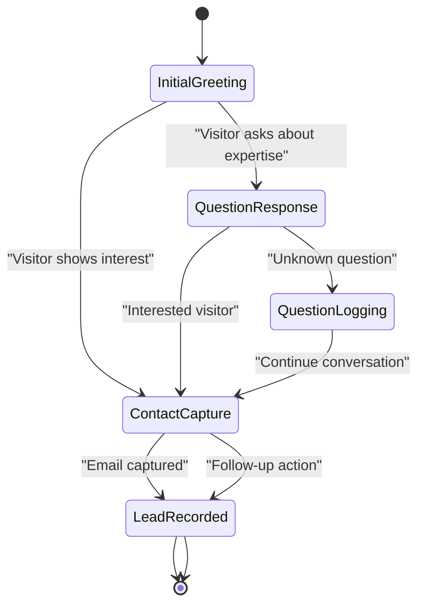
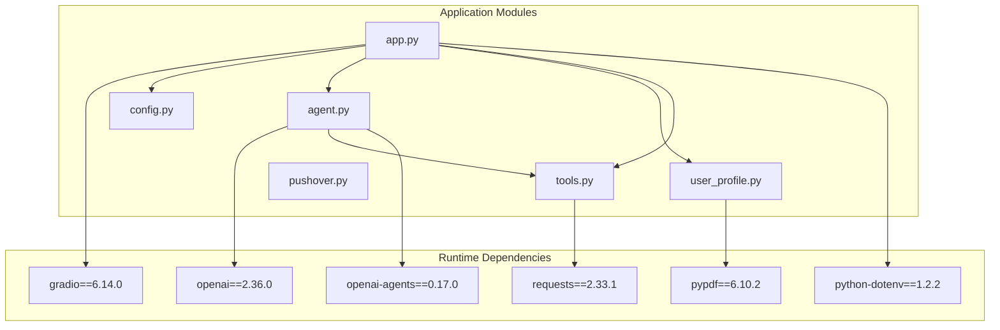

# Project Overview

<cite>
**Referenced Files in This Document**
- [README.md](file://README.md)
- [agent.py](file://agent.py)
- [app.py](file://app.py)
- [config.py](file://config.py)
- [tools.py](file://tools.py)
- [user_profile.py](file://user_profile.py)
- [pushover.py](file://pushover.py)
- [pyproject.toml](file://pyproject.toml)
- [me/summary.txt](file://me/summary.txt)
</cite>

## Table of Contents
1. [Introduction](#introduction)
2. [Project Structure](#project-structure)
3. [Core Components](#core-components)
4. [Architecture Overview](#architecture-overview)
5. [Detailed Component Analysis](#detailed-component-analysis)
6. [Dependency Analysis](#dependency-analysis)
7. [Performance Considerations](#performance-considerations)
8. [Troubleshooting Guide](#troubleshooting-guide)
9. [Conclusion](#conclusion)

## Introduction
Professional Alter Ego is an AI-powered chatbot designed to emulate a data scientist's personality and expertise for website interactions and lead generation. The project transforms a professional's LinkedIn profile and personal summary into a context-aware conversational agent that can engage visitors, answer questions about career background and technical expertise, and capture contact information for follow-up.

The chatbot operates as a Gradio-based web interface that integrates with OpenAI's language models through a structured tool-calling mechanism. It maintains a professional persona while guiding conversations toward lead generation workflows, making it ideal for business owners seeking professional insights and engagement.

## Project Structure
The project follows a modular architecture with clear separation of concerns:



**Diagram sources**
- [app.py:1-76](file://app.py#L1-L76)
- [agent.py:1-80](file://agent.py#L1-L80)
- [config.py:1-14](file://config.py#L1-L14)

**Section sources**
- [README.md:1-3](file://README.md#L1-L3)
- [pyproject.toml:1-20](file://pyproject.toml#L1-L20)

## Core Components
The chatbot system consists of several interconnected components that work together to deliver professional, context-aware conversations:

### Chat Agent
The central intelligence component that orchestrates conversations with OpenAI's language models. It maintains conversation history, applies professional system prompts, and manages tool-calling workflows for lead generation.

### Professional Profile Management
A structured data layer that loads and processes professional information from PDF and text sources, providing context-aware responses tailored to the data scientist's expertise.

### Tool System
A flexible framework for extending chatbot capabilities through function calling. Current tools support lead capture and question logging for continuous improvement.

### Web Interface
A Gradio-based chat interface that provides an intuitive user experience while maintaining the professional persona of the data scientist.

**Section sources**
- [agent.py:6-80](file://agent.py#L6-L80)
- [user_profile.py:4-22](file://user_profile.py#L4-L22)
- [tools.py:4-25](file://tools.py#L4-L25)
- [app.py:10-76](file://app.py#L10-L76)

## Architecture Overview
The system implements a sophisticated conversation flow that combines AI reasoning with practical lead generation:



**Diagram sources**
- [agent.py:42-79](file://agent.py#L42-L79)
- [app.py:10-63](file://app.py#L10-L63)
- [pushover.py:12-16](file://pushover.py#L12-L16)

The architecture emphasizes:
- **Context-Aware Responses**: Professional system prompts combined with loaded profile data
- **Lead Generation Workflows**: Structured tool-calling for capturing user details
- **Continuous Learning**: Question logging for improving future responses
- **Real-Time Communication**: Immediate notifications for lead capture

## Detailed Component Analysis

### ChatAgent Implementation
The ChatAgent serves as the primary orchestrator for all conversational logic:

```mermaid
classDiagram
class ChatAgent {
-OpenAI openai
-Profile profile
-Tool[] tools
-string model
-string reasoning_effort
-dict~Tool~ _tool_map
+__init__(profile, tools, model, reasoning_effort)
+system_prompt() string
+handle_tool_call(tool_calls) list
+chat(message, history) string
}
class Profile {
+string name
+string linkedin
+string summary
+_load_linkedin(path) string
+_load_summary(path) string
}
class Tool {
+string name
+string description
+dict parameters
+handler
+to_schema() dict
+execute(**kwargs) dict
}
ChatAgent --> Profile : "uses"
ChatAgent --> Tool : "manages"
Profile --> "PDF Reader" : "loads"
```

**Diagram sources**
- [agent.py:6-80](file://agent.py#L6-L80)
- [user_profile.py:4-22](file://user_profile.py#L4-L22)
- [tools.py:4-25](file://tools.py#L4-L25)

Key implementation patterns include:
- **System Prompt Engineering**: Dynamic construction of professional personas based on loaded profiles
- **Tool-Called Reasoning**: Iterative conversation loop that continues until completion
- **Context Preservation**: Maintains conversation history for coherent dialogue flow

**Section sources**
- [agent.py:8-40](file://agent.py#L8-L40)
- [agent.py:42-79](file://agent.py#L42-L79)

### Tool System Architecture
The tool framework enables extensible functionality through function calling:



**Diagram sources**
- [tools.py:22-24](file://tools.py#L22-L24)

Current tool implementations focus on lead generation:
- **record_user_details**: Captures visitor contact information for follow-up
- **record_unknown_question**: Logs questions that require additional research

**Section sources**
- [tools.py:4-25](file://tools.py#L4-L25)
- [app.py:10-63](file://app.py#L10-L63)

### Professional Profile Integration
The profile system provides context-aware responses through structured data loading:



**Diagram sources**
- [user_profile.py:11-21](file://user_profile.py#L11-L21)
- [agent.py:16-40](file://agent.py#L16-L40)

The profile loading process handles:
- **PDF Text Extraction**: Multi-page LinkedIn content processing
- **Text Normalization**: Consistent formatting for AI consumption
- **Context Injection**: Seamless integration into system prompts

**Section sources**
- [user_profile.py:4-22](file://user_profile.py#L4-L22)
- [me/summary.txt:1-117](file://me/summary.txt#L1-L117)

### Lead Generation Workflow
The system implements a comprehensive lead capture mechanism:



**Diagram sources**
- [agent.py:27-32](file://agent.py#L27-L32)
- [app.py:39-41](file://app.py#L39-L41)

The workflow ensures:
- **Professional Guidance**: Steering conversations toward meaningful engagement
- **Data Capture**: Structured collection of visitor information
- **Notification System**: Real-time alerts for new leads

**Section sources**
- [agent.py:16-40](file://agent.py#L16-L40)
- [app.py:10-63](file://app.py#L10-L63)

## Dependency Analysis
The project maintains clean dependencies through strategic module separation:



**Diagram sources**
- [pyproject.toml:7-14](file://pyproject.toml#L7-L14)
- [app.py:1-8](file://app.py#L1-L8)

Key dependency characteristics:
- **Minimal External Coupling**: Clear separation between AI services and local logic
- **Configuration Management**: Environment-based service configuration
- **Extensible Tool System**: Pluggable functionality through tool definitions

**Section sources**
- [pyproject.toml:1-20](file://pyproject.toml#L1-L20)
- [config.py:1-14](file://config.py#L1-L14)

## Performance Considerations
The system is optimized for efficient conversation handling:

### Memory Management
- **Conversation History**: Maintains minimal necessary context for cost efficiency
- **Profile Loading**: Single-time loading of static profile data
- **Tool Results**: Streaming tool execution without excessive memory retention

### API Efficiency
- **Model Selection**: Configurable model choice for balancing quality vs. cost
- **Reasoning Effort**: Optional reasoning effort parameter for performance tuning
- **Batch Operations**: Consolidated tool execution in single conversation turns

### Scalability Factors
- **Stateless Design**: No server-side session storage required
- **Asynchronous Notifications**: Non-blocking lead notification system
- **Modular Architecture**: Independent scaling of individual components

## Troubleshooting Guide

### Common Configuration Issues
- **Missing Environment Variables**: Ensure PUSHOVER_TOKEN, PUSHOVER_USER, and OPENAI_MODEL are configured
- **File Path Errors**: Verify LinkedIn PDF and summary text files exist at configured paths
- **API Authentication**: Confirm OpenAI API key availability in environment

### Conversation Flow Problems
- **Tool Call Failures**: Check tool handler implementations and argument validation
- **Profile Loading Issues**: Verify PDF readability and text extraction permissions
- **Memory Constraints**: Monitor conversation length for long-running sessions

### Integration Debugging
- **Pushover Notifications**: Test network connectivity and API credentials
- **OpenAI Model Availability**: Verify selected model is accessible and properly configured
- **Gradio Interface**: Check browser compatibility and network connectivity

**Section sources**
- [config.py:6-14](file://config.py#L6-L14)
- [pushover.py:12-16](file://pushover.py#L12-L16)
- [agent.py:42-55](file://agent.py#L42-L55)

## Conclusion
Professional Alter Ego represents a sophisticated integration of AI capabilities with professional branding and lead generation workflows. The system successfully combines contextual awareness from professional profiles with structured tool-calling mechanisms to create engaging, purposeful conversations.

Key strengths include:
- **Professional Authenticity**: Context-aware responses that reflect genuine expertise
- **Lead Generation Focus**: Integrated workflows for capturing valuable visitor information
- **Technical Excellence**: Clean architecture with clear separation of concerns
- **Extensibility**: Modular design enabling easy addition of new capabilities

The project serves as an excellent foundation for AI-powered professional engagement, offering both immediate value for business owners seeking professional insights and a robust platform for continued development and customization.