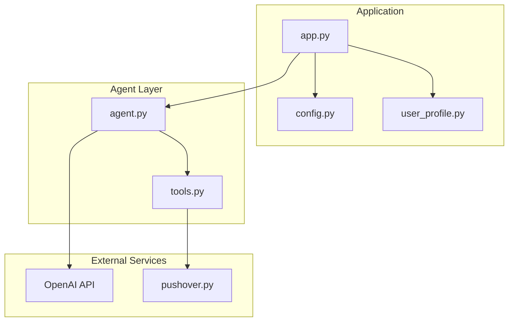
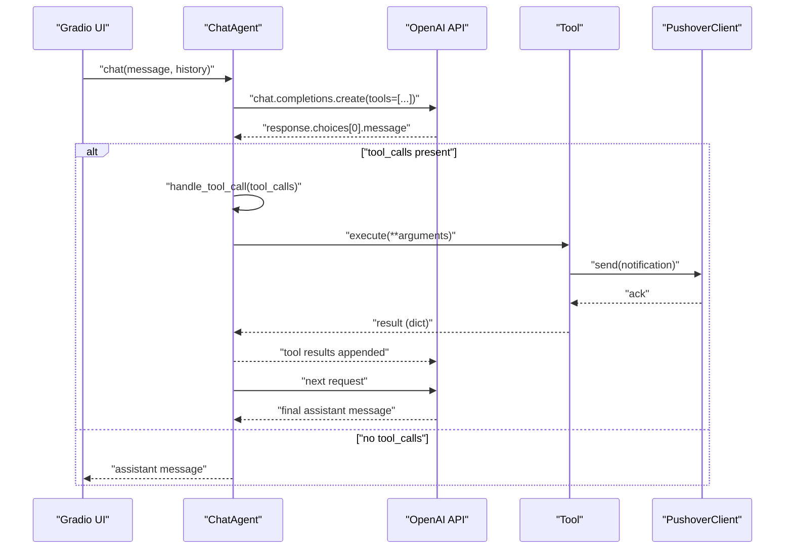
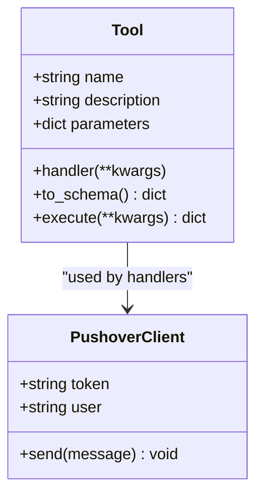
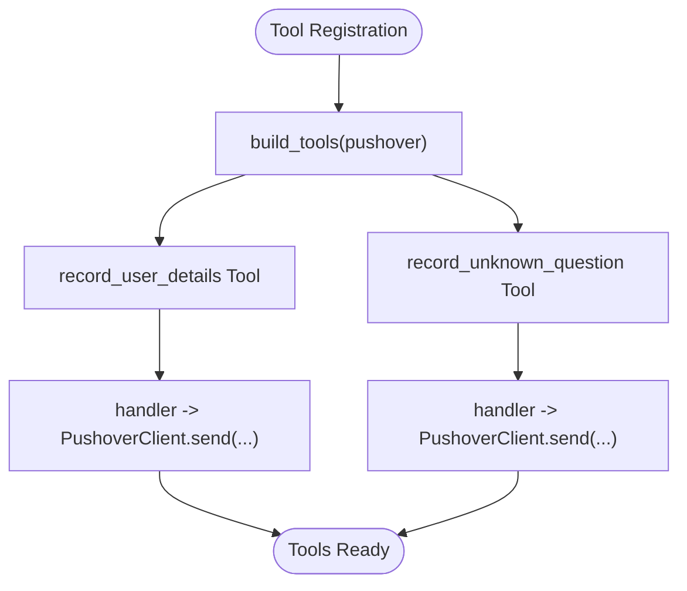
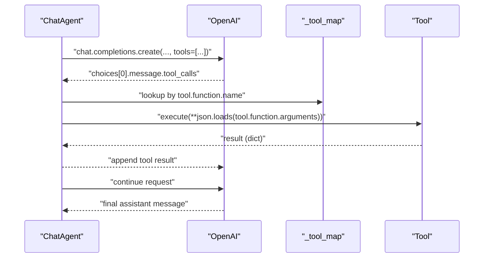
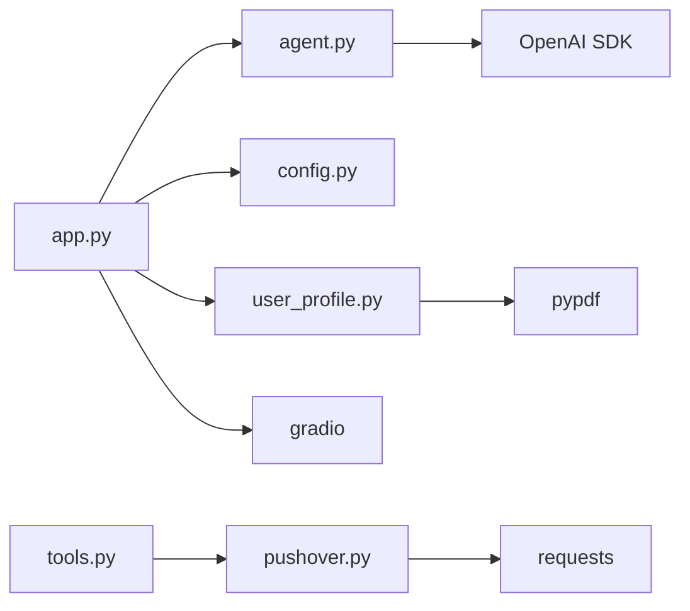

# Tool System

<cite>
**Referenced Files in This Document**
- [tools.py](file://tools.py)
- [agent.py](file://agent.py)
- [app.py](file://app.py)
- [config.py](file://config.py)
- [pushover.py](file://pushover.py)
- [user_profile.py](file://user_profile.py)
- [README.md](file://README.md)
- [pyproject.toml](file://pyproject.toml)
</cite>

## Table of Contents
1. [Introduction](#introduction)
2. [Project Structure](#project-structure)
3. [Core Components](#core-components)
4. [Architecture Overview](#architecture-overview)
5. [Detailed Component Analysis](#detailed-component-analysis)
6. [Dependency Analysis](#dependency-analysis)
7. [Performance Considerations](#performance-considerations)
8. [Troubleshooting Guide](#troubleshooting-guide)
9. [Conclusion](#conclusion)
10. [Appendices](#appendices)

## Introduction
This document explains the Tool System framework used by the professional chatbot. It covers the abstract Tool base class, JSON schema generation for tool definitions, dynamic tool registration, and the execution pipeline integrated with the ChatAgent. It also documents the built-in tools for capturing user emails and recording unknown questions, and provides practical guidance for building custom tools with JSON schema validation, parameter handling, and lifecycle management.

## Project Structure
The Tool System spans several modules:
- tools.py defines the Tool abstraction and JSON schema conversion.
- agent.py integrates tools with the OpenAI chat completion API and orchestrates tool execution.
- app.py constructs tools and wires them into the ChatAgent.
- pushover.py provides a simple notification delivery mechanism used by tools.
- user_profile.py loads profile data used by the ChatAgent’s system prompt.
- config.py centralizes environment-driven configuration.
- pyproject.toml lists dependencies including OpenAI and Gradio.

**Diagram sources**
- [app.py:1-76](file://app.py#L1-L76)
- [agent.py:1-80](file://agent.py#L1-L80)
- [tools.py:1-25](file://tools.py#L1-L25)
- [pushover.py:1-17](file://pushover.py#L1-L17)
- [config.py:1-14](file://config.py#L1-L14)
- [user_profile.py:1-22](file://user_profile.py#L1-L22)

**Section sources**
- [app.py:1-76](file://app.py#L1-L76)
- [agent.py:1-80](file://agent.py#L1-L80)
- [tools.py:1-25](file://tools.py#L1-L25)
- [pushover.py:1-17](file://pushover.py#L1-L17)
- [config.py:1-14](file://config.py#L1-L14)
- [user_profile.py:1-22](file://user_profile.py#L1-L22)
- [pyproject.toml:1-20](file://pyproject.toml#L1-L20)

## Core Components
- Tool: An abstraction that encapsulates a callable action with a JSON schema definition. It exposes:
  - A constructor accepting name, description, parameters (JSON schema), and a handler function.
  - A to_schema method that produces an OpenAI-compatible function tool schema.
  - An execute method that invokes the handler with validated parameters and ensures a dictionary response.
- ChatAgent: Integrates the Tool set with OpenAI’s chat completions. It:
  - Builds a system prompt enriched with profile data.
  - Registers tools by name-to-tool mapping.
  - Invokes OpenAI with tools included in the request.
  - Handles tool_calls by resolving the tool name, parsing arguments, executing the tool, and returning structured tool results.
- Application bootstrap: Creates tools, initializes the ChatAgent, and launches a Gradio UI.

Key behaviors:
- Tool schema validation is driven by the parameters field, which must conform to a JSON Schema object with required properties and strict additionalProperties rules.
- Tool execution returns a dictionary; if the handler does not return a dict, a standardized success record is produced.

**Section sources**
- [tools.py:4-25](file://tools.py#L4-L25)
- [agent.py:6-80](file://agent.py#L6-L80)
- [app.py:10-64](file://app.py#L10-L64)

## Architecture Overview
The Tool System sits between the ChatAgent and external services. Tools are registered with the ChatAgent and exposed to OpenAI. When OpenAI responds with tool_calls, the ChatAgent executes the corresponding Tool handlers and posts results back to the model.

**Diagram sources**
- [agent.py:42-80](file://agent.py#L42-L80)
- [tools.py:22-25](file://tools.py#L22-L25)
- [pushover.py:12-17](file://pushover.py#L12-L17)
- [app.py:66-76](file://app.py#L66-L76)

## Detailed Component Analysis

### Tool Base Class
The Tool class defines a minimal interface for actions:
- Initialization stores name, description, parameters (JSON schema), and handler.
- to_schema converts the tool into an OpenAI function tool schema suitable for inclusion in chat completions.
- execute delegates to the handler and normalizes the result to a dictionary.

**Diagram sources**
- [tools.py:4-25](file://tools.py#L4-L25)
- [pushover.py:4-17](file://pushover.py#L4-L17)

**Section sources**
- [tools.py:4-25](file://tools.py#L4-L25)

### Built-in Tools: Email Capture and Unknown Question Recording
Two tools are constructed in the application bootstrap:
- record_user_details: Captures user interest with email, optional name, and notes. Its parameters define a strict JSON schema requiring email and rejecting extra properties.
- record_unknown_question: Records questions that could not be answered, requiring a question field.

Both tools use lambda handlers that delegate to PushoverClient.send, which posts notifications to a Pushover endpoint.

**Diagram sources**
- [app.py:10-64](file://app.py#L10-L64)
- [pushover.py:12-17](file://pushover.py#L12-L17)

**Section sources**
- [app.py:10-64](file://app.py#L10-L64)
- [pushover.py:12-17](file://pushover.py#L12-L17)

### Tool Execution Pipeline
The ChatAgent manages the tool execution loop:
- It builds a system prompt from profile data and maintains a conversation history.
- It sends a chat request with tools included in the schema.
- On receiving tool_calls, it parses arguments, resolves the tool by name, executes it, and appends the result as a tool role message.
- It continues looping until the model returns a non-tool-calling response.

**Diagram sources**
- [agent.py:42-80](file://agent.py#L42-L80)

**Section sources**
- [agent.py:42-80](file://agent.py#L42-L80)

### JSON Schema Validation Requirements
Each Tool’s parameters must be a JSON Schema object:
- type equals "object".
- properties define the accepted fields.
- required lists mandatory fields.
- additionalProperties set to false enforces strict argument validation.

Validation behavior:
- If the model passes arguments that violate the schema, the handler will receive only the validated subset. The Tool.execute wrapper ensures a dictionary result is returned.

Best practices:
- Keep required minimal and explicit.
- Avoid additionalProperties unless truly necessary.
- Provide clear descriptions for each property to aid model reasoning.

**Section sources**
- [app.py:17-38](file://app.py#L17-L38)
- [app.py:49-59](file://app.py#L49-L59)
- [tools.py:22-25](file://tools.py#L22-L25)

### Dynamic Tool Registration Mechanism
Tools are dynamically constructed in build_tools and passed to ChatAgent. The agent maintains a name-to-tool map for fast resolution during tool_calls. This enables:
- Easy addition of new tools by appending to the returned list.
- Centralized configuration of tool schemas and handlers.

Lifecycle:
- Construction: build_tools creates Tool instances with handlers bound to PushoverClient.
- Registration: ChatAgent stores tools and builds a lookup map.
- Execution: Agent resolves tool by name and executes handler with parsed arguments.

**Section sources**
- [app.py:10-64](file://app.py#L10-L64)
- [agent.py:14-14](file://agent.py#L14-L14)

### Integration with ChatAgent
- The ChatAgent includes tools in each request via to_schema.
- It parses tool_calls and routes them to the appropriate Tool.
- Results are formatted as tool messages with tool_call_id for model correlation.

Operational notes:
- Arguments are parsed from JSON string form.
- The agent appends tool results to the conversation history before continuing.

**Section sources**
- [agent.py:68-79](file://agent.py#L68-L79)
- [agent.py:42-55](file://agent.py#L42-L55)

### Practical Examples: Implementing Custom Tools
To add a new tool:
1. Define a Tool with:
   - name: unique identifier.
   - description: concise purpose.
   - parameters: JSON Schema object with properties, required, and additionalProperties rules.
   - handler: a callable that accepts validated keyword arguments and returns a dictionary.
2. Add the Tool instance to the list returned by build_tools.
3. Optionally integrate with external services inside the handler (e.g., sending notifications or writing logs).

Example patterns:
- Strict input validation: require essential fields and reject extras.
- Optional fields: supply defaults in the handler signature to simplify downstream logic.
- Standardized response: ensure handler returns a dict; Tool.execute will normalize non-dict results.

**Section sources**
- [app.py:10-64](file://app.py#L10-L64)
- [tools.py:6-25](file://tools.py#L6-L25)

## Dependency Analysis
External dependencies relevant to the Tool System:
- OpenAI SDK: Used by ChatAgent to create chat completions with tools.
- Requests: Used by PushoverClient to deliver notifications.
- PyPDF: Used by Profile to extract text from PDFs for the system prompt.
- Gradio: Provides the UI entry point that invokes ChatAgent.chat.

**Diagram sources**
- [app.py:1-76](file://app.py#L1-L76)
- [agent.py:1-80](file://agent.py#L1-L80)
- [tools.py:1-25](file://tools.py#L1-L25)
- [pushover.py:1-17](file://pushover.py#L1-L17)
- [user_profile.py:1-22](file://user_profile.py#L1-L22)
- [pyproject.toml:7-14](file://pyproject.toml#L7-L14)

**Section sources**
- [pyproject.toml:7-14](file://pyproject.toml#L7-L14)

## Performance Considerations
- Minimize tool-side network calls: batch or cache where possible.
- Keep tool schemas small and precise to reduce model reasoning overhead.
- Avoid heavy synchronous operations in handlers; consider async patterns if extending the system.
- Limit tool result sizes to reduce token usage in subsequent turns.

## Troubleshooting Guide
Common issues and resolutions:
- Tool not found: Ensure the tool name in tool_calls matches the registered tool name. Verify the tool list passed to ChatAgent and the name used in the schema.
- Invalid arguments: Confirm parameters strictly match the JSON Schema. If the model passes extra fields, they will be ignored; adjust the schema or handler defaults accordingly.
- Handler returns non-dict: The Tool.execute wrapper normalizes results to a dict. If you expect a structured response, ensure your handler returns a dictionary.
- Notification delivery failures: Check Pushover credentials and connectivity. Validate tokens and user keys configured via environment variables.
- Environment configuration: Ensure required environment variables are set before launching the app.

**Section sources**
- [agent.py:42-55](file://agent.py#L42-L55)
- [tools.py:22-25](file://tools.py#L22-L25)
- [config.py:7-14](file://config.py#L7-L14)

## Conclusion
The Tool System provides a clean, extensible foundation for integrating actions into the ChatAgent. By defining strict JSON Schemas, registering tools dynamically, and executing them through a standardized pipeline, the system supports robust tooling for capturing user details, logging unknown questions, and enabling future business functions. Following the outlined patterns ensures reliable validation, predictable execution, and maintainable extensions.

## Appendices

### Appendix A: Configuration Reference
- PUSHOVER_TOKEN: Pushover API token.
- PUSHOVER_USER: Pushover user key.
- OPENAI_MODEL: OpenAI model identifier.
- OPENAI_REASONING_EFFORT: Optional reasoning effort setting.
- PROFILE_NAME: Agent’s persona name.
- LINKEDIN_PATH: Path to LinkedIn PDF.
- SUMMARY_PATH: Path to personal summary text.

**Section sources**
- [config.py:7-14](file://config.py#L7-L14)

### Appendix B: Example Tool Schema Patterns
- Strict object with required fields and no extras.
- Optional fields with defaults in the handler signature.
- Descriptive property-level documentation to guide model behavior.

**Section sources**
- [app.py:17-38](file://app.py#L17-L38)
- [app.py:49-59](file://app.py#L49-L59)