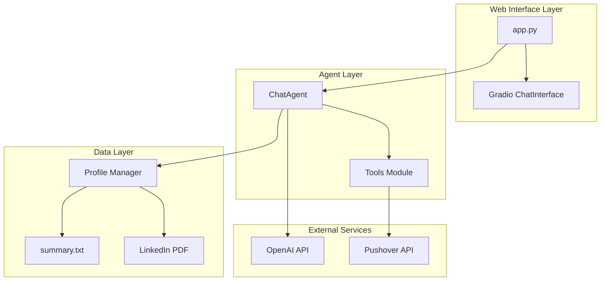
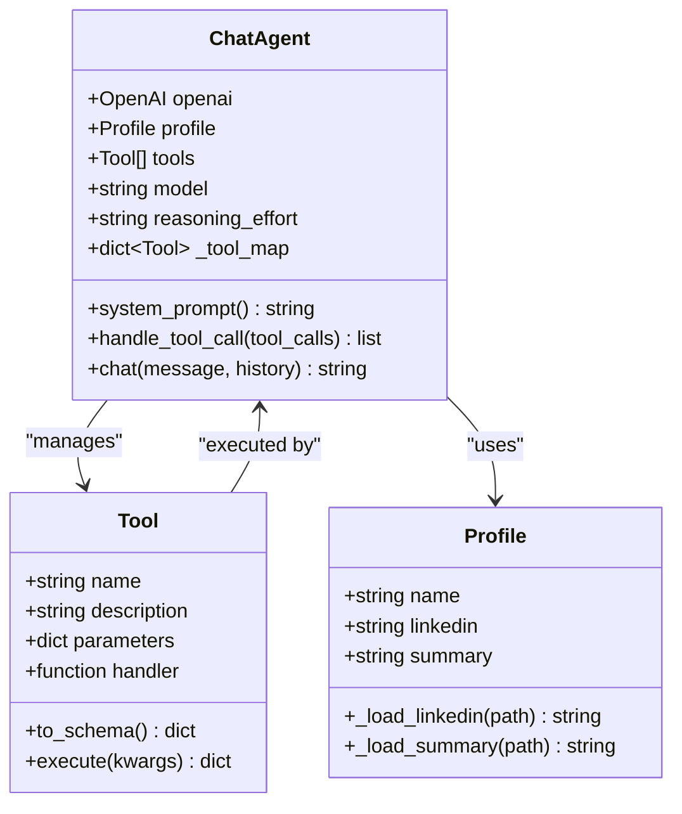
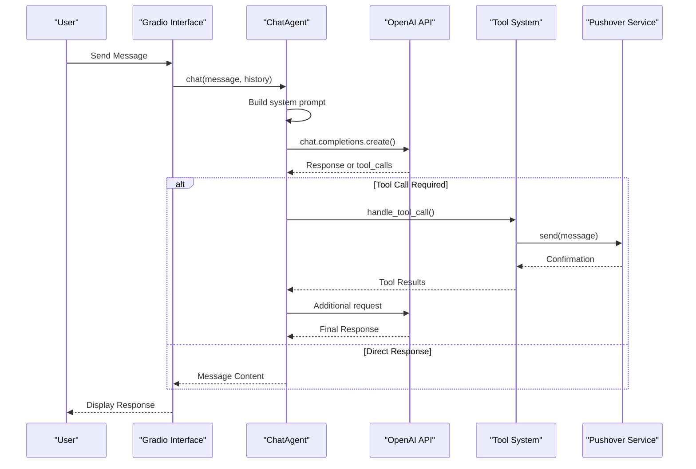
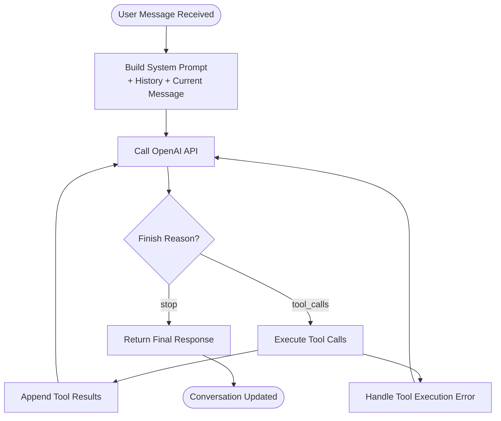
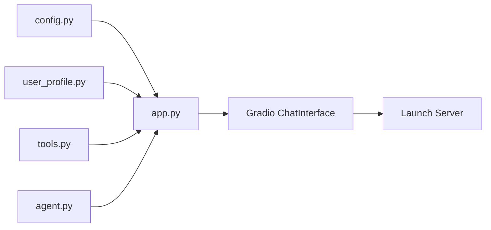
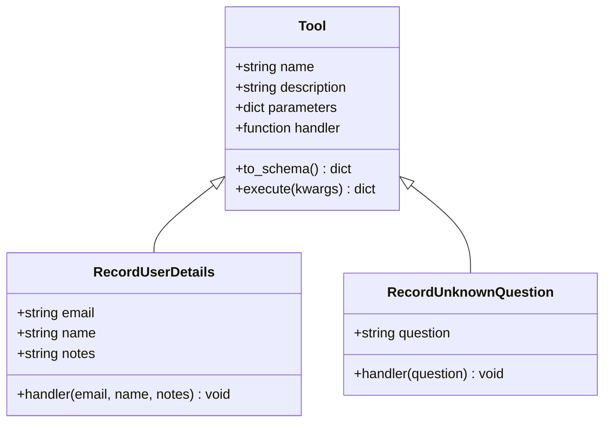
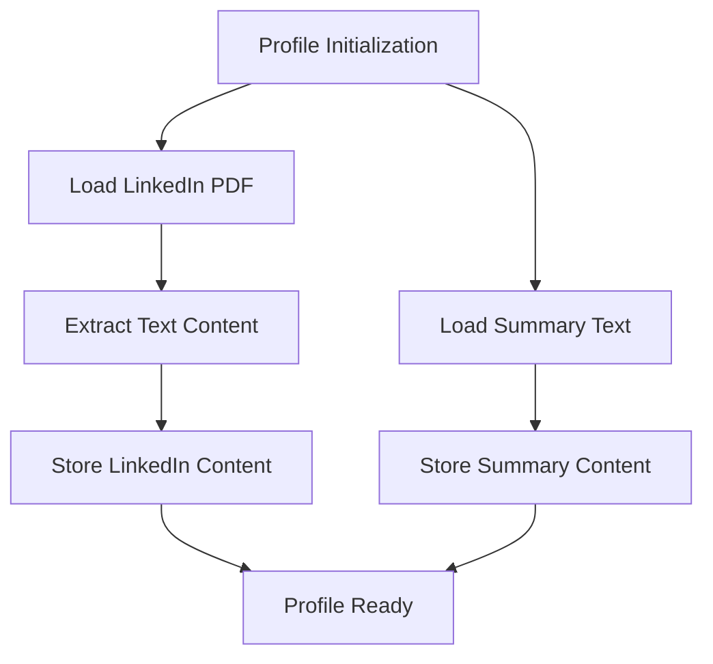
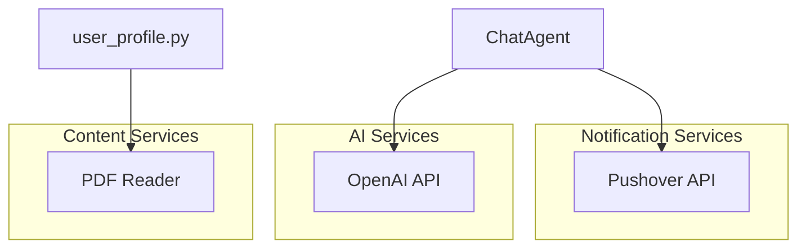
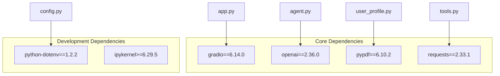

# Web Interface

<cite>
**Referenced Files in This Document**
- [app.py](file://app.py)
- [agent.py](file://agent.py)
- [config.py](file://config.py)
- [tools.py](file://tools.py)
- [user_profile.py](file://user_profile.py)
- [pushover.py](file://pushover.py)
- [pyproject.toml](file://pyproject.toml)
- [README.md](file://README.md)
- [me/summary.txt](file://me/summary.txt)
</cite>

## Table of Contents
1. [Introduction](#introduction)
2. [Project Structure](#project-structure)
3. [Core Components](#core-components)
4. [Architecture Overview](#architecture-overview)
5. [Detailed Component Analysis](#detailed-component-analysis)
6. [Dependency Analysis](#dependency-analysis)
7. [Performance Considerations](#performance-considerations)
8. [Troubleshooting Guide](#troubleshooting-guide)
9. [Conclusion](#conclusion)
10. [Appendices](#appendices)

## Introduction
This document provides comprehensive documentation for the Gradio-based web interface that powers a professional chatbot experience. The application integrates a sophisticated chat agent with OpenAI's language models, enabling natural conversations that reflect a professional persona. The interface supports real-time messaging, tool-based capabilities, and seamless conversation flow management.

The web interface serves as the primary user interaction point, leveraging Gradio's ChatInterface to provide an intuitive chat experience. Users can engage in professional conversations about career, background, skills, and experience, with the system designed to guide discussions toward meaningful connections and contact information collection.

## Project Structure
The project follows a modular architecture with clear separation of concerns:

**Diagram sources**
- [app.py:66-76](file://app.py#L66-L76)
- [agent.py:6-15](file://agent.py#L6-L15)
- [user_profile.py:4-22](file://user_profile.py#L4-L22)

The application consists of five primary modules:
- **app.py**: Main application entry point and Gradio interface configuration
- **agent.py**: Core chat agent implementation with OpenAI integration
- **tools.py**: Tool framework for specialized capabilities
- **user_profile.py**: Professional profile management and content loading
- **pushover.py**: Notification service integration

**Section sources**
- [app.py:1-76](file://app.py#L1-L76)
- [agent.py:1-80](file://agent.py#L1-L80)
- [tools.py:1-25](file://tools.py#L1-L25)
- [user_profile.py:1-22](file://user_profile.py#L1-L22)
- [pushover.py:1-17](file://pushover.py#L1-L17)

## Core Components

### Gradio Chat Interface
The web interface utilizes Gradio's ChatInterface as the foundation for user interaction. The interface provides a clean, professional chat experience with automatic conversation history management and real-time response handling.

Key interface characteristics:
- **Conversation Management**: Automatic history tracking and message threading
- **Real-time Responses**: Streaming-like behavior through OpenAI completions
- **Professional Styling**: Clean, accessible interface suitable for professional contexts
- **Responsive Design**: Adapts to various screen sizes and devices

### Chat Agent Implementation
The ChatAgent class orchestrates the entire conversation flow, integrating multiple components for comprehensive functionality:

**Diagram sources**
- [agent.py:6-80](file://agent.py#L6-L80)
- [tools.py:4-25](file://tools.py#L4-L25)
- [user_profile.py:4-22](file://user_profile.py#L4-L22)

**Section sources**
- [app.py:66-76](file://app.py#L66-L76)
- [agent.py:57-80](file://agent.py#L57-L80)
- [tools.py:12-25](file://tools.py#L12-L25)

## Architecture Overview

### System Architecture
The application follows a layered architecture pattern with clear separation between presentation, business logic, and external service integration:

**Diagram sources**
- [app.py:66-76](file://app.py#L66-L76)
- [agent.py:57-80](file://agent.py#L57-L80)
- [tools.py:22-25](file://tools.py#L22-L25)
- [pushover.py:12-17](file://pushover.py#L12-L17)

### Conversation Flow Management
The conversation flow is managed through a sophisticated iterative process that handles both direct responses and tool-based interactions:

**Diagram sources**
- [agent.py:57-80](file://agent.py#L57-L80)
- [agent.py:42-55](file://agent.py#L42-L55)

**Section sources**
- [agent.py:57-80](file://agent.py#L57-L80)
- [agent.py:42-55](file://agent.py#L42-L55)

## Detailed Component Analysis

### Application Entry Point
The application initializes all components and launches the Gradio interface:

**Diagram sources**
- [app.py:66-76](file://app.py#L66-L76)
- [config.py:7-14](file://config.py#L7-L14)

The initialization process establishes:
- **Environment Configuration**: Loading API keys and model settings from environment variables
- **Profile Management**: Loading professional summary and LinkedIn content
- **Tool Registration**: Defining specialized capabilities for user interaction
- **Agent Setup**: Configuring the chat agent with all necessary components

**Section sources**
- [app.py:66-76](file://app.py#L66-L76)
- [config.py:7-14](file://config.py#L7-L14)

### Tool System Architecture
The tool system provides extensible functionality for specialized operations:

**Diagram sources**
- [tools.py:4-25](file://tools.py#L4-L25)
- [app.py:10-63](file://app.py#L10-L63)

The tool system enables:
- **User Engagement Tracking**: Recording contact information for potential leads
- **Knowledge Management**: Logging unanswered questions for future improvement
- **Extensible Design**: Easy addition of new tools without modifying core agent logic

**Section sources**
- [tools.py:4-25](file://tools.py#L4-L25)
- [app.py:10-63](file://app.py#L10-L63)

### Profile Management System
The profile system loads and manages professional content from multiple sources:

**Diagram sources**
- [user_profile.py:11-22](file://user_profile.py#L11-L22)

The profile system provides:
- **Multi-format Content Loading**: PDF extraction and text file parsing
- **Structured Content Organization**: Separation of LinkedIn content and professional summary
- **Content Validation**: Ensures readable text extraction from PDF pages

**Section sources**
- [user_profile.py:11-22](file://user_profile.py#L11-L22)
- [me/summary.txt:1-117](file://me/summary.txt#L1-L117)

### External Service Integration
The application integrates with external services for enhanced functionality:

**Diagram sources**
- [agent.py:9](file://agent.py#L9)
- [pushover.py:12-17](file://pushover.py#L12-L17)
- [user_profile.py:11-17](file://user_profile.py#L11-L17)

**Section sources**
- [pushover.py:12-17](file://pushover.py#L12-L17)
- [agent.py:9](file://agent.py#L9)

## Dependency Analysis

### Package Dependencies
The application relies on several key dependencies for its functionality:

**Diagram sources**
- [pyproject.toml:7-14](file://pyproject.toml#L7-L14)

### Version Compatibility
The application requires Python 3.12+ and maintains compatibility with modern Gradio versions. The dependency tree ensures minimal conflicts while providing all necessary functionality.

**Section sources**
- [pyproject.toml:1-20](file://pyproject.toml#L1-L20)

## Performance Considerations

### Response Time Optimization
The chat interface is designed for optimal user experience with several performance considerations:

- **Streaming-like Behavior**: While not true streaming, the iterative tool-call mechanism provides responsive feedback
- **Caching Strategy**: System prompts and profile content are loaded once during initialization
- **Connection Pooling**: OpenAI client maintains efficient connection management
- **Memory Management**: Profile content is processed and stored efficiently

### Scalability Factors
The current implementation scales well for single-user scenarios. For multi-user deployments, consider:
- **Session Management**: Implement user session isolation
- **Rate Limiting**: Add API rate limiting for OpenAI
- **Caching Layers**: Introduce caching for repeated queries
- **Database Integration**: Store conversation history for persistence

## Troubleshooting Guide

### Common Issues and Solutions

#### Environment Configuration Problems
**Issue**: Missing environment variables cause application startup failures
**Solution**: Ensure all required environment variables are set:
- `PUSHOVER_TOKEN`: Pushover API token
- `PUSHOVER_USER`: Pushover user identifier  
- `OPENAI_MODEL`: OpenAI model identifier (defaults to "gpt-4o-mini")
- `PROFILE_NAME`: Professional name for persona
- `LINKEDIN_PATH`: Path to LinkedIn PDF file
- `SUMMARY_PATH`: Path to professional summary text file

#### OpenAI API Connectivity
**Issue**: Network connectivity or API key issues prevent chat functionality
**Solution**: Verify:
- OpenAI API key is valid and has sufficient permissions
- Network connectivity to OpenAI endpoints
- API quota limits are not exceeded
- Model availability matches configured model

#### Tool Execution Failures
**Issue**: Tool calls fail to execute properly
**Solution**: Check:
- Tool handlers are properly defined
- Required parameters are provided
- External service integrations (Pushover) are functioning
- Network connectivity to external APIs

#### Profile Loading Issues
**Issue**: LinkedIn PDF or summary files cannot be loaded
**Solution**: Verify:
- File paths are correct and accessible
- PDF files are readable and contain text content
- Text files are properly formatted and encoded
- File permissions allow read access

**Section sources**
- [config.py:7-14](file://config.py#L7-L14)
- [agent.py:57-80](file://agent.py#L57-L80)
- [user_profile.py:11-22](file://user_profile.py#L11-L22)

## Conclusion
The Gradio-based web interface provides a robust, professional chat experience that effectively bridges human interaction with AI capabilities. The modular architecture ensures maintainability while the tool system enables extensible functionality for various use cases.

Key strengths of the implementation include:
- **Professional Persona Management**: Accurate representation of professional identity
- **Seamless Integration**: Smooth interaction between Gradio interface and OpenAI services
- **Extensible Design**: Tool system allows easy addition of new capabilities
- **Robust Error Handling**: Comprehensive error management and recovery mechanisms

The application serves as an excellent foundation for professional chatbot implementations, with clear pathways for customization, enhancement, and deployment in various environments.

## Appendices

### Deployment Considerations
For production deployment, consider:
- **Containerization**: Package application in Docker containers
- **Reverse Proxy**: Deploy behind Nginx or similar reverse proxy
- **SSL/TLS**: Configure HTTPS termination
- **Environment Management**: Use separate environment files for different deployments
- **Monitoring**: Implement logging and health checks
- **Scaling**: Consider load balancing for multiple concurrent users

### Browser Compatibility
The application is compatible with modern browsers including:
- Chrome 90+
- Firefox 88+
- Safari 14+
- Edge 90+

### Accessibility Features
The Gradio interface provides built-in accessibility support including:
- Keyboard navigation
- Screen reader compatibility
- High contrast mode support
- Focus management
- ARIA labels and roles

### Security Best Practices
- **Environment Variable Protection**: Store sensitive credentials securely
- **Input Validation**: Validate and sanitize user inputs
- **API Key Management**: Use scoped API keys with minimal permissions
- **Network Security**: Implement secure communication channels
- **Audit Logging**: Track important user interactions and tool executions